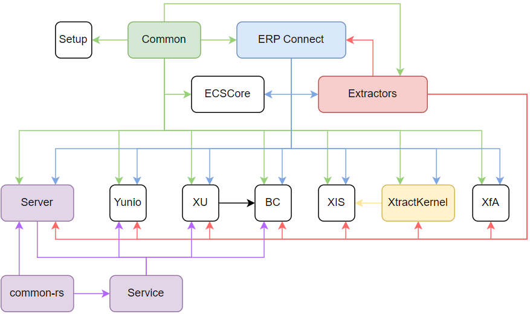

Aside from product changelogs, the following library codes affect the functionalities of Theobald Software products:

-   __Common__

    ---

    This is the common basis for all Theobald Software products. 
	It contains low-level technical changes that typically not directly relevant to the users.
	
-   __Theobald Server__

    ---

    Contains the common server basis and is used by the following products:

	- Board Connector
	- Xtract Universal
	- yunIO

-   __Theobald Extractors__

    ---

    Contains core extraction & SAP integration logic and is used by the following products:

	- Board Connector
	- Xtract for Alteryx
	- Xtract IS
	- Xtract Universal
	- yunIO

	For communication with the SAP system, Theobald Extractors use ERPConnect.

-   __Xtract Kernel__

    ---

    The Xtract Kernel contains core extraction logic and is used by the following products:

	- Xtract IS

	For communication with the SAP system, the Xtract Kernel uses ERPConnect.
	
	!!! note
		Xtract Kernel is deprecated and will be replaced by Theobald Extractors in the future. 
	

### Dependencies of Changelogs

The following dependencies of our library codes affect the changelog of our products:

