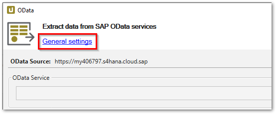
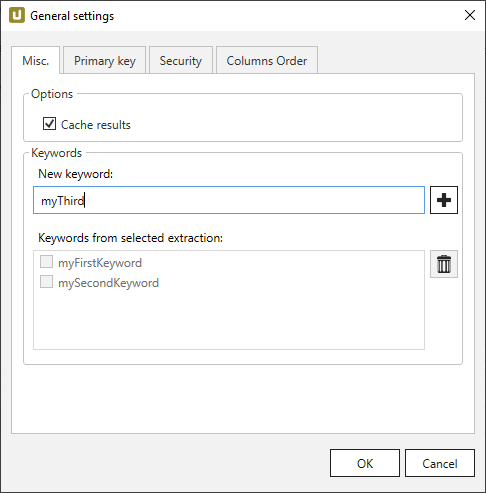
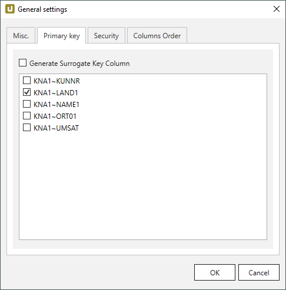
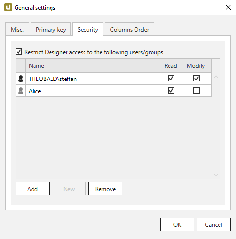
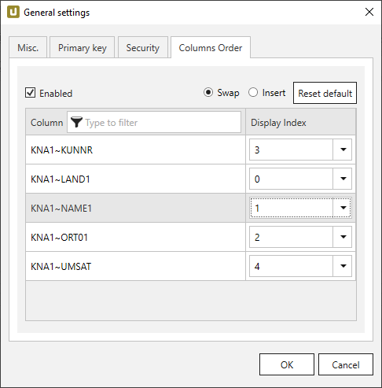

This page contains an overview of the settings in the window "General Settings". 
To open the general settings, click **General Settings** in the main window of the extraction type.

{:class="img-responsive"}

### Misc. Tab

The *Misc.* tab covers cache settings, column encryption and keywords of an extraction type.

{:class="img-responsive"}

#### Cache results

The *Cache results* option is only available in [pull destinations](../destinations/index.md), e.g., PBI, Qlik etc.
Pull destinations often pull the data from SAP for several times. 
To decrease the SAP server load, you can select the **Cache results** option, this way the pull destination pulls the data from cache and not from the SAP.

This increases the performance and limits the impact on the SAP system. 
If this behavior is not desired (for example, because the data must be always 100% up to date), the cache option must be explicitly turned off.

#### Keywords
One or more keywords (tags) can be assigned to an extraction. 
Keywords can be entered directly in the keyword field.
You can use these keywords to filter extractions in the "Search Extractions" window.
To open the "Search Extractions" window, click **[:magnifying-glass: Search]** in the main window of the Designer. 

!!! tip
	To add keywords to multiple extractions at once, select the extractions in the main window of the Designer.
	Right-click + **Add/Remove keywords** opens the window "Add/Remove Keywords To/From Multiple Extractions".

### Primary Key Tab

Table extractions inherit the primary keys from SAP. Other objects such as SAP Query, BW Cube etc. require manual setting of the primary keys.  

{:class="img-responsive"}

The depicted example shows the SAP object *MAKT* with its primary key inherited from SAP in the general settings of the Designer. 
In this example the primary key consists of *MANDT*, *MATNR* and *SPRAS*. The primary key is also taken over in the destination. 

!!! note
	A defined primary key field in a table is a prerequisite for merging data. 

#### Generate Surrogate Key Column

If this option is active, an additional column THEO_SURR_KEY is added to the extracted data.
The THEO_SURR_KEY column contains surrogate keys that can be used as row IDs. 
The surrogate keys are hash values of type signed 8 byte integer, e.g., `#-3008591679982390000`.
They are generated from the selected primary key columns and the name of the SAP source that is assigned to the extraction.

### Security Tab

Restrict user access to the extraction. For more information, see [Restrict Designer Access](restrict-designer-access.md).

{:class="img-responsive"}

### Columns Order Tab

The "Columns Order" feature enables users to rearrange the order of result columns when running an extraction.
To rearrange the result order, assign indexes to the available result columns. 
Index 0 defines the first column in the result set, index 1 the second columns, etc.

{:class="img-responsive"}

| Option | Description |
|--------|-------------|
| **Enabled** | When this option is active, the defined column order is applied when running the extraction. |
| **Swap** | Swaps the index of 2 columns. All other columns keep their indexes.|
| **Insert** | Inserts the selected column into the selected index. All other indexes are recalculated. |
| **Reset default** | Restores the original column order. |

