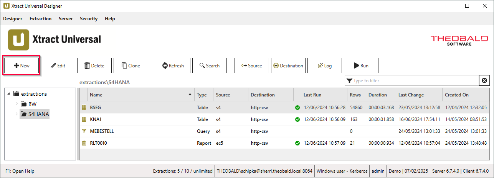
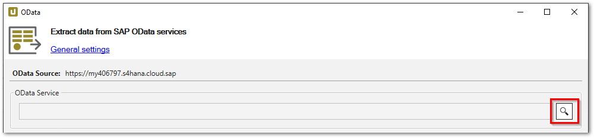
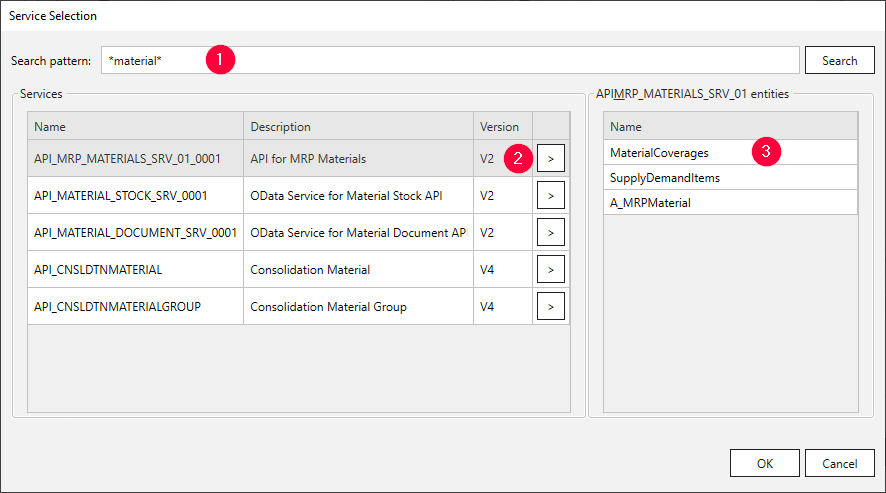
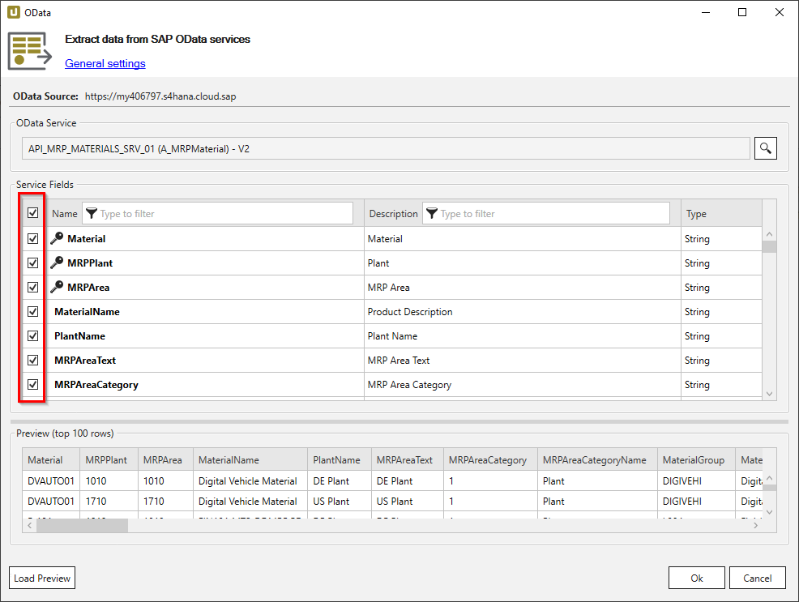

This page shows how to use the OData extraction type. 
The OData extraction type can be used to extract data provided by SAP OData services.

!!! note
	This extraction type ist still in **beta** phase.
	This means, the OData extraction type is subject to change. 
	Extractions that use the OData extraction type can stop working with future updates and might require manual changes.
	
### About OData Services

The OData extraction type in Xtract Universal consumes the data provided by SAP OData services.
You can build OData services in SAP using the [SAP Gateway Service Builder](https://help.sap.com/docs/SAP_NETWEAVER_AS_ABAP_751_IP/68bf513362174d54b58cddec28794093/cddd22512c312314e10000000a44176d.html).

The OData (Open Data) protocol defines a set of rules to create, edit and consume resources through RESTful interfaces (HTTP requests).
Furthermore, the OData protocol describes the data and the data model, meaning the data has its respective metadata, with column name, description, length and data type.
<!--- OData can also be used to track changes (deltas), create and run procedures, and send asynchronous/batch requests. -->

The OData extraction type supports [OData V2](https://www.odata.org/documentation/odata-version-2-0/overview/) and [OData V4](https://www.odata.org/documentation/)

### Prerequisites

**SAP On-Premise Systems**: 
Enable OData services in SAP, see [SAP Help: How to Enable OData Services in SAP S/4HANA](https://help.sap.com/docs/advanced-financial-closing/administration/how-to-enable-odata-services-in-sap-s4hana).
For more information on how to build OData services, see [SAP Learning: Building OData Services with SAP Gateway](https://learning.sap.com/learning-journeys/building-odata-services-with-sap-gateway).

**SAP Cloud Systems**: 
Expose SAP OData services to 3rd party systems using Communication Arrangements, see [SAP Learning: Setting up Communication Management](https://learning.sap.com/learning-journeys/implement-sap-s-4hana-cloud-public-edition-for-sourcing-and-procurement/setting-up-communication-management_a913171c-c96d-47a9-81ec-dc9ee8754320).
For more information on predefined OData services in the SAPS/4HANA Public Cloud, see [OData V4 List](https://api.sap.com/products/SAPS4HANACloud/apis/ODATAV4) and [OData V2 List](https://api.sap.com/products/SAPS4HANACloud/apis/ODATA).

### Create an OData Extraction

1. In the main window of the Designer, click **[:material-plus-thick:New]** to create a new extraction. The window "Create Extraction" opens. 
{:class="img-responsive"}
2. Select an [SAP Connection](../sap-connection/index.md) of type **Odata** from the drop-down menu **Source**.
3. Enter a unique name for your extraction.
4. Select the extraction type **OData** and click **[OK]**. The main window of the extraction type opens automatically.

The majority of the functions of the extraction type can be accessed in the main window.

### Look up OData Services

1. In the main window of the extraction type, click **[:magnifying-glass:]**. The window “Service Selection” opens. 
{:class="img-responsive"}	
2. In the field **Search pattern**, enter the technical service name of an OData V2 service or the service ID of an OData V4 service :number-1:. 
Use wildcards (*), if needed. 
3. Click **[Search]**. Search results are displayed.
{:class="img-responsive"}	
4. Click **[:material-greater-than:]** to select a service :number-2:. 
The SAP objects that are available via the service are displayed in the right screen of the menu:
5. Select an SAP object :number-3: and click **[OK]** to confirm.

The application now returns to the main window of the extraction type.

### Define the OData extraction type

The OData extraction type offers the following options for data extractions:

1. In the section *Service Fields*, select the items you want to extract. 
{:class="img-responsive"}
2. Click **[Load Preview]** to display a live preview of the first 100 records.
3. Check the [General Settings](general-settings.md) before running the extraction.
4. Click **[OK]** to save the extraction type.

You can now run the extraction, see [Execute and Automate Extractions](../execute-and-automate/index.md).

