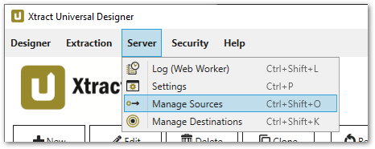
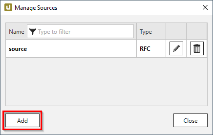
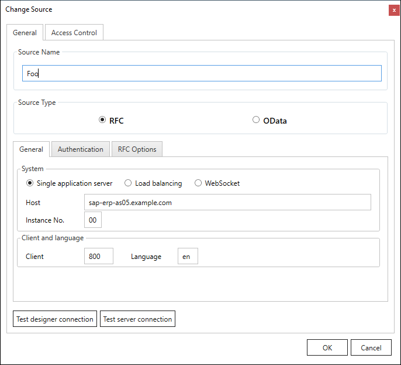
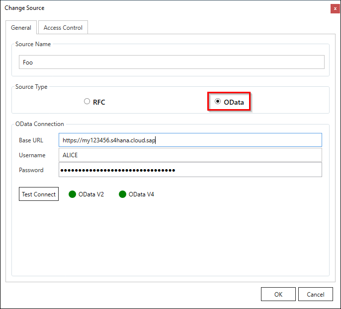
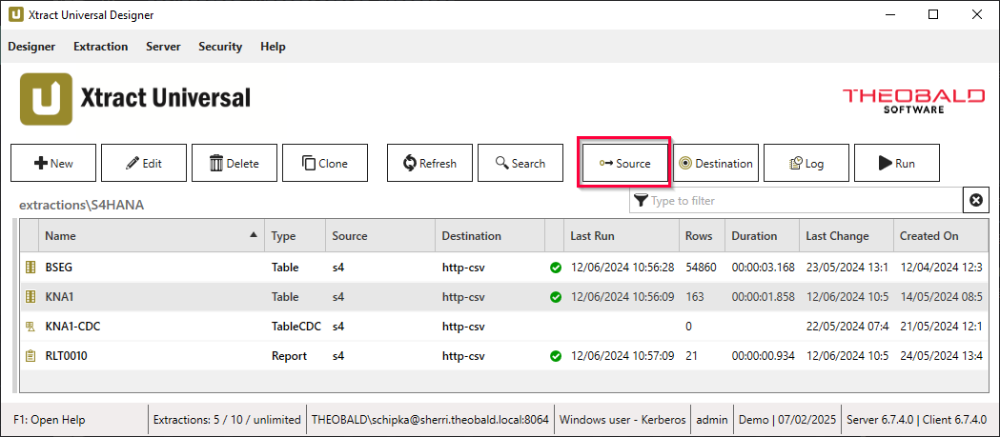
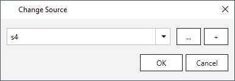

This page shows how to connect to SAP. 
An SAP connection is required to use any Xtract Universal extraction type.

**Supported Connection Methods** 

- Connection to a single application server via [RFC protocol](settings.md/#source-type-rfc)
- Connection to a message server (Load Balancing) via [RFC protocol](settings.md/#source-type-rfc)
- Connection to a single application server or [public or private cloud instance via RFC over WebSocket](../../knowledge-base/access-data-in-the-sap-public-cloud.md)
- Connection to SAP on-premise systems and SAP cloud systems via [OData protocol](settings.md/#source-type-odata)

**Supported Authentication Methods** 

The RFC protocol supports the following authentication methods:

- Plain login using SAP username and password (system or dialogue user)
- [Secure Network Communication (SNC)](snc-authentication.md) using username and password via basic authentication
- [SSO with Logon-Ticket](sso-with-logon-ticket.md) using username and password via basic authentication

### Connect to SAP

Follow the steps below to create a source that connects to SAP:

=== "Connect via RFC protocol"

	1. In the main window of the Designer, navigate to the menu bar and select **Server > Manage Sources**. The window "Manage Sources" opens.   
	{:class="img-responsive"}
	2. Click **[Add]** to add a new SAP connection or click **[:pen-button:]** to edit an existing connection. The window "Change Source" opens.  
	{:class="img-responsive"}
	3. Enter a name for the SAP connection in the field **Name**.
	4. Select **RFC** as the source type.  
	{:class="img-responsive"}
	5. In the *General* tab, select a connection method and enter the [system details](settings.md#general) of your SAP system. 

		!!! tip
			Input values for the SAP connection can be found in the Properties of the SAP Logon Pad or they can be requested from the SAP Basis team.
					
	6. In the *Authentication* tab, select one of the following authentication methods:
		- *Plain* uses the SAP username and password.
		- [*Secure Network communication (SNC)*](snc-authentication.md) uses an encrypted connection between Xtract Universal and SAP with an SAP username and password.
		- [*SAP Logon Ticket*](sso-with-logon-ticket.md) uses SAP Logon-Tickets in place of user credentials. This connection is not encrypted.
	7. In the *RFC Options* tab, select an [RFC library](settings.md#rfc-libraries) for the SAP connection. The default is the NetWeaver RFC library.
	8. Optional: In the *Access Control* tab, you can restrict read and write access to the SAP source, see [Access Management](../access-restrictions/restrict-designer-access.md/#restrict-access-to-the-designer).
	9. Click **[Test designer connection]** to validate the connection between the Xtract Universal Designer and the SAP system. 
	10. Click **[Test server connection]** to validate the connection between the Xtract Universal Server and the SAP system. 
	11. Click **[OK]** to save the SAP source.
	
	!!! warning  
	**Missing Authorization.** 
    To establish a connection to SAP, the access to general authority objects must be available.
    Adjust the [SAP Authority Objects](site:documentation/setup-in-sap/sap-authority-objects#general-authorization-objects) accordingly.

=== "Connect via OData protocol"

	1. In the main window of the Designer, navigate to the menu bar and select **Server > Manage Sources**. The window "Manage Sources" opens.   
	{:class="img-responsive"}
	2. Click **[Add]** to add a new SAP connection or click **[:pen-button:]** to edit an existing connection. The window "Change Source" opens.  
	{:class="img-responsive"}
	3. Enter a name for the SAP connection in the field **Name**.
	4. Select **OData** as the source type.  
	{:class="img-responsive"}
	5. Enter the [base URL](settings.md#base-url) of your SAP system.
	6. Enter login [credentials](settings.md#username) for your SAP system.
	7. Click **[Test Connect]** to validate the connection between the Xtract Universal Designer and the SAP system.  
	8. Optional: In the *Access Control* tab, you can restrict read and write access to the SAP source, see [Access Management](../access-restrictions/restrict-designer-access.md/#restrict-access-to-the-designer).
	9. Click **[OK]** to save the SAP source.

	
For more information on the input options, see [Connection Settings](settings.md).

### Assign an SAP Source to Extractions

An SAP source is assigned when [creating an extraction](../../getting-started.md/#create-an-extraction).  
Follow the steps below to change the SAP source of an existing extraction:

1. Select an extraction from the list of extractions in the main window of the Designer.
2. Click **[:designer-source:{ .lg .middle }Source]**. The window “Change Source” opens. 
{:class="img-responsive"}
3. Select an SAP source from the dropdown list. 
{:class="img-responsive"}
4. Click **[OK]** to confirm your input.

### Single-Sign-On (SSO)

BI client tools such as Power BI, Power Pivot, Alteryx, etc. can start extractions in Xtract Universal. 
Xtract Universal loads the extracted data directly into the tools. 
In this use case, it is often required that the extraction is executed with the SAP credentials of the (Windows AD) user, whose BI client triggered the extraction. 
This means that the SAP authorizations of the user apply. This is especially important when extracting BW/BEx queries.

The Windows credentials of the user are forwarded to SAP using Xtract Universal. 
On the way to SAP or on the SAP side, the Windows user and its SAP credentials are mapped.

#### Supported SSO Scenarios

Xtract Universal supports the following procedures for Single Sign-On (SSO):

- [Secure Network Communication (SNC) with Client Certificates](../../knowledge-base/sso-with-client-certificates.md)
- [Secure Network Communication (SNC) with PSE and External ID](../../knowledge-base/sso-with-external-id.md)
- [Secure Network Communication (SNC) with SAP’s Kerberos Wrapper Library (deprecated)](../../knowledge-base/sso-with-kerberos-snc.md)
- [SAP Logon Ticket](../../knowledge-base/sso-with-logon-ticket.md)

The authentication method can be selected in the SAP source connection settings.

### Connect via Router

If you access the SAP source system (Application server or Message server) via an SAP router, set the router string before the host name. 
For more information on SAP routers, see [SAP Help: SAP-Router](https://help.sap.com/viewer/6d9a59096c4b1014b507f15bed51571f/7.01.22/en-US/486b41efb74c07bee10000000a42189d.html).

Example: 
If the application server is "hamlet" and the router string is `/H/lear.theobald-software.com/H/`, set the host property to `/H/lear.theobald-software.com/H/hamlet`.

*****
#### Related Links
- [Connection Settings](settings.md)
