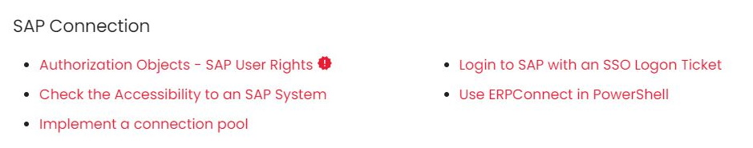

### Documentation

What to consider when creating new documentation pages:

- Create new documentation pages in the `documentation` folder of the product.
- Filenames use "-" instead of empty spaces, e.g., `bapis-and-function-modules.md`.
- The URL of the file is relative to the `/docs` directory. Example:<br>
- Define the following front matter items in the .md file:

	``` yaml
	---
	title: Page Title
	description: I’m a description
	status: new # this is optional, available are "new", "deprecated" or "beta" 
	tags: 
	   - some tag # this is optional, add tags 
	---
	```
	Additional front matter items can be defined in [.meta.yml files](files-and-folders.md#metayml-files).
	
- Add the name of the new .md file to the list of navigation items in the [.pages file](files-and-folders.md#pages-files) that is located in the same directory. 
If no .pages file exists, create one.
- Preview and check the content before running [LinkChecker](linkchecker.md) on the new page. Example:

	```
	linkchecker --no-warnings --no-status -r 0 http://localhost:8000/erpconnect/documentation/introduction/requirements/
	```

### Articles

What to consider when creating new articles:

- Create new articles in the `articles` directory of the product.
- Use an introduction sentence: "The following article shows / describes / contains..."
- Add authors to the front matter of an article:

	``` yaml
	--- 
	title: I'm an article
	author: Valerie Schipka, Fabian Steffan
	---
	```
	
- Add the article in the index page of the `articles` folder.
- Mark new articles in the index page using :material-alert-decagram:. Remove the status after a month.

	``` markdown
	- [Authorization Objects - SAP User Rights {==:material-alert-decagram:==}](authority-objects-sap-user-rights.md) 
	```
	
	<div class="result" markdown>

	

	</div>	

