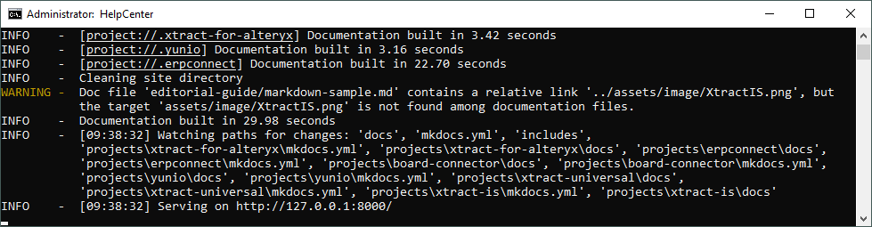

### About LinkChecker

LinkChecker checks links in web documents or full websites.
This check validates recursively all pages starting with `http://www.example.org/myhomepage/`. 
Additionally, all external links pointing outside of www.example.org will be checked but not recursed into.

For more information, see [LinkChecker Website](https://linkchecker.github.io/linkchecker/install.html).

!!! note
	LinkChecker does not work well with images. Check images using the warnings in the console when serving a project:<br>
	


### Install LinkChecker

Open the commandline tool and run the following command:

```
pip install LinkChecker
```

### How to Use LinkChecker

Open the commandline tool and run one of the following commands:

=== "Check all pages"

	```
	linkchecker --no-warnings --no-robots --check-extern https://helpcenter.theobald-software.com/
	```

=== "Check specific product"

	```
	linkchecker --no-warnings --no-robots --check-extern https://helpcenter.theobald-software.com/erpconnect/
	```

=== "Check single pages"

	```
	linkchecker --no-warnings --no-robots --check-extern -r 0 https://helpcenter.theobald-software.com/
	```

!!! note
	LinkChecker can be used to validate links in local .html files and local builds. <br>
	:octicons-arrow-right-24: Use LinkChecker to check links in your localhost preview (product-level only) before pushing new content to GitHub.

#### Results

If broken links are detected, the following information is printed to the console:

| Result | Description |
| -------- | ------- |
| URL| Link as defined in the source page   |
| Name | Name of the link   |
| Parent URL | Source page that contains the link    |
| Real URL    | Target page that is linked to  |
| Result    | HTML return code, e.g., 404, 200, etc.  |

Examples:

=== "Statistics"

	```console
	Statistics:
	Downloaded: 11.7MB.
	Content types: 55 image, 260 text, 0 video, 0 audio, 6 application, 1 mail and 345 other.
	URL lengths: min=18, max=899, avg=109.
	
	That's it. 667 links in 667 URLs checked. 8 warnings found. 0 errors found.
	Stopped checking at 2024-01-13 00:20:57+002 (2 minutes, 8 seconds)
	```
	
=== "Error"

	``` console
	URL        `/erpconnect/documentation/rfc-server/create-rfc-functions.md'
	Name       `RFC-Server'
	Parent URL https://helpcenter.theobald-software.com/erpconnect/documentation/idocs/prerequisites/, line 1, col 22166
	Real URL   https://helpcenter.theobald-software.com/erpconnect/documentation/rfc-server/create-rfc-functions.md
	Check time 3.508 seconds
	Size       3KB
	Result     Error: 404 Not Found
	```

=== "Warning"

	``` console
	URL        `/erpconnect/documentation/rfc-server/create-rfc-functions'
	Name       `RFC Server'
	Parent URL https://helpcenter.theobald-software.com/erpconnect/samples/receive-an-idoc/, line 1, col 19600
	Real URL   https://helpcenter.theobald-software.com/erpconnect/documentation/rfc-server/create-rfc-functions/
	Check time 3.442 seconds
	D/L time   0.043 seconds
	Size       103.35KB
	Warning    [http-redirected] Redirected to
			   `https://helpcenter.theobald-software.com/erpconnect/documentation/rfc-server/create-rfc-functions/'
			   status: 301 Moved Permanently.
	Result     Valid: 200 OK
	```

