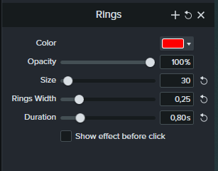

This page contains almost all elements that can be used for pages.


### Admonitions

A specific element that can be inserted is the information box. This can be used to highlight information in a certain way.
The content of a box must be indenting. An admonition ends after 1 unindented empty line.

=== "Note"

	``` markdown
	!!! note
		This is a note box.
	```

	<div class="result" markdown>

	!!! note
		This is a note box.

	</div>	

=== "Warning"

	``` markdown
	!!! warning "Warning! Missing Authorization"
		Explanation of warning or error message.
	```

	<div class="result" markdown>

	!!! warning "Warning! Missing Authorization"
		Explanation of warning / error message.

	</div>	

=== "Tip"

	``` markdown
	!!! tip 
		This is a tip.
	```

	<div class="result" markdown>

	!!! tip 
		This is a tip.

	</div>	

=== "Recommendation"

	``` markdown
	!!! tip "Recommendation"
		This is a recommendation box.
	```

	<div class="result" markdown>

	!!! tip "Recommendation"
		This is a recommendation box.

	</div>	

=== "Summary"

	``` markdown
	!!! summary

		- I am a list
		- I summarize long passages of text
	```

	<div class="result" markdown>

	!!! summary

		- I am a list
		- I summarize long passages of text

	</div>	

=== "FAQs"

	``` markdown
	??? question "Am I a question?"

		Yes and I am the answer to the question.
	```

	<div class="result" markdown>

	??? question "Am I a question?"

		Yes and I am the answer to the question.

	</div>	
	
	
### Animations

Record and process animations as 12 frames per second GIFs in Camtasia 2020.
Use the following settings to create the cursor click effect:<br>
{:class="img-responsive"}

Add animations the same way as [images](#images).
If necessary, use `style="border:1px solid black` to add a black border to the animation:

```
{:class="img-responsive" style="border:1px solid black;"}
```


### Announcements

Material for MkDocs includes an announcement bar to display product news or other important information.

- Open the following file: <br>
`helpcenter.theobald-software.github.io\projects\[product-name]\overrides\main.html`.
- Add an `announce` block in the main.html file:

	``` html title="Announcement in main.html"
	

	
	  <p>The ERPConnect HelpCenter will soon replace the ERPConnect Online Help!<p>
	
	```

To delete an announcement, remove the `announce` block from the file.

### Buttons

Links can be rendered as buttons. They are used for download links.

```
[:material-download-circle: Download-Button](../assets/files/sap_roles/ZXTQUERY.SAP){ .md-button }
```

<div class="result" markdown>

[:material-download-circle: Download-Button](#buttons){ .md-button }

</div>

### Code Blocks

Include code using the highlight tag. A language parameter adds syntax highlights to the code. For code blocks (> 2 lines) add a title and line numbers.
Refer to [this github page](https://github.com/jneen/rouge/wiki/List-of-supported-languages-and-lexers) to see all supported languages.

To add a code block use the following syntax: 

=== "Code"

	```` markdown 
	``` c#
	ERPConnect.LIC.SetLic("XXXXXXXXXX");
	```
	````

	<div class="result" markdown>

	``` c#
	ERPConnect.LIC.SetLic("XXXXXXXXXX");
	```

	</div>
=== "Code Block"
	```` markdown
	``` c# linenums="1" title="SAP Conenction"
	using (R3Connection con = new R3Connection())
	{
		con.UserName = "SAPUser";
		con.Password = "SAPPassword";
		con.Language = "EN";
		con.Client = "800";
		con.Host = "sap-erp-as05.example.com";
		con.SystemNumber = 00;
		con.Protocol = ClientProtocol.NWRFC; 

		con.Open();
	}
	```
	````

	<div class="result" markdown>

	``` c# linenums="1" title="SAP Conenction"
	using (R3Connection con = new R3Connection())
	{
		con.UserName = "SAPUser";
		con.Password = "SAPPassword";
		con.Language = "EN";
		con.Client = "800";
		con.Host = "sap-erp-as05.example.com";
		con.SystemNumber = 00;
		con.Protocol = ClientProtocol.NWRFC;

		con.Open();
	}
	```

	</div>


### Content Tabs

Use content tabs for code blocks and changelogs.

``` title="Content tabs"

=== "Xtract Universal"

    This tab contains the Xtract Universal changelog

=== "Theobald Extractors"

    This tab contains the Theobald Extractors changelog
```

<div class="result" markdown>

=== "Xtract Universal"

    This tab contains the Xtract Universal changelog

=== "Theobald Extractors"

    This tab contains the Theobald Extractors changelog

</div>


### Grid Cards

The list syntax is a shortcut for card grids and consists of an unordered (or ordered) list wrapped by a `div` with both, the `grid` and `cards` classes:


``` html title="Grid Cards"
<div class="grid cards" markdown>

- :fontawesome-brands-html5: __HTML__ for content and structure
- :fontawesome-brands-js: __JavaScript__ for interactivity
- :fontawesome-brands-css3: __CSS__ for text running out of boxes
- :fontawesome-brands-internet-explorer: __Internet Explorer__ ... huh?

</div>
```

<div class="result" markdown>
  <div class="grid cards" markdown>

- :fontawesome-brands-html5: **HTML** for content and structure
- :fontawesome-brands-js: **JavaScript** for interactivity
- :fontawesome-brands-css3: **CSS** for text running out of boxes
- :fontawesome-brands-internet-explorer: **Internet Explorer** ... huh?

  </div>
</div>


You can use regular markdown syntax in grid cards to add links, images, etc:

``` html title="Grid Cards, complex example"
<div class="grid cards" markdown>

-   { .lg .middle width="50px"} __Xtract Universal__

	---
	
    The flexible SAP interface for databases, analytics, BI or cloud solutions.<br>
    [:octicons-arrow-right-24: Xtract Universal](https://help.theobald-software.com/en/xtract-universal/)

-   { .lg .middle width="50px"} __Xtract IS__

    ---

    The powerful SAP plug-in for SQL Server Integration Services to extract mass data.<br>
    [:octicons-arrow-right-24: Xtract IS](https://help.theobald-software.com/en/xtract-is/)

</div>
```

<div class="result" markdown>
  <div class="grid cards" markdown>

-   { .lg .middle width="50px"} __Xtract Universal__

	---
	
    The flexible SAP interface for databases, analytics, BI or cloud solutions.

    [:octicons-arrow-right-24: Xtract Universal](https://help.theobald-software.com/en/xtract-universal/)

-   { .lg .middle width="50px"} __Xtract IS__

    ---

    The powerful SAP plug-in for SQL Server Integration Services to extract mass data.

    [:octicons-arrow-right-24: Xtract IS](https://help.theobald-software.com/en/xtract-is/)

  </div>
</div>


### Icons

Icons can be integrated in flowing text via `:[folder]-[name-of-the-icon]:`. 
They can be used in the following manner:

Click **[:material-pencil-outline:]** to edit an entry.

- Additional clarification that an icon is an icon is unnecessary. 
- Make sure not to write “click on”.
- Product or component logos are not icons.

=== "Products"

	:products-erpconnect: `:products-erpconnect:`

	:products-board-connector: `:products-board-connector:`

	:products-xtract-for-alteryx: `:products-xtract-for-alteryx:`

	:products-xtract-is: `:products-xtract-is:`
	
	:products-xtract-is-for-azure: `:products-xtract-is-for-azure:`
	
	:products-xtract-universal: `:products-xtract-universal:`
	
	:products-yunio: `:products-yunio:`

=== "Xtract"

	:simple-sap: `:simple-sap:`

	:glasses-button: `:glasses-button:`

	:magnifying-glass: `:magnifying-glass:`

	:pen-button: `:pen-button:`

	:refresh: `:refresh:`

	:trashbin: `:trashbin:`

	:runtime-parameters-dynamic: `:runtime-parameters-dynamic:`

	:runtime-parameters-static: `:runtime-parameters-static:`

	:x-button: `:x-button:`

	:material-checkbox-blank-outline: `:material-checkbox-blank-outline:`

	:material-checkbox-outline: `:material-checkbox-outline:`

=== "WHERE Clause Editor"

	:where-clause-add: `:where-clause-add:`
	
	:where-clause-add-group: `:where-clause-add-group:`
	
	:where-clause-add-literal: `:where-clause-add-literal:`
	
	:where-clause-add-sql: `:where-clause-add-sql:`
	
	:material-code-brackets: `:material-code-brackets:`
	
	:where-clause-column: `:where-clause-column:`

	:where-clause-warning: `:where-clause-warning:`

	:where-clause-remove: `:where-clause-remove:`

=== "yunIO"

	:yunio-nav-access-control: `:yunio-nav-access-control:`

	:yunio-nav-connections: `:yunio-nav-connections:`

	:yunio-nav-license: `:yunio-nav-license:`

	:yunio-nav-logs: `:yunio-nav-logs:`

	:yunio-nav-services: `:yunio-nav-services:`

	:yunio-nav-settings: `:yunio-nav-settings:`

	:yunio-nav-user: `:yunio-nav-user:`

	:yunio-copy: `:yunio-copy:`

	:yunio-delete: `:yunio-delete:`

	:yunio-download: `:yunio-download:`

	:yunio-edit: `:yunio-edit:`
	
	:yunio-rename-icon: `:yunio-edit-general:`

	:yunio-run: `:yunio-run:`
	
	:yunio-run-collapse: `:yunio-run-collapse:`

	:yunio-run-expand: `:yunio-run-expand:`

	:yunio-run-download: `:yunio-run-download:`
	
	:yunio-run-upload: `:yunio-run-upload:`
	
	:yunio-run-reset: `:yunio-run-reset:`
	
	:yunio-run-fullscreen: `:yunio-run-fullscreen:`

Old syntax:

```
{:class="img-responsive" style="display:inline"}
```


### Images  

Images are stored in the folder `/images`.
The folder contains the following subfolders:

| subfolder|  content     | 
|----------|:-------------|
| `articles` |  images for general knowledge base articles, e.g., about SAP | 
| `[product-name]`|  images used in a specific product - this subfolder contains another subfolder `articles` for product-specific knowledge base articles|   
| `logos`|  product and component logos |  
| `components`|  images used by Xtract components, e.g., Table, BWCube, etc. | 

Open the correct folder and add an image or a .gif animation.
Note the image path as images are referenced as {==relative links==}.

Example:

- location of .md file:
`docs\editorial-guide`
- location of image:
`docs\assets\images`
- resulting relative link:
`../assets/images/`

To add an image to a page, use the following syntax:

```
{class="img-responsive"}
```

When adding images in [reusable text](#include-reusable-text), you can use the following syntax:

```

```
	
This makes it possible to include images independently from the location in the directory. Downside: broken links to images do not cause errors or warnings when building the project.

#### Additional Options

=== "Specific Image Size"

	```
	{:height="150px" width="150px" class="img-responsive"}
	```

	Be aware that if a big size is set and the image is viewed on mobile,
	it does shrink to the screen size (to prevent sideways scrolling), but does not scale proportionally.
	Therefore it is advised that {==if height and width are added, the class img-responsive is also added==}, so images scale proportionally on small screens.

=== "Image Align Left"

	``` markdown
    { align=left }
    ```

    <div class="result" markdown>

    { align=left width=300 }

    Lorem ipsum dolor sit amet, consectetur adipiscing elit. Nulla et euismod
    nulla. Curabitur feugiat, tortor non consequat finibus, justo purus auctor
    massa, nec semper lorem quam in massa.

    </div>

=== "Image Align Right"

	``` markdown
    { align=right }
    ```

    <div class="result" markdown>

    { align=right width=300 }

    Lorem ipsum dolor sit amet, consectetur adipiscing elit. Nulla et euismod
    nulla. Curabitur feugiat, tortor non consequat finibus, justo purus auctor
    massa, nec semper lorem quam in massa.

    </div>


### Include Reusable Text
To write content that can be injected in other pages, navigate to the folder `/includes`.
The folder contains the following subfolders:

| subfolder|  content     | 
|----------|:-------------|
| `articles` |  general knowledge base articles, e.g., about SAP | 
| `[product-name]`|  text that is used multiple times within a product |   
| `requirements`|  sap requirements that apply to all products |  
| `version-history`|  changelogs of all libraries as provided by version-control |  

Open the correct folder and create a new .md file.
Make sure there is no front matter in the file (no `---` lines at the top of content pages).
To inject the content of the file in a page, use the following syntax:

```

```


### Internal Links

MKDocs only supports relative links (this will change in the future). Example:

```
[Link text](./filename.md#headline)
```

When using internal links in [reusable text](#include-reusable-text), you can use the following syntax:

```
[Link text](site:folder/subfolder/filename/#headline)
```
	
This makes it possible to include internal links independently from the location in the directory. 
Downside: broken links do not cause errors or warnings when building the project.


### Lists

=== "Ordered Lists"

	``` markdown
	1. First item.
	2. Second item.
	3. Third item.
	4. Fourth item.
	```

    <div class="result" markdown>

	1. First item.
	2. Second item.
	3. Third item.
	4. Fourth item.
	
	</div>
	
=== "Unordered Lists"

	``` markdown
	- Some item. 
		- Some item.
		- Some item.
	- Some item.
		- Some item.
    ```

    <div class="result" markdown>

	- Some item. 
		- Some item.
		- Some item.
	- Some item.
		- Some item.
		
	</div>

### Metadata (Conditional Text)

Metadata can be used in [resusable texts](#include-reusable-text) to change text and screenshots according to the product or component that the content is injected to.

<!---
Example: The BWCube component exists in multiple Xtract products, but uses different screenshots.
The screenshots can be linked to a condition that checks the product name, so that only the screenshot for that product is displayed.
This way you can use a single .md file for multiple products and reduce maintenance.
-->

All metadata in the front matter of .md files are available for conditions. <br>
You can use `if`, `or` and `elif` logic using the following format:

```markdown title="Conditional Text"

This is only displayed on Xtract Universal pages.

This is only displayed on pages that are **not** Xtract Universal.

```

Most .md files only use the front matter items `title` and `description`. 
Metadata like `product` or `component` are usually defined in the [.meta.yml file](./files-and-folders.md#metayml-files) of the folder or root folder of .md files.
	
!!! note

	Use [variables](#variables) to switch between {==recurring words==} based on the products.
	
### Redirect Links

When moving/deleting .md files or changing the name of the files, a redirection link can be added to the mkdocs.yml of the product to redirect from the old file to the new file.
Use redirection links for pages that are used regularly by 3rd parties. A list of affected links is stored in the server: `X:\Online-Help\Links_to_OH`.<br>

To redirect deprecated links, use the following mapping in the mkdocs.yml file:

```yaml title="Redirect Mapping in mkdocs.yml"
plugins:
  - redirects: #redirect URLs when renaming/moving .md files
      redirect_maps:
        'old.md': 'new.md'
        'old/file.md': 'new/file.md'
        'some_file.md': 'http://external.url.com/foobar'
```

??? note "Links from KNIME"

	KNIME offers a documentation that contains links to our Online Help and that is integrated into the KNIME software (offline). 
	If one of those links changes due to editing .md files, a redirection link must be added. Otherwise KNIME needs to release a new software version to correct broken links.

	List of documentation links in KNIME (last updated March 2023):

	-	https://help.theobald-software.com/en/xtract-universal/introduction/requirements
	-	https://help.theobald-software.com/en/xtract-universal/advanced-techniques/metadata-access-via-http
	-	https://help.theobald-software.com/en/xtract-universal/destinations/csv-via-http
	-	https://help.theobald-software.com/en/xtract-universal/destinations/csv-via-http#convert--encoding
	-	https://help.theobald-software.com/en/xtract-universal/introduction/sap-connection#authentication
	-	https://help.theobald-software.com/en/xtract-universal/execute-and-automate-extractions/extraction-parameters
	-	https://help.theobald-software.com/en/xtract-universal/advanced-techniques/user-defined-variables
	-	https://help.theobald-software.com/en/xtract-universal/destinations/csv-via-http#csv-settings
	-	https://help.theobald-software.com/en/xtract-universal/destinations/csv-via-http#convert--encoding

### Search

The Material search function allows to exclude pages and single sections of text from the search results.
It also allows ranking pages.

=== "Exclude page"

	``` yaml
	---
	search:
	  exclude: true
	---
	```
	
=== "Exclude section"

	```
	### I'm a Headline { data-search-exclude }
	```

=== "Rank up pages"

	``` yaml
	---
	search:
	  boost: 2 
	---
	```

=== "Rank down pages"

	``` yaml
	---
	search:
	  boost: 0.5
	---
	```
	

### Tables

To add a table use the following syntax: 

```markdown title="Simple Table"
| Number | Next number | Previous number |
| :------ |:--- | :--- |
| Five | Six | Four |
| Ten | Eleven | Nine |
| Seven | Eight | Six |
| Two | Three | One |  
```

<div class="result" markdown>

| Number | Next number | Previous number |
| :------ |:--- | :--- |
| Five | Six | Four |
| Ten | Eleven | Nine |
| Seven | Eight | Six |
| Two | Three | One |  

</div>

The style of the table is defined in the theme of the HelpCenter and cannot be modified in markdown.

### Tags

Tags can be used to add hidden keywords to a page. 
The keywords are included in the search functionality of the HelpCenters.

Use case:
When there are multiple terms to describe an important object / process, etc., our documentation usually only uses one of those terms.
Adding the synonyms as tags ensures that users who are not familiar with that term can still find results when searching the documentation.

To add tags, use the following syntax in the front matter of an .md file:

``` yaml
tags:
  - version
  - getting started
```

A list of defined tags and their associated pages is available on the following pages:

- :products-erpconnect: [tags](https://helpcenter.theobald-software.com/erpconnect/tags/)
- :products-board-connector: [tags](https://helpcenter.theobald-software.com/board-connector/tags/)
- :products-xtract-for-alteryx: [tags](https://helpcenter.theobald-software.com/xtract-for-alteryx/tags/)
- :products-xtract-is: [tags](https://helpcenter.theobald-software.com/xtract-is/tags/)
- :products-xtract-universal: [tags](https://helpcenter.theobald-software.com/xtract-universal/tags/)
- :products-yunio: [tags](https://helpcenter.theobald-software.com/yunio/tags/)
	

### Variables 

Variables are placeholders for product specific words, e.g., "runtime parameters" versus "SSIS variables".
They can be used in products and in reusable texts (includes). <br>
How to define and use variables:

1. Open the mkdocs.yml file of a product.
2. Define variables under `extra`:

	``` yaml
	extra:
	  variable-name: value
	  product: Xtract Universal
	```
	
3. Use the variable in reusable or regular text using the following syntax:

	```
	{{ variable-name }}
	```

Example:

=== ".md file"

	```
	Welcome to {{ product }}!
	```

=== "ERPConnect product page"

	Welcome to ERPConnect!

=== "Xtract Universal product page"

	Welcome to Xtract Universal!

!!! note

	For texts and screenshots that only occur once or twice, use [metadata](#metadata-conditional-text) instead of variables.
	
	
#### List of Variables

| Variable     | Xtract IS            | Xtract for Alteryx       | Xtract Universal           |  Board Connector            |  yunIO          |
|--------------|----------------------|--------------------------|----------------------------|-----------------------------|-----------------|
| product      | Xtract IS            | Xtract for Alteryx       | Xtract Universal           | Board Connector             | yunIO           |
| variable     | SSIS variable        | runtime parameter        | runtime parameter          | runtime parameter           | -               |
| variables    | SSIS variables       | runtime parameters       | runtime parameters         | runtime parameters          | -               |
| settings     | settings             | extraction settings      | extraction settings        | extraction settings         | -               |
| settingsBtn | **Settings**         | **[Extraction Settings]**|**Extraction Settings**     | **Extraction Settings**     | -               |
| parameterBtn| **Edit parameters**  | **[Edit parameters]**    |**Edit runtime parameters** | **Edit runtime parameters** | -               |
| table        | Xtract Table         | Xtract Table             |Table                       | Table                       | SAP Tables and Views |
| tableCDC    | Xtract Table CDC     | Xtract Table CDC         |Table CDC                   | Table CDC                   | -               |
| bapi         | Xtract BAPI          | Xtract BAPI              |BAPI                        | BAPI                        |Function Module / BAPI  |
| bwcube      | Xtract BW Cube       | Xtract Cube              |BW Cube                     | BW Cube                     | -               |
| hierarchy    | Xtract Hierarchy     | Xtract Hierarchy         |BW Hierarchy                | BW Hierarchy                | -               |
| deltaq       | Xtract DeltaQ        | -                        |DeltaQ                      | DeltaQ                      | -               |
| odp          | Xtract ODP           | Xtract ODP               |ODP                         | ODP                         | -               |
| ohs          | Xtract OHS           | Xtract OHS               |OHS                         | OHS                         | -               |
| query        | Xtract Query         | Xtract Query             |SAP Query                   | SAP Query                   | -               |
| report       | Xtract Report        | Xtract Report            |Report                      | Report                      | Report          |
| component    | component            | component                |extraction type             | extraction type             | integration type|
| extraction   | SSIS package         | workflow                 |extraction                  | extraction                  | service         |

!!! note

	Use the following syntax to format variables in .yml files:
	
	- Bold: `__test__` :octicons-arrow-right-24: __test__
	- Italic: `_test_`:octicons-arrow-right-24: _test_
