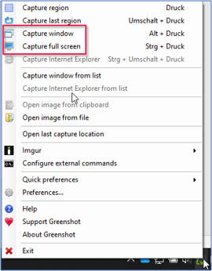
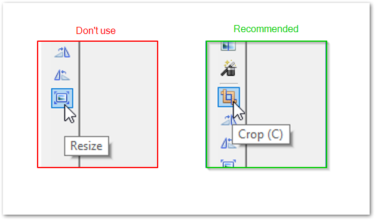
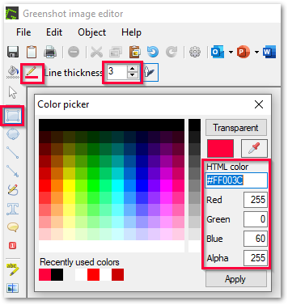
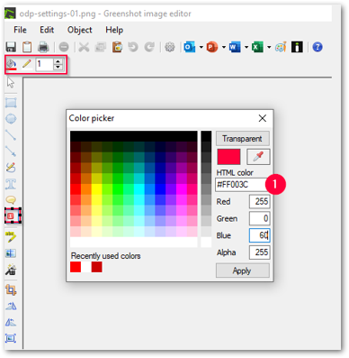

### About screenshot conventions
The following section contains information on creating consistent screenshots. 

The main topics around creating screenshots are the following:
- Storing & naming screenshots
- Size, resolution & quality
- Frames & shadows
- Highlighting (type, size, color)
- Position numbers

### General
The author of a section decides about the number of used screenshots. The rule of thumb in this case is:
"The main focus is on the user, if an additional screenshot is necessary for understanding, place a screenshot."
Additional benefits of using more screenshots
- Less text
- Less translation effort
- Lower error probability

#### Storing & naming screenshots

Creating new subfolders for new content and placing the new screenshots into existing subfolders simplifies search and ensures order in the image repository.
For better searching it is also advisable to use a self-explanatory file name.
For screenshots that don't belong to a product, try to place the component or destination name at the beginning (e.g., odp_dynamic-param.png)
For product specific screenshots, place the product name at the beginning of the file name (e.g., xfa_settings_update-mode.png)

Optionally underscore can be used to separate the items and hyphen (minus) to separate words belonging to one item (e.g., xfa_settings_update-mode.png )

### Size, resolution & quality
The recommended software for creating the screenshots is Greenshot. The following instructions will be based on the usage of Greenshot.
It is not possible to regulate the image sizes without quality loss.  

When manually resizing the file size in Greenshot editor, the quality of the image decreases. 
To prevent quality loss, you can use other screenshot taking options:
- Capture window **[Alt]+[Print]** - to capture only a prompted window
- Capture full screen **[Ctrl]+[Print]** - to capture full screen and crop image in the editor. 
The quality does not decrease  when it's cropped.  

{:class="img-responsive"}

!!! warning
**Quality loss**  
Don't use resize option in Greenshot. It always leads to quality loss. Use the crop option instead. 

{:width="400px" class="img-responsive"}

Png is recommended file type for online content. Jpeg is not forbidden but remember that .jpeg-files are more compressed and this may lead to quality loss. In Greenshot .png is set by default. To check or change output file type in Greenshot, navigate to **Settings > Output > Image format**. 
 

![Settings]../assets/images/editorial-guide/screenshot-conventions/greenshot_settings.png){:class="img-responsive"}

### Frames & shadows
When creating a screenshot of a prompted window with the option *Capture Window* (**[Alt]+[Print]**), the frame appears automatically. 

When creating a part of a screen, use *Capture region* (**[Print]**) or / then crop the image to the needed size and add a shadow **[CTRL]+[Q]**. 
 

{:class="img-responsive"}

!!! note
 When placing an image within a text block, make sure to place a break and an additional return to maintain space between the text and the image.
When placing an image within a list (OL or UL) avoid breaks and returns after a step to maintain the proper formatting: images in the same horizontal line as the numbers or bullet points.

### Highlighting 
Highlighting refers to marking any kind of elements on a screenshot.
The following guidelines refer to the color, style and usage of highlighting elements.

#### General

- Color - Use Theobald red - #FF003C (255,0,60) for any kind of highlighting. If an additional color is necessary, use black from Greenshot.
- Line thickness 
    - big images - 3pt
    - small images - 2pt

{:class="img-responsive"}

- Mouse pointer - avoid if not helpful for understanding.
.  
Avoid mixture of elements, don't use ovals.  

{:class="img-responsive"}

To keep the squares consistent, check the line thickness & hold down **[Ctrl]** when drawing to have the object anchored in it's geometrical middle. 

### Position numbers
Use position numbers for action steps. Make sure not to cover important information (buttons, text) when placing position numbers. Place the position numbers in reading direction (from left to right & clockwise) or depending on steps order.  

{:class="img-responsive"}

Use the default position numbers provided in Greenshot. Change the color to Theobald red (1). 

{:class="img-responsive"}

 When an instruction contains images with position numbers, make sure to address the position numbers in the text in brackets. 

