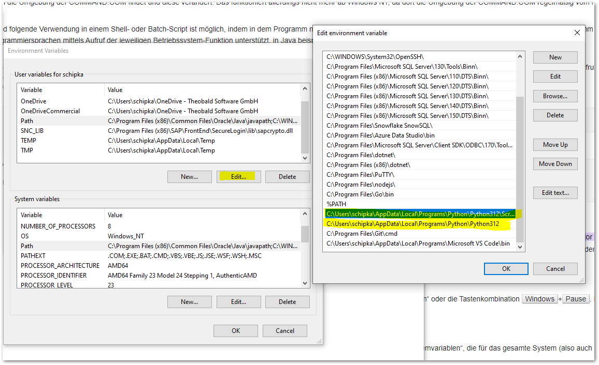
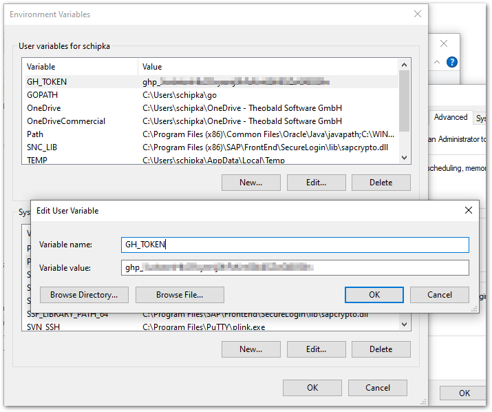
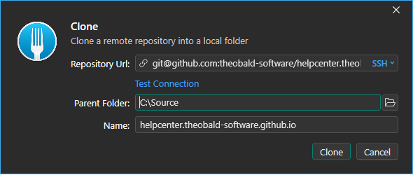
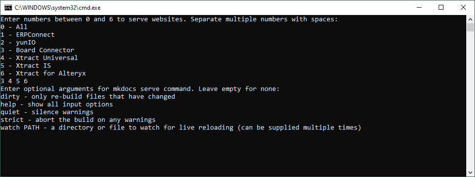

### Definitions
MKDocs - OpenSource framework to create static websites (Jekyll alternative with a focus on documentation). <br>
Material- a theme for MKDocs that comes with multiple useful functionalities and plugins.


### Install MkDocs and Material Theme

How to install the MKDocs framework and its main theme:

1. Install [git](https://git-scm.com/download/win).
2. Install [Python](https://www.python.org/downloads/) (recommended version V 3.11, because of possible incompatibilities with latest versions).
3. Add git, Python and the Python PIP scripts to the Path environment variable to your system. Make sure to use the correct version number stated in the name of the Python directory, e.g., "Python 312":

	- C:\Program Files\Git\cmd\git.exe
	- C:\Users\username\AppData\Local\Programs\Python\Python3xx 
	- C:\Users\username\AppData\Local\Programs\Python\Python3xx\Scripts)

	
4. Create a new environment variable GH_TOKEN. For the value for the token, refer to your admins.<br>

5. Log into gitHub with the user TSEDV (credentials in PSONO).
6. Open the command line tool and use the following command to install MKDocs: 
```
pip install mkdocs
```
7. Use the following command to install the material theme for MKDocs: 
```
pip install git+https://${GH_TOKEN}@github.com/squidfunk/mkdocs-material-insiders.git
```
8. Log out of the TSEDV gitHub account.

Congratulations! The installation of the MKDocs framework and its main theme is complete.

!!! note
	The gitHub Token in the environment variables needs to be updated regularly (90 days interval), refer to the Admins.


### Install External Plugins

The Theobald Software HelpCenters use external plugins to add functionalities that are not included in MKDocs and the material theme. 
Install the following plugins via command line to build the Theobald Software HelpCenters:

- Mandatory to use optimize-plugin:
```
pip install "mkdocs-material[imaging]"
```
- Add “last updated” to pages:
```
pip install mkdocs-git-revision-date-localized-plugin
```
- Enable includes and variables:
```
pip install mkdocs-macros-plugin 
```
- Add navigation via .pages files:
```
pip install mkdocs-awesome-pages-plugin 
```
- Compression for output HTML files:
```
pip install mkdocs-minify-plugin
```
- Add redirects for URLs:
```
pip install mkdocs-redirects
```
- Add additional grid card design:
```
pip install neoteroi-mkdocs
```
- Add breakless lists (for compatibility with migrated content):
```
pip install mdx-breakless-lists
```
- Create a list of files in a directory 
```
pip install git+https://github.com/Andre601/mkdocs-pagenav-generator
``` 
- Integrate .pdf files
```
pip install mkdocs-pdf
```
- Encrypt content
```
pip install mkdocs-encryptcontent-plugin
```


### Access the HelpCenter Repository

The Theobald Software HelpCenters are available in the following gitHub repository: <br>
[https://github.com/theobald-software/helpcenter.theobald-software.github.io](https://github.com/theobald-software/helpcenter.theobald-software.github.io)

How to clone the repository to your local machine using Fork:

1. Enable Developer Mode in Windows to use symlinks in git:
	1. Open Windows Settings by pressing ++windows+i++.
	2. From there, go to **Privacy and Security**.
	3. Select the **For Developers** page.
	4. Enable the **Developer Mode** toggle.
	5. Save the setting by clicking **[Yes]**.
2. Copy the following SSH link: 
```
git@github.com:theobald-software/helpcenter.theobald-software.github.io.git
```
3. Open Fork and navigate to **File > Clone**.
4. Paste the SSH link in the field Repository URL.<br>

5. In the field Parent Folder select a local directory (recommended: C:\Source). 
The repository is cloned into the folder.
6. Click **[Clone]**.

Congratulations! The repository is now available on your local machine.

{==Make sure to create the [symlinks](symlinks.md) used in the repository on your local Windows machine before you continue.==}

### Serve a Local Preview of the HelpCenters

How to serve a local preview of all / single / multiple HelpCenters:

=== "Serve Projects using a Batch File"
	
	1. Run the following batch file located in the root directory of the HelpCenter repository:<br>
	`local-preview.bat`
	2. Enter one or more of the following numbers into the console and press ++enter++:

		| Input | Description |
		|----------|-----------|
		| 0 | Builds all HelpCenters in port 8000 |
		| 1 | Builds the :products-erpconnect: HelpCenter in port 8001 |
		| 2 | Builds the :products-yunio: HelpCenter in port 8002 |
		| 3 | Builds the :products-board-connector: HelpCenter in port 8003 |
		| 4 | Builds the :products-xtract-universal: HelpCenter in port 8004 |
		| 5 | Builds the :products-xtract-is: HelpCenter in port 8005 |
		| 6 | Builds the :products-xtract-for-alteryx: HelpCenter in port 8006 |

		!!! tip
			You can enter multiple numbers separated by an empty space.
			This lets you monitor products separately from each other and reduces build times.

	3. Enter options for building the preview or press ++enter++ to serve the project without options. Example:<br>
	When files are edited, mkdocs rebuilds whole project by default. 
	If you enter the option `dirty`, mkdocs only rebuilds files that have changed, resulting in a faster preview.<br>
	
	4. For every product you selected, a new command window and a new tab is opened in your default browser. 
	Once the project is build, reload the browser tabs.

=== "Serve Projects Manually"

	It is necessary to build projects manually, when the console of the `local-preview.bat` shuts down without warnings or error messages.

	1. Open the Windows command prompt.
	2. Navigate to the root directory of the Theobald HelpCenters repository on your local machine.
		- To build all HelpCenters, navigate to `C:\Source\helpcenter.theobald-software.github.io\`
		- To build a specific product, navigate to `C:\Source\helpcenter.theobald-software.github.io\projects\[product name]\`
	3. Use the following command to build the static website:
	```
	mkdocs serve
	```
	4. After the build is complete, open the following URL in a webbrowser: `http://localhost:8000/`

Congratulations! The website is build in the folder ‘site’ and can be previewed under your localhost.

!!! warning
	**Target not found**<br>
	When building previews, the console prints warnings about missing content / images if [symlinks](symlinks.md) are missing or broken.
	As symlinks are not automatically created when pulling content from the repository, they need to be created manually on your local Windows machine.

****

### Related Links

- [GitHub Workflow Runs](https://github.com/theobald-software/helpcenter.theobald-software.github.io/actions/workflows/ci.yml)
- [Installation - Material for MkDocs](https://squidfunk.github.io/mkdocs-material/getting-started/)
- [Creating your site - Material for MkDocs](https://squidfunk.github.io/mkdocs-material/creating-your-site/)

