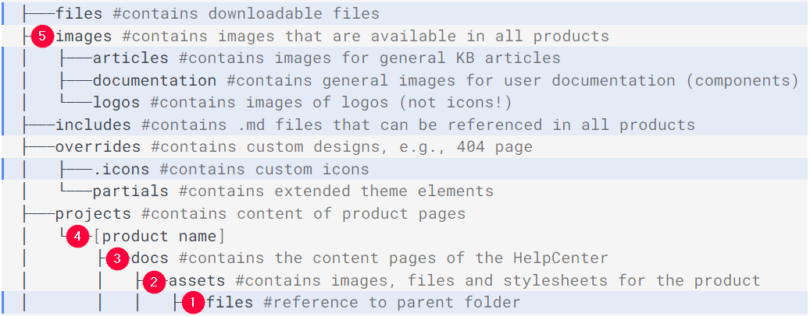
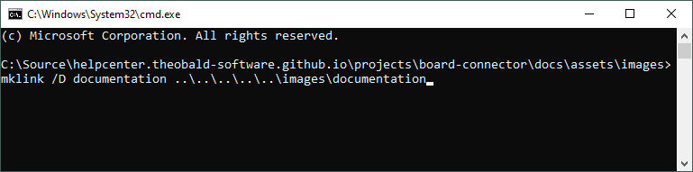

The HelpCenter uses symlinks to make general content / resources available in multiple products.
This means, each product contains symlinks that point to a [target folder](#target-folders) in the root directory of the HelpCenter repository.

!!! warning
	**Target not found**<br>
	When building previews, the console prints warnings about missing content / images, if symlinks are missing or broken.
	When pulling content from the repository, symlinks are not automatically created. Therefore, you need to manually create the symlinks on your local Windows machine.

The following symlinks are required for building previews of the HelpCenters:

| Source Folder | Command |
|-----------------|-----------------|
| `[product name]/overrides/` | `mklink /D .icons ..\..\..\overrides\.icons` |
| `[product name]/`            | `mklink /D includes ..\..\includes` |
| `[product-name]/docs/assets/` | `mklink /D files ..\..\..\..\files` |
| `[product-name]/docs/assets/images/` | `mklink /D articles ..\..\..\..\..\images\articles` |
| `[product-name]/docs/assets/images/` | `mklink /D documentation ..\..\..\..\..\images\documentation` |
| `[product-name]/docs/assets/images/` | `mklink /D logos ..\..\..\..\..\images\logos` |


Make sure to correctly count the number of folders to jump up the file tree (each number represents the amount of "..\" within the symlink).




### Create Symlinks in Windows

1. When pulling content from the HelpCenter repository, broken symlinks are displayed as a single file instead of a folder.
Delete these files, before creating local symlinks.
2. Open the Windows command prompt and navigate to one of the source folders in your local HelpCenter repository. Example: <br>
`C:\Source\helpcenter.theobald-software.github.io\projects\board-connector\docs\assets\images`
3. Enter an `mklink` command that uses the option `/D` to point to a target folder:
	```
	mklink /D name_of_new_symlink relative_path_to_target_folder
	```

	Example:<br>
	
	
4. Double-click the created symlink. If the symlink is set correctly, the symlink folder opens and the files from the target folder are available.


Repeat the steps for all source folders and products.<br>
For more information on symlinks, see [Complete Guide to Symbolic Links](https://www.howtogeek.com/16226/complete-guide-to-symbolic-links-symlinks-on-windows-or-linux/)

### Target Folders

The following folders in the HelpCenter repository are used as targets for symlinks:

- `helpcenter.theobald-software.github.io\files` 
	- contains downloadable files
- `helpcenter.theobald-software.github.io\images\articles`
	- contains images for KB articles
- `helpcenter.theobald-software.github.io\images\documentation`
	- contains images for user documentation
- `helpcenter.theobald-software.github.io\images\logos` 
	- contains custom logos
- `helpcenter.theobald-software.github.io\includes` 
	- contains .md files for articles and user documentation (for local previews)
- `helpcenter.theobald-software.github.io\overrides\.icons` 
	- contains [custom icons](markdown-sample.md/#icons)

