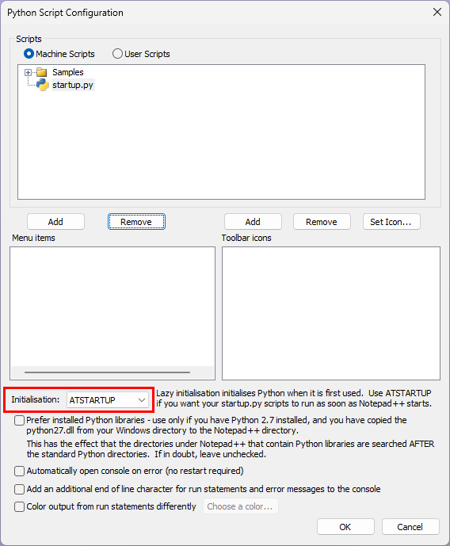
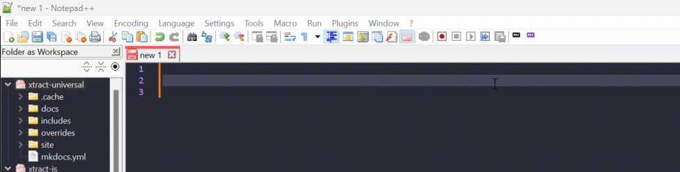
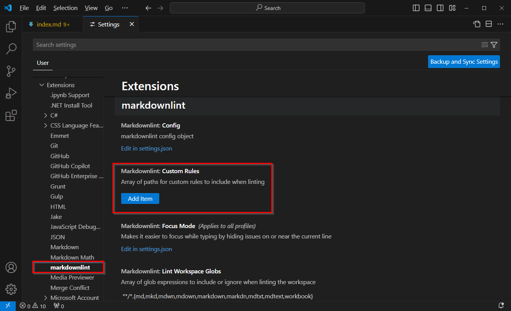
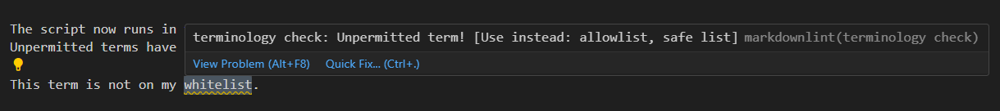

You can enable a script in Notepad++ that checks the content of your document against a local termbase.
If an unpermitted term is detected, the word is highlighted in red. When selecting the word, a drop-down list with permittted alternatives opens.

!!! note
	When an alternative consists of multiple words, the empty space is replaced with '_' due to restrictions. Example:
	"drop-down list" is displayed as "drop-down_list".

### Termbase

Unpermitted terms are collected in a json file that is part of the helpcenter repository at `helpcenter.theobald-software.github.io\docs\terminology.json`.

The json file uses the following format to define unpermitted terms and permitted alternatives:

```json
"unpermitted": ["permitted_alternative_1", "permitted_alternative_2"],
```


```json title="Example"
{
    "whitelist": ["allowlist", "safe list"],
    "blacklist": ["denylist", "blocklist"],
    "master": ["main", "primary"],
    "slave": ["secondary", "replica"],
    "dummy": ["sample", "placeholder"],
    "manpower": ["workforce", "personnel"],
    "sanity check": ["validation check", "integrity check"],
    "guys": ["folks", "everyone", "team"]
}
```


### Activate Checks in Notepad++

Follow the steps below to add a python script to Notepad++ that checks your terminology in realtime:


1. Install the PythonScript Plugin:
    - Open Notepad++.
    - Go to **Plugins > Plugins Admin**.
    - Search for **PythonScript** and install it.
    - Restart Notepad++.
2. Open the following file with administrator rights: `C:\Program Files\Notepad++\plugins\PythonScript\scripts\startup.py`.
3. Paste the following code into the `startup.py` file.

	```python	
	import json
	import re
	from Npp import *
	
	# Load forbidden terms and their alternatives from the JSON file
	with open(r'C:\Source\helpcenter.theobald-software.github.io\docs\terminology.json', 'r') as f:
	    forbidden_terms = json.load(f)
	
	# Create a regex pattern for forbidden terms
	forbidden_pattern = re.compile(r'\b(' + '|'.join(re.escape(term) for term in forbidden_terms.keys()) + r')\b', re.IGNORECASE)
	
	# Function to highlight forbidden terms
	def highlight_forbidden_terms():
	    # Setting up indicator style and color
	    editor.indicSetStyle(0, INDICATORSTYLE.FULLBOX)  # Fullbox style for highlighting
	    editor.indicSetFore(0, (255, 0, 0))  # Red color for forbidden terms
	
	    text = editor.getText()
	
	    # Search for forbidden terms in the text
	    for match in forbidden_pattern.finditer(text):
	        start_pos = match.start()
	        end_pos = match.end()
	        editor.setIndicatorCurrent(0)
	        editor.indicatorFillRange(start_pos, end_pos - start_pos)  # Highlight the forbidden term
	
	# Function to suggest alternatives if a forbidden term is selected
	def suggest_alternatives_on_selection():
	    # Get the start and end positions of the selection
	    selection_start = editor.getSelectionStart()
	    selection_end = editor.getSelectionEnd()
	
	    # Ensure the selection is non-empty
	    if selection_start == selection_end:
	        return
	
	    # Get the selected word
	    selected_word = editor.getTextRange(selection_start, selection_end).lower()
	
	    # Check if the selected word is a forbidden term
	    if selected_word in forbidden_terms:
	        # Get the list of alternatives
	        alternatives = forbidden_terms[selected_word]
	
	        # Replace spaces in multi-word alternatives with underscores temporarily
	        alternatives_with_underscores = [alt.replace(' ', '_') for alt in alternatives]
	
	        # Show a dropdown with alternatives, using a space as the separator
	        editor.autoCShow(0, ' '.join(alternatives_with_underscores))
	
	# Function to handle when a user selects an alternative from the dropdown
	def on_autocomplete_selection(args):
	    # Get the start and end positions of the current selection
	    selection_start = editor.getSelectionStart()
	    selection_end = editor.getSelectionEnd()
	
	    # Get the selected alternative from the dropdown
	    selected_alternative = args['text']
	
	    # Replace underscores with spaces in the selected alternative
	    selected_alternative = selected_alternative.replace('_', ' ')
	
	    # Replace the forbidden term with the selected alternative
	    if selection_start != selection_end:
	        # Ensure replacement by covering the exact range of the selected text
	        editor.setTargetStart(selection_start)
	        editor.setTargetEnd(selection_end)
	        editor.replaceTarget(selected_alternative)
	
	        # Clear the auto-completion list after replacement
	        editor.autoCCancel()
	
	# Event handler for text modification
	def on_text_modified(args):
	    # Highlight forbidden terms whenever the text is modified
	    highlight_forbidden_terms()
	
	# Set up event listener for text modification
	editor.callback(on_text_modified, [SCINTILLANOTIFICATION.MODIFIED])
	
	# Event handler for selection changes
	def on_selection_changed(args):
	    suggest_alternatives_on_selection()
	
	# Set up event listener for selection changes to trigger suggestions
	editor.callback(on_selection_changed, [SCINTILLANOTIFICATION.UPDATEUI])
	
	# Initial highlighting and setup
	highlight_forbidden_terms()
	```
	
4. Save the file and open Notepad++.
5. Navigate to **Plugin > Python Script > Configuration...**.
6. In the section *Scripts*, select **Machine Scripts**. The startup.py file should be listed in the file tree menu.
7.  Select *ATSTARTUP* as the initialization method.<br> 

8. Click **[OK]** and restart Notepad++.

The script now runs in the background and checks the current document against the `terminology.json` file for unpermitted terms.

{:class="img-responsive" style="border:1px solid black;"}

### Activate Checks in VS Code

Follow the steps below to make Visual Studio Code check your terminology in realtime:

1. Install the [Markdownlint](https://marketplace.visualstudio.com/items?itemName=DavidAnson.vscode-markdownlint) extension. 
This extension allows you to include a library of rules to encourage standards and consistency. 
2. To add a custom rule, create a new java script file, e.g., in the installation directory of Visual Studio Code:<br>
`C:\Users\AppData\Local\Programs\Microsoft VS Code\custom-rules\term-checker.js`.
3. Copy the following code into the java script file:

	```java
	const fs = require('fs');
	const path = require('path');

	// Load the JSON file with unpermitted terms
	const termsPath = "C:/Source/helpcenter.theobald-software.github.io/docs/terminology.json";
	const terms = JSON.parse(fs.readFileSync(termsPath, 'utf8'));

	module.exports = {
		names: ["terminology check"],
		description: "Unpermitted term!",
		tags: ["terminology"],
		function: function rule(params, onError) {
			// Iterate through each line in the Markdown document
			params.tokens.forEach((token) => {
				if (token.type === "paragraph_open") {
					const lineNumber = token.lineNumber;
					const lineText = params.lines[lineNumber - 1];

					// Check for unpermitted terms
					Object.entries(terms).forEach(([unpermittedTerm, alternatives]) => {
						const regex = new RegExp(`\\b${unpermittedTerm}\\b`, 'gi');
						let match;
						while ((match = regex.exec(lineText)) !== null) {
							onError({
								lineNumber,
								detail: `Use instead: ${alternatives.join(", ")}`,
								range: [match.index + 1, unpermittedTerm.length],
							});
						}
					});
				}
			});
		}
	};
	```
4. Save the file and open Visual Studio Code.
5. Navigate to **File > Preferences > Settings** and scroll down to the settings of your lint extension.<br>

6. Enter the path to the java script of the new custom rule, e.g.
`C:\Users\AppData\Local\Programs\Microsoft VS Code\custom-rules\term-checker.js`
7. Open a markdown file in Visual Studio Code and test the rule. Example:<br>


The script now runs in the background and checks the current document against the termbase.json file for unpermitted terms. 
Unpermitted terms have a wavy green underline. Hover over the word to display alternative terms. 

!!! note
	Most rules of the Markdownlint extension are enabled by default. 
	They cause similar highlights in your markdown text. You can disable rules via **File > Preferences > Settings > Extensions > markdownlint > Edit in settings.json**. 
	In the settings.json file, add the rules you want to disable.
	Example:

	```json
	"markdownlint.config": {
		"MD013": false,   // Disables line-length rule
		"MD033": false,   // Disables inline HTML rule
		"MD041": false,   // Disables first-line header rule
		"MD007": { "indent": 4 }  // Configures unordered list indentation to 4 spaces
	}
	```
	
!!! tip
	You can add additional rules, e.g., checks for passive voice or checks for max number of words in a sentence:
	
	```java
	module.exports = {
		names: ["Simplified Technical English"],
		description: "Ensure the text complies with ASD-STE100",
		tags: ["style", "STE"],
		function: function rule(params, onError) {

			const passiveVoicePattern = /\b(used|done|was|were|are|been|being)\s+\w+ed\b/i; // Matches passive voice.

			params.lines.forEach((line, lineNumber) => {

				// Check for passive voice
				if (passiveVoicePattern.test(line)) {
					onError({
						lineNumber: lineNumber + 1,
						detail: "Avoid passive voice; use active voice instead.",
						context: line,
					});
				}

				// Check if sentence exceeds 20 words
				const sentences = line.split(/[.?!]/); // Split by sentence-ending punctuation
				sentences.forEach((sentence) => {
					const wordCount = sentence.trim().split(/\s+/).length; // Count words in the sentence
					if (wordCount > 20) {
						onError({
							lineNumber: lineNumber + 1,
							detail: `Sentence exceeds 20 words (${wordCount} words). Consider breaking it into shorter sentences.`,
							context: sentence.trim(),
						});
					}
				});
			});
		},
	};

	```