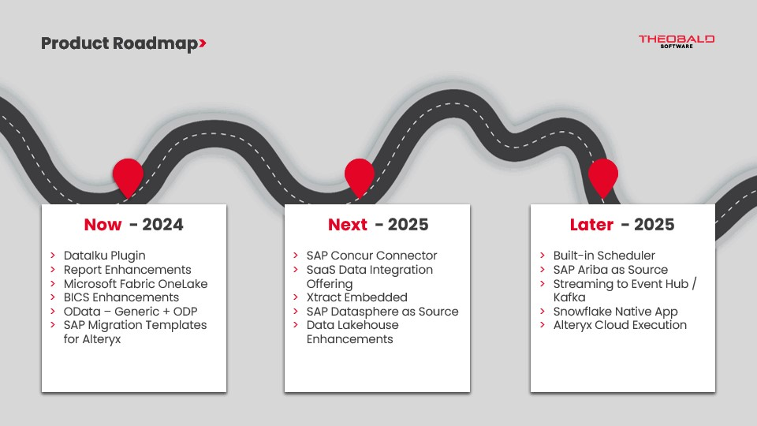

The idea is to publish product roadmaps as part of the HelpCenter.
The following options are available:

- [Neoteroi Gantt Plugin](gantt-diagram.md)
- [Neoteroi Timeline Plugin](timeline.md)
- [Embed .pdf files](embed-pdf.md)

## Considerations

- If roadmaps are to be released in every HelpCenter, there has to be a roadmap specific to every product
- Roadmaps can be hosted in the HelpCenter (changes require the involvement of a technical writer or developer) or separately (where product management and dev can make changes themselves)
- Should we also host the internal roadmap here that includes developer and kaboard information for support?

=== "Current External Roadmap (png export)"

	

=== "Current Internal Roadmap"

	{ type=application/pdf style="height:85vh;width:100%" }