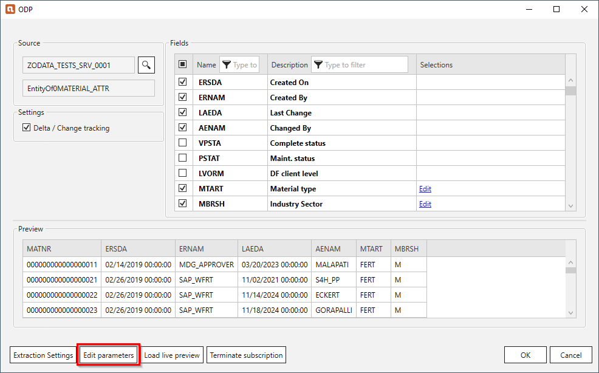
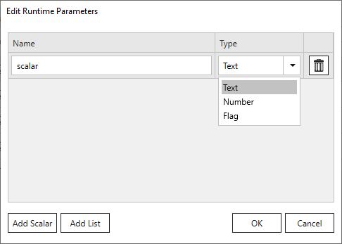
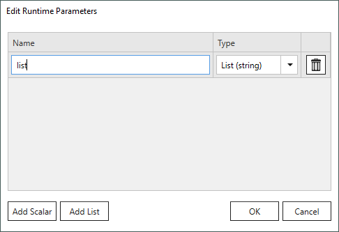
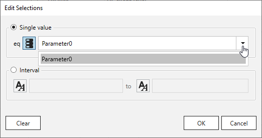
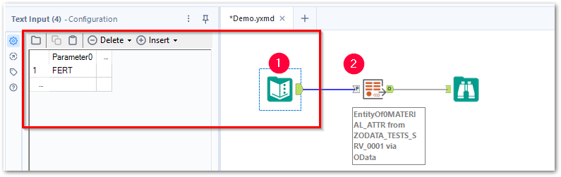

Runtime parameters are are placeholders for values that are passed at runtime.
They can be created in context of [Selections](selections.md).

### Create Runtime Parameters 

There are two types of runtime parameters:

=== "Scalar parameters"

	Scalar runtime parameters represent a single value.  
	Follow the steps below to create a scalar runtime parameter:
	
	1. In the main window of the component click **[Edit Parameters]**. The window “Edit Runtime Parameters” opens. 
	{:class="img-responsive"}
	2. Click **[Add Scalar]** to define scalar parameters to be used as placeholders for actual values.
	The placeholders need to be populated with actual values at runtime. 
	{:class="img-responsive"}
	
		!!! tip
			Parameter0..-n is the default naming for the added parameter. You can enter a name of your choice.
		
	3. Select one of the following data types from the drop-down menu.
	The data types may correlate to SAP data types.

		| Type | Description |
		|--------|-------------|
		| *Text* | Can be used for any type of SAP selection field. |
		| *Number* | Can be used for numeric SAP selection fields. |
		| *Flag* | Can only be used for SAP selection fields THAT require an ‘X’ (true) or a blank ‘‘ (false) as input value. |

	4. Click **[OK]** to confirm.

	The runtime parameters are now available in the component.
	
=== "List parameters"

	List runtime parameters represent multiple values.  
	Follow the steps below to create a list runtime parameter:
	
	1. In the main window of the component click **[Edit Parameters]**. 
	The window “Edit Runtime Parameters” opens. 
	{:class="img-responsive"}
	2. Click **[Add List]** to define list parameters that contain multiple values separated by commas e.g., 1,10 or “1”, “10”.
	The placeholders need to be populated with actual values at runtime.  
	{:class="img-responsive"}
	
		!!! tip
			Parameter0..-n is the default naming for the added parameter. You can enter a name of your choice.
		
	3. Click **[OK]** to confirm.

	The runtime parameters are now available in the component.

### Assign Runtime Parameters
Follow the steps below to assign the runtime parameters to selections.

1. In the main window of the component, click the **[Edit]** button next to the selection you want to parameterize. 
The window "Edit Selections" opens.
2. Select a filter option, see [Edit Selections](selections.md/#edit-selections).
3. Click the icon button next to the input field to switch between static values (:runtime-parameters-static:) and runtime parameters (:runtime-parameters-dynamic:). 
If no icon button is available, [create a runtime parameter](#create-runtime-parameters). 
 
4. Select a runtime parameter from the dropdown-list.
5. Click **[OK]** to confirm the input.

### Pass Values at Runtime

Follow the steps below to replace runtime parameters with actual values at runtime:

1. [Create and assign runtime parameters](#create-runtime-parameters) in the Xtract ODP(OData) component.
2. Close the Xtract ODP(OData) component.
3. Define the input values for the runtime parameters :number-1:, e.g., single values or lists. 
{:class="img-responsive" }
4. Make sure that the data type of the input values match the data type of the corresponding runtime parameter.
5. Make sure that the name of the input matches the name of the corresponding runtime parameter. The values of the input is automatically assigned to a runtime parameter by the same name.
6. Connect the input to the Xtract ODP(OData) component using the input anchor "P" :number-2:.
7. Run the workflow to test if the runtime parameters are assigned correctly.

!!! note 
	Parameterization via input anchors is supported as of Xtract for Alteryx version 1.19. 
	When using an older version of Xtract for Alteryx, parameterize Xtract components using batch macros, see [Parameterizing via Batch Macros](../../knowledge-base/parameterization-via-batch-macros.md).

