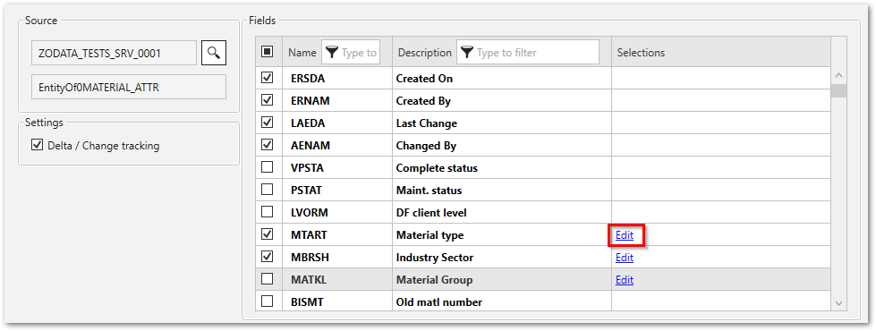
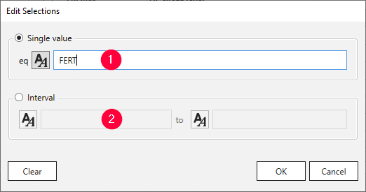

This page shows how to filter the data that is extracted by the Xtract ODP(Odata) component.
Selections limit the result set of the Xtract ODP(Odata) component to extract only records that match the selection.

### Edit Selections

Follow the steps below to edit selection fields and filter data:

1. In the subsection Fields, click **Edit** next to the field you want to edit. The window “Edit selection” opens.<br>
{:class="img-responsive"}	
2. Select one of the following filter types:
	- :number-1: **Single** : only extract data that equals a single specified value.
	- :number-2: **Interval**: only extract data that lies within a specified range of values.
	
	{:class="img-responsive"}	
	
3. Enter a values directly into the input fields or assign existing [runtime parameters](edit-runtime-parameters.md) to the selection.

	!!! note
		When runtime parameters are available, you can use the icon button next to the input field to switch between static values (:runtime-parameters-static:) and runtime parameters (:runtime-parameters-dynamic:).

4. Click **[OK]** to confirm your input.
5. Click **[Load live preview]** in the main window of the component to check the result of your selection. 
If runtime parameters are defined, you are prompted to populate the parameters with actual values.

When a filter is defined, the filter statement is displayed next to the **Edit** option.

### Data Format

Use the following internal SAP representation for input:
- Date: The date 01.01.1999 has the internal representation 19990101 (YYYYMMDD).
- Year period: The year period 001.1999 has the internal representation 1999001 (YYYYPPP).
- Numbers: Numbers must contain the leading zeros, e.g., customer number 1000 has the internal representation 0000001000.

!!! warning
	**Values accept only the internal SAP representation.**<br>
	Input that does not use the internal SAP representation results in error messages. <br>
	Use the internal SAP representation. <br> Example: 
	```
	ERPConnect.ABAPProgramException: RfcInvoke failed(RFC_ABAP_MESSAGE): Enter date in the format \_.\_.\_
	```

