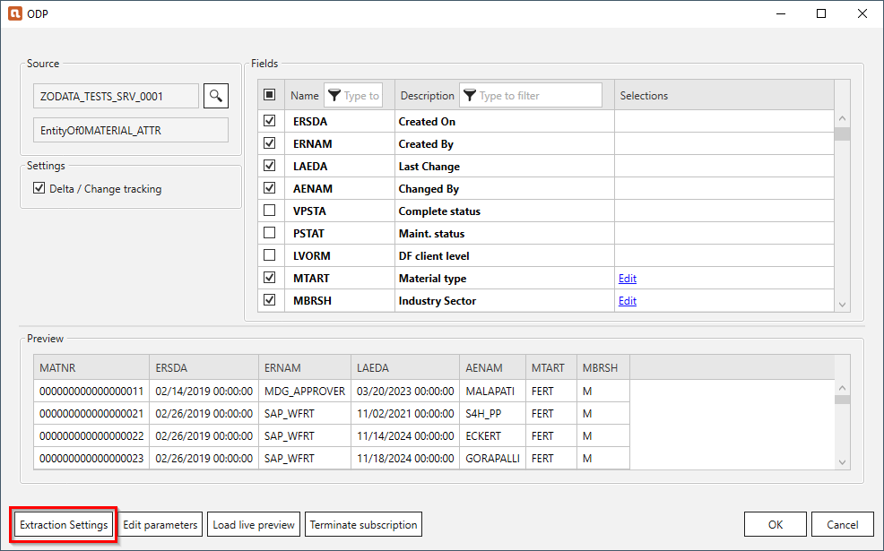
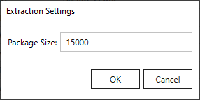

This page contains an overview of the Extraction Settings in the Xtract ODP(OData) component. 
To open the Extraction Settings, click **[Extraction Settings]** in the main window of the component.

{:class="img-responsive"}

### Extraction Settings

{:class="img-responsive"}

#### Package Size

The extracted data is be split into packages of the defined size. The default value is 50000 lines. 
A package size between 20000 and 50000 is advisable for large amounts of data. 0 means no packaging. 
Not using packaging can lead to an RFC timeout for large data extracts.
	
!!! warning   
	**RFC_ERROR_SYSTEM_FAILURE - No more storage space available for extending an internal table** 
    To avoid a memory overflow on the SAP source system and to avoid huge overheads, choose a package size that suits your memory capacity.

