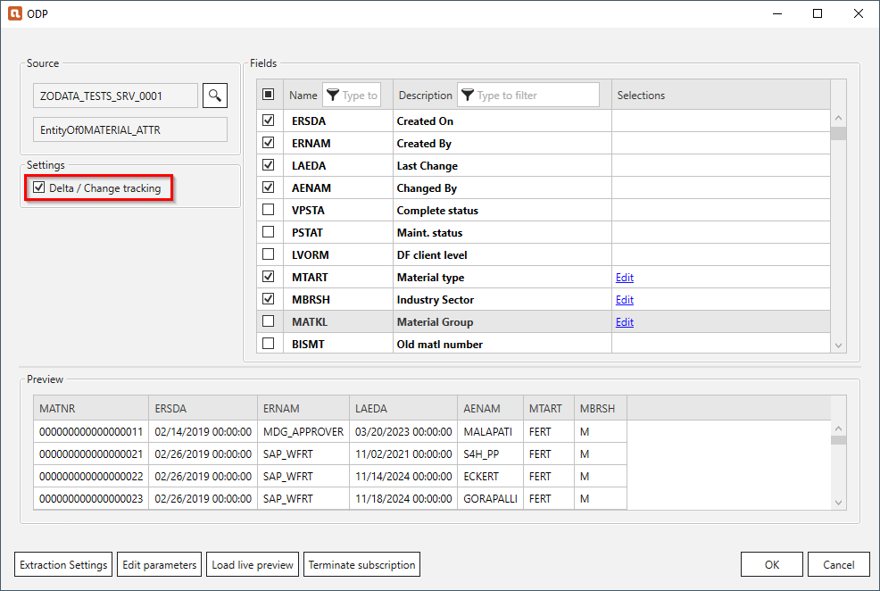
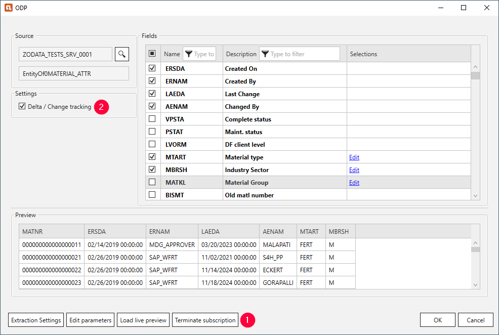

The Xtract ODP (OData) component acts as a subscriber to data providers to extract delta data from the data provider. 

### Subscribe to a Data provider

To initialize delta extractions, activate the checkbox **Delta / Change tracking** and run the workflow once.
The first run extracts all data that match the set selection criteria.
After the initialization, the Xtract ODP (OData) component only extracts data added or changed on the SAP system since the last run. 

!!! tip
	Use SAP transaction *ODQMON* to display information about active subscribers in SAP.
	
#### Limitations

Delta subscriptions are limited to one SAP user per service. 
The ODP framework has to be exposed in multiple different services for a single user to have multiple delta subscriptions.

### Terminate Subscriptions

To terminate a subscription in Xtract for Alteryx, click **[Terminate subscription]** :number-1: and deactivate the checkbox **Delta / Change tracking** :number-2:.

