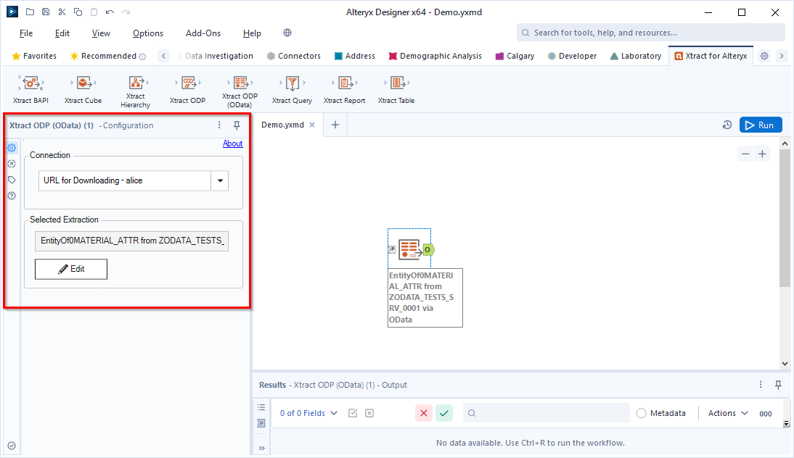

This page contains an overview of the settings in the configuration menu of the Xtract ODP(OData) component.
To display the configuration menu, select an Xtract ODP(OData) component in the workflow.

{:class="img-responsive" style="border:1px solid black"} 

### About

At the top of the configuration menu, click **About** to display information about the software version and license.

### Connection

The section *Connection* of the configuration menu defines which [SAP Connection](../sap-connection/index.md) is used for the component.
