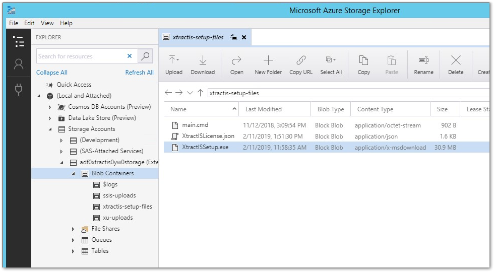
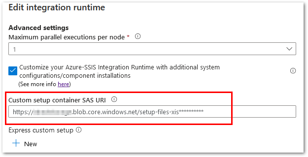

{ .lg .middle width="30px"} This section shows how to set up Xtract IS on an Azure SSIS Integration Runtime environment.

### About Xtract IS for Azure

SSIS packages that contain [Xtract IS](documentation/introduction.md) components can be run on an [Azure SSIS Integration Runtime (IR)](https://docs.microsoft.com/en-us/azure/data-factory/create-azure-ssis-integration-runtime).
Instead of deploying the developed packages to an on-prem SSIS server, the packages are deployed to an Azure SSIS-IR to be scheduled and run in the Azure cloud.
In this scenario Xtract IS is licensed per Azure SSIS-IR using the [Azure SSIS-IR Cluster ID](knowledge-base/determine-the-azure-cluster-ID.md).
This license model is distributed as "Xtract IS for Azure".

How it works:

-   :yunio-edit: __Development of SSIS Packages__

    ---

    - Install Xtract IS on an on-prem Visual Studio/SSDT environment, see [Xtract IS - Installation](documentation/setup/installation.md).
	- Develop SSIS packages with Xtract IS and deploy them to an Azure SSIS-IR.

-   :yunio-run: __Running SSIS Packages__

    ---

    - Install Xtract IS on an Azure SSIS-IR, see [Install Xtract IS For Azure](#install-xtract-is-for-azure).
	- Schedule and run the deployed SSIS packages in the Azure cloud.

<!---
{:class="img-responsive"}
-->

### Prerequisites

- [Azure-SSIS Integration Runtime (IR), based on Microsoft's Azure Data Factory v2 (ADFv2)](https://docs.microsoft.com/en-us/azure/data-factory/create-azure-ssis-integration-runtime)
- The SAP system needs to be accessible from the Azure SSIS-IR, e.g., through a VPN tunnel or a self-hosted Integration Runtime (SHIR), see [Microsoft Documentation: Configure a self-hosted IR as a proxy for an Azure SSIS-IR in Azure Data Factory](https://docs.microsoft.com/en-us/azure/data-factory/self-hosted-integration-runtime-proxy-ssis). 
- When creating the SSIS packages, make sure to use the correct SQL Server Data Tools (SSDT) for your SQL Server Integration Services (SSIS) version, see [Microsoft Documentation: Download SQL Server Data Tools (SSDT) for Visual Studio](https://docs.microsoft.com/en-us/sql/ssdt/download-sql-server-data-tools-ssdt?view=sql-server-ver15) for details.

### Setup an Azure SSIS-IR Environment

Refer to the Microsoft documentation to set up the Azure-SSIS Integration Runtime environment:

- [Provision the Azure-SSIS Integration Runtime in Azure Data Factory with Azure portal UI](https://docs.microsoft.com/en-us/azure/data-factory/tutorial-deploy-ssis-packages-azure) 
- [Provision the Azure-SSIS Integration Runtime in Azure Data Factory with PowerShell](https://docs.microsoft.com/en-us/azure/data-factory/tutorial-deploy-ssis-packages-azure-powershell)

Once the environment runs, develop a simple SSIS package that does NOT contain any Xtract IS  {{ components }} and deploy and run the package on the Azure SSIS-IR.
If the SSIS package runs is successfully, proceed to set up Xtract IS for Azure on the Azure SSIS-IR. 

!!! note
    By default Azure automatically updates the Microsoft integration runtime. 
	To avoid possible compatibility issues with Xtract IS for Azure, disable automatic updates.

### Install Xtract IS for Azure

Follow the steps below to create an Azure Storage container for Xtract IS and add the container to an Azure SSIS-IR:

1. Follow the instructions in the [Microsoft Documentation: Standard Custom Setup](https://docs.microsoft.com/en-us/azure/data-factory/how-to-configure-azure-ssis-ir-custom-setup#standard-custom-setup) to set up 3rd party extensibility for Azure SSIS-IR. 
Only the part of the Azure storage container setup and the creation of a Shared Access Signature is relevant.
2. Copy the following files provided in the [customer portal](https://my.theobald-software.com/) into the Azure storage container:
	
	- *XtractISSetup.exe*
	- [main.cmd](https://cdn-files.theobald-software.com/download/XtractIS/main.cmd)
	- [XtractISLicense.json](documentation/setup/license.md) (license file provided after purchasing Xtract IS for Azure)

	{:class="img-responsive" }
3. Add Azure Storage Container to SSIS-IR:
	- When provisioning the Azure SSIS-IR via the Azure Portal UI, enter the Azure Storage container's SAS URI in the *Custom setup container SAS URI* field.  
	{:class="img-responsive" }
    - When provisioning the Azure SSIS-IR via [PowerShell](https://docs.microsoft.com/de-de/azure/data-factory/tutorial-deploy-ssis-packages-azure-powershell#create-an-azure-ssis-integration-runtime) populate the parameter `-SetupScriptContainerSasUri` with the Azure Storage container's SAS URI.
4. Start the Integration Runtime. 
During the startup of the Integration Runtime the *main.cmd* is executed, which triggers an unattended installation of Xtract IS for Azure on the SSIS-IR.

The startup process of the Azure SSIS-IR might take up to 20 minutes.

!!! tip "Recommendation"
	A regular update of the software is crucial for stable performance.
	Check the [changelog](changelog.md) for updates. 
	A newer version can be installed over the older version.

******
#### Related Links
- [Knowledge Base Article: Determine the Azure SSIS-IR Cluster ID](knowledge-base/determine-the-azure-cluster-ID.md)
- [Knowledge Base Article: Execute SSIS Packages between Cloud Data Stores and a Private Network Data Storage](knowledge-base/execute-ssis-packages-between-cloud-data-stores-and-a-private-network-data-storage.md)

