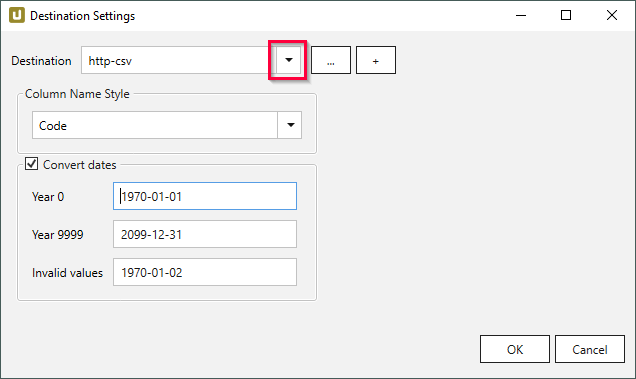

The following article shows how to run Xtract Universal in a virtual machine on an AWS EC2.

AWS enables running virtual servers (instances) in the cloud, see [AWS Documentation: EC2](https://docs.aws.amazon.com/AWSEC2/latest/WindowsGuide/concepts.html).
Theobald Software offers Xtract Universal as an [Amazon Machine Image (AMI)](https://docs.aws.amazon.com/AWSEC2/latest/WindowsGuide/AMIs.html) for the following customer purposes:
- Xtract Universal evaluation
- Hosting of Xtract Universal in the cloud

The Xtract Universal AMI can be selected when launching an instance in AWS.

## Pre-Configured Settings

When starting an Xtract Universal instance, the following settings are pre-configured:

|          | Configuration  |  Resources |
|:---------|:-------------|:------|
| License  | Xtract Universal is already installed and running with a 30-days trial license. You can replace the trial license with your regular license. | [Documentation: Licensing](../documentation/setup/license.md) |
| Software Updates | The pre-installed version of Xtract Universal is displayed in the AWS marketplace. Make sure to keep Xtract Universal up-to-date with the latest software releases, see [Xtract Universal Changelog](../changelog.md). | [Documentation: Installation and Update](../documentation/setup/update.md) |
| Server Settings | The webserver is pre-configured with a self-signed TLS certificate and can be accessed in a browser via ``https://xtractuniversal:8165/`` from within the rdp session. | [Documentation: Server Settings](../documentation/server/server-settings.md) |
| Data Extractions | There are no default SAP data extractions. To get started with Xtract Universal, [create an SAP connection](../getting-started.md/#connect-to-sap) and [create new extractions](../getting-started.md/#create-an-extraction). | [Documentation: Getting Started](../getting-started.md) |

## Prerequisites

- Access to an AWS account
- Access to the [EC2](https://docs.aws.amazon.com/AWSEC2/latest/WindowsGuide/concepts.html) console

## Set Up Xtract Universal in AWS

There are multiple ways to set up Xtract Universal in EC2:

=== "Set Up from the AWS Marketplace"

	1. Log in to AWS marketplace and open the [Xtract Universal product page in AWS](https://aws.amazon.com/marketplace/pp/prodview-anarfo2osmhl4?sr=0-1&ref_=beagle&applicationId=AWSMPContessa#pdp-reviews).
	2. Click **[Continue to Subscribe]** to [subscribe](https://docs.aws.amazon.com/marketplace/latest/buyerguide/buyer-ami-contracts.html) to Xtract Universal. 
	
	3. Click **[Continue to Configuration]** to select a software version and a region for hosting Xtract Universal.
	4. Click **[Continue to Launch]**.  
	
	5. In **Choose Action** select *Launch through EC2* to access all options for configuring a virtual machine in EC2. 
	
	6. Click **[Launch]**. The EC2 console opens.
	7. Set up your virtual machine, see [AWS Documentation: Launch an Instance](https://docs.aws.amazon.com/AWSEC2/latest/WindowsGuide/EC2_GetStarted.html#ec2-launch-instance).
	The Xtract Universal AMI is already selected. 
	
	8. Start the EC2 instance and connect to it, see [AWS Documentation: Connect to an Instance](https://docs.aws.amazon.com/AWSEC2/latest/WindowsGuide/EC2_GetStarted.html#ec2-connect-to-instance-windows).
	9. When connected, the Xtract Universal Designer is located on the Desktop. Start the Xtract Universal Designer.
	10. Set up an SAP connection and extractions, see [Documentation: Getting Started](../getting-started.md).

=== "Set Up from the EC2 Console"

	1. Open the [Amazon EC2 console](https://console.aws.amazon.com/ec2/).
	2. In the EC2 console dashboard, click **[Launch instance]**. 
	
	3. In the *Quick Start* tab of **Application and OS Images (Amazon Machine Image)** click **[Browse more AMIs]**.  
	
	4. Enter "Xtract Universal" in the search bar. Xtract Universal is listed under *AWS Marketplace AMIs*.
	5. Click **[Select]**. The application returns to the EC2 console. 
	
	6. Set up your virtual machine, see [AWS Documentation: Launch an Instance](https://docs.aws.amazon.com/AWSEC2/latest/WindowsGuide/EC2_GetStarted.html#ec2-launch-instance).
	The Xtract Universal AMI is already selected. 
	
	7. Start the EC2 instance and connect to it, see [AWS Documentation: Connect to an Instance](https://docs.aws.amazon.com/AWSEC2/latest/WindowsGuide/EC2_GetStarted.html#ec2-connect-to-instance-windows).
	8. When connected, the Xtract Universal Designer is located on the Desktop. 
	9. Start the Xtract Universal Designer and click **[:designer-connect: Connect]** to [connect to the Xtract Universal Server](../documentation/designer.md/#connect-the-designer-to-a-server). 

	!!! note
		If you are not already [subscribed](https://docs.aws.amazon.com/marketplace/latest/buyerguide/buyer-ami-contracts.html) to Xtract Universal, launching the EC2 instance automatically adds the subscription.

## Getting Started on AWS

After Xtract Universal is set up on AWS,  the following steps are required to start data extractions from SAP:
- [Connect Xtract Universal to an SAP system](#connect-to-sap)
- [Create an extraction](#create-an-extraction) that defines which SAP data to extract
- [Testrun the extraction](#run-an-extraction) in the Xtract Universal Designer to preview the extracted data
- [Add a destination](#write-data-to-a-target-environment) to connect Xtract Universal to a target environment
- [Assign a destination to your extraction](#assign-a-destination-to-an-extraction)

### Connect to SAP

Before connecting to SAP for the first time, set up an SAP dialog user with the necessary [SAP user rights](../documentation/setup-in-sap/sap-authority-objects.md/#general-authorization-objects).

1. In the main window of the Designer, click **[:material-plus-thick:New]**. The window "Change Source" opens. 

2. Enter a name for the SAP connection in the field **Name**, e.g., *s4hana*, *bw*, etc.
3. In the *General* tab, enter the system details of your SAP system.
Input values for the SAP connection can be found in the *Properties* of the SAP Logon Pad or they can be requested from the SAP Basis team. 
{:class="img-responsive" }
4. In the *Authentication* tab, enter the SAP credentials of the SAP dialog user.
5. Click **[Test designer connection]** to validate the connection between the Xtract Universal Designer and the SAP system.
6. Click **[Test server connection]** to validate the connection between the Xtract Universal Server and the SAP system.
7. Click **[OK]** to save the SAP source. 

For more information, see [SAP Connection](../documentation/sap-connection/index.md).

!!! tip
	To edit a source or to create new sources, navigate to **Server > Manage Sources** in the menu bar.
	
### Create an Extraction

Extractions are the main entities of Xtract Universal. 
They define what data to extract from SAP and where to write the data.

=== "Create Extractions"

	Follow the steps below to create a new extraction:

	1. In the main window of the Designer, click **[:material-plus-thick:New]**. The window "Create Extraction" opens.
	2. Select an SAP Connection from the drop-down menu in **Source** :number-1:. 
	
	3. Enter a name for the extraction :number-2:.
	4. Select one of the following extraction types :number-3::

		|  extraction type  |  Description   |  
		|----------|-------------|
		| [:component-bapi: {{ bapi }}](../documentation/bapi/index.md) | Execute BAPIs and Function Modules. |
		| [:component-bwcube: {{ bwcube }}](../documentation/bwcube/index.md) | Extract data from SAP BW InfoCubes and BEx Queries. |
		| [:component-hierarchy: {{ hierarchy }}](../documentation/hierarchy/index.md) | Extract Hierarchies from an SAP BW / BI system. |
		| [:component-deltaq: {{ deltaq }}](../documentation/deltaq/index.md) | Extract data from DataSources (OLTP) and extractors from ERP and ECC systems. |
		| [:component-odp: {{ odp }}](../documentation/odp/index.md) | Extract data via the SAP Operational Data Provisioning (ODP) framework. |
		| [:component-ohs: {{ ohs }}](../documentation/ohs/index.md) | Extract data from InfoSpokes and OHS destinations. |
		| [:component-query: {{ query }}](../documentation/query/index.md) | Extract data from ERP queries. **Note: BEx queries are covered by {{ bwcube }}**. |
		| [:component-report: {{ report }}](../documentation/report/index.md) | Extract data from SAP ABAP reports. | 
		| [:component-table: Table](../documentation/table/index.md) | Extract data from SAP tables and views. |
		| [:component-table-cdc: {{ tableCDC }}](../documentation/table-cdc/index.md) | Extract delta data from SAP tables and views. |
		
	5. Click **[OK]**. The main window of the extraction type opens automatically. 
	Follow the instructions in the documentation of the selected extraction type to set up the extraction.

=== "Create a Simple Extraction for Beginners"

	Follow the steps below to extract customer master data from the SAP table KNA1:

	1. In the main window of the Designer, click **[:material-plus-thick:New]**. The window "Create Extraction" opens.
	2. Select an SAP Connection from the drop-down menu in **Source** :number-1:. 
	
	3. Enter a name for the extraction :number-2:.
	4. Select the **Table** extraction type :number-3:.
	5. Click **[OK]**. The main window of the extraction type opens automatically.
	6. In the main window of the extraction type, click **[:material-plus-thick:Add]** to look up an SAP table. The window "Table Lookup" opens. 
	
	7. In the field **Table Name**, enter the name of the table to extract (KNA1) :number-1:. Use wildcards (*) if needed. 
	
	8. Click **[:magnifying-glass:]** :number-2:. Search results are displayed.
	9. Select the table KNA1 :number-3: and click **[OK]**. The application returns to the main window of the extraction type.
	10. Optional: Select the table columns you want to extract. By default all columns are extracted. 
	For more information on filter options and advanced settings, see, [Define the Table extraction type](../documentation/table/index.md/#define-the-table-extraction-type)
	11. Click **[Load Live Preview]** to display a live preview of the first 100 records.
	12. Click **[OK]** to save the extraction type.

	The extraction is now listed in the main window of the Designer. To edit an extraction, double-click the extraction.

### Run an Extraction

Extractions can be run directly in the Xtract Universal Designer or via [web service](../web-api.md) and [command line](../documentation/execute-and-automate/call-via-commandline.md).
Follow the steps below to testrun your extraction in the Designer:

1. In the main window of the Designer, select an extraction :number-1: and click **[:designer-run:Run]** :number-2:. The window "Run Extraction" opens. 

2. Click **[Run]** :number-3: to execute the extraction.
The status in the subsection *General Info* indicates if the extraction finished successfully.
3. Open the *Output* tab to view the extracted data :number-4:. 

For more information, see [Execute and Automate](../documentation/execute-and-automate/index.md).

### Write Data to a Target Environment

<!---
this script generates a link to the destination details of the selected destination (in step 5)
the option in the list must be set as follows:
	<option value="name-of-the-md-file-of-the-destination">DisplayedName</option>
	
-->
   
  
Xtract Universal allows you to load data to a wide range of target environments, including databases, cloud storages, BI tools, etc.
By default, extractions use the [**http-csv**](../documentation/destinations/csv-via-http.md) destination as a target environment.

Follow the steps below to add a new destination to Xtract Universal:

1. In the main window of the Designer, navigate to **Server > Manage Destinations**. The window “Manage Destinations” opens. 

2. Click **[Add]** to create a new destination. The window "Destination Details" opens. 

3. Enter a **Name** for the destination.
4. Select a destination type from the drop-down menu. 
A list of connection details opens.
5. Fill out the destination details to connect to the destination. 
Destination details vary depending on the destination type.
For more information about destination details, select your destination: <select name="destinationlist" id="destination" onChange="getSelectedValueDetails();" style="font-family:'Poppins'; font-size:16px; padding-top:3px; padding-bottom:3px;">
    <option value=" " disabled selected>Select a destination</option>
	<option value="alteryx">Alteryx</option>
	<option value="amazon-aws-s3">Amazon S3</option>
	<option value="amazon-redshift">Amazon Redshift</option>
	<option value="dataiku">Dataiku</option>
	<option value="exasol">EXASolution</option>
    <option value="csv-flat-file">Flat File CSV</option>
    <option value="json-flat-file">Flat File JSON</option>
    <option value="parquet">Flat File Parquet</option>
	<option value="google-cloud-storage">Google Cloud Storage</option>
	<option value="csv-via-http">HTTP CSV</option>
	<option value="json-via-http">HTTP JSON</option>
	<option value="huawei">Huawei Cloud OBS</option>
	<option value="ibm-db2">IBM Db2</option>
	<option value="knime">KNIME</option>
	<option value="azure-storage">Microsoft Azure Storage</option>
	<option value="azure-synapse-analytics">Microsoft Azure Synapse Analytics</option>
	<option value="microsoft-fabric-onelake">Microsoft Fabric (OneLake)</option>
	<option value="Power-BI-Connector">Microsoft Power BI</option>
	<option value="server-report-services">Microsoft Power BI Report Server</option>
	<option value="sharepoint">Microsoft SharePoint</option>
	<option value="microsoft-sql-server">Microsoft SQL Server</option>
	<option value="mysql">MySQL</option>
	<option value="oracle">Oracle</option>
	<option value="postgreSQL">PostgreSQL</option>
	<option value="qliksense-qlikview">QlikSense and QlikView</option>
	<option value="salesforce">Salesforce</option>
	<option value="sap-hana">SAP HANA</option>
	<option value="snowflake">Snowflake</option>
	<option value="tableau">Tableau</option>
  </select>
5. Click **[OK]** to confirm your input.

The destination is now available and can be assigned to extractions.

#### Assign a Destination to an Extraction

<!---
this script generates a link to the destination settings of the selected destination (in step 4)
the option in the list must be set as follows:
	<option value="name-of-the-md-file-of-the-destination">DisplayedName</option>
-->
   
  
Extractions write data to their assigned destination.
Follow the steps below to assign a destination to an extraction:

1. In the main window of the Designer, select an extraction.
2. Click **[:designer-destination:Destination]**. The window “Destination Settings” opens. 
{:class="img-responsive"}
3. In the “Destination Settings” window, select a destination from the drop down menu. 
{:class="img-responsive"}
4. Optional: change the destination settings. 
Destination settings are specific to the selected extraction and vary depending on the destination type.
For more information about destination settings, select your destination: <select id="destinationsettings" onChange="getSelectedValueSettings();" style="font-family:'Poppins'; font-size:16px; padding-top:3px; padding-bottom:3px;">
    <option value=" " disabled selected>Select a destination</option>
	<option value="alteryx">Alteryx</option>
	<option value="amazon-aws-s3">Amazon S3</option>
	<option value="amazon-redshift">Amazon Redshift</option>
	<option value="dataiku">Dataiku</option>
	<option value="exasol">EXASolution</option>
    <option value="csv-flat-file">Flat File CSV</option>
    <option value="json-flat-file">Flat File JSON</option>
    <option value="parquet">Flat File Parquet</option>
	<option value="google-cloud-storage">Google Cloud Storage</option>
	<option value="csv-via-http">HTTP CSV</option>
	<option value="json-via-http">HTTP JSON</option>
	<option value="huawei">Huawei Cloud OBS</option>
	<option value="ibm-db2">IBM Db2</option>
	<option value="knime">KNIME</option>
	<option value="azure-storage">Microsoft Azure Storage</option>
	<option value="azure-synapse-analytics">Microsoft Azure Synapse Analytics</option>
	<option value="microsoft-fabric-onelake">Microsoft Fabric (OneLake)</option>
	<option value="Power-BI-Connector">Microsoft Power BI</option>
	<option value="server-report-services">Microsoft Power BI Report Server</option>
	<option value="sharepoint">Microsoft SharePoint</option>
	<option value="microsoft-sql-server">Microsoft SQL Server</option>
	<option value="mysql">MySQL</option>
	<option value="oracle">Oracle</option>
	<option value="postgreSQL">PostgreSQL</option>
	<option value="qliksense-qlikview">QlikSense and QlikView</option>
	<option value="salesforce">Salesforce</option>
	<option value="sap-hana">SAP HANA</option>
	<option value="snowflake">Snowflake</option>
	<option value="tableau">Tableau</option>
  </select> 
5. Click **[OK]** to confirm your input.

When running the extraction, the extracted SAP data is now written to the destination.
For more information on available destinations, see [Destinations](../documentation/destinations/index.md).

