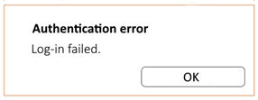
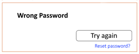
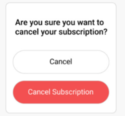
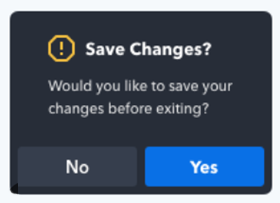

Always check if your texts are:

- Understandable (use simple sentences that even a sixth-grader would understand)
- Concise (remove unnecessary words)
- Useful (only write text if it’s useful to the user)

[:material-download-circle: Download UX-Writing-Checklist.pdf](../assets/images/ui-style-guide/UX-Writing-Checklist.pdf){:download .md-button}

### :muscle_tone3: Best Practices

| Characteristic    | Description |
| -------- | ------- |
| **Readable**   | Is the text simple and not overloaded?  {==1 information = 1 sentence and vice versa.==} |  
| **Concise**   | Are headlines and instruction text as short and clear as possible with no repetition, redundancy, ambiguity, or unnecessary words?	 |    
| **Universal**   | Does the word choice avoid technical jargon, idioms, and hard-to-translate phrases? |    
| **Consistent**   | Do text elements or UI components of the same type use the same patterns and styles (e.g., see yunIO styleguide)?  Check the other products or components to make sure.	 |    
| **User-focused**   | Does the content focus on how the product will benefit users in solving their problem (and less on features or technical details)?	 |   
| **Guiding**   | Is the next required action clear?  |   
| **Prioritized**   | If you squint at any screen, is the info hierarchy clear?  Do important actions stand out? |    

### :material-tooltip-text: Instructions & Tooltips

| Characteristic    | Description |
| -------- | ------- |
| **Informative** | Do users have enough guidance and info about consequences at every point in the flow to make a (critical) decision with confidence and continue?  |    
| **Supportive** | Do tooltips provide additional details for users who need help understanding?  |  

### :x: Error Messages

| Characteristic    | Description |
| -------- | ------- |
| **Actionable** | Does the error say what happened in simple terms and explain what the user needs to do next to get back on task?  |    
| **Compassionate** | Do the language and the tone of the message match the severity of the issue and avoid blaming the user for the error?  |  

### :octicons-alert-16: Notifications & Alerts

| Characteristic    | Description |
| -------- | ------- |
| **Front-loaded** | Do important words / phrases appear first in the message? {==Users usually only scan the first 11 characters of a text, so it is advised to put important stuff first.==}  |    
| **Meaningful** | Are notifications or alerts useful and relevant to the user at the moment they are presented?  |  
| **Consistent** | Do individual alerts and messages conform to an overall framework that uses consistent patterns for similar message types?  Check other products/other messages to make sure.  | 

??? example "Template for Notifications & Alerts"

	{:class="img-responsive"}

### :material-window-maximize: Dialogs / Modals

| Characteristic    | Description |
| -------- | ------- |
| **To-the-Point Headlines** | Does the headline communicate a single concise message?	  |    
| **Distinct Buttons** | Does the primary button text state a clear action and indicate what happens on-click?  |  
| **Explanatory UI Texts** | Does the text in the UI clarify any consequences and explain options in simple terms?  | 
| **Guided User Input** | When data needs to be entered, is it clear where the user can find that data?  | 

### :octicons-mortar-board-16: Onboarding (First-Use)

!!! note
	We currently do not offer onboarding functionalities, e.g., wizards, beginner guides, etc.
	
| Characteristic    | Description |
| -------- | ------- |
| **Value-oriented** | Does the text show the user how to experience the value of the product as soon as possible?	  |    
| **User-focused** | Does the content focus on how the product will benefit users in solving their problem (and less on features or technical details)?  |  
| **Cohesive** | Do the stated product benefits match the major selling points promised in marketing materials?  | 
| **Necessary** | Do the initial screens convey only the essential info needed to inspire action and avoid any info not meaningful to first-time users?  | 
| **Reassuring** | Does the onboarding content answer the user's most pressing questions and remove mystery or doubt on first use?  | 
 

### Some Examples

| :x: Not Helpful/Clear  | :white_check_mark: Helpful/Clear |
| -------- | ------- |
| {:class="img-responsive"} | {:class="img-responsive"} |
| {:class="img-responsive"}   | {:class="img-responsive"} |
| {:class="img-responsive"} | {:class="img-responsive"} |
