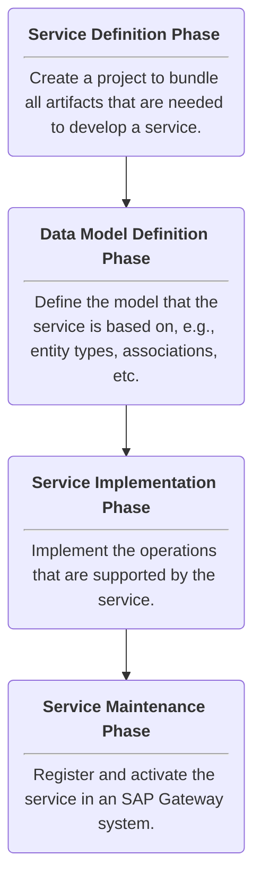

This article shows how to use the SAP Gateway Builder to create OData services that provide ODP based data for the [{{ odpOdata }} {{ component }}](../documentation/odp-odata/index.md)[{{ odata }} {{ component }}](../documentation/odata/index.md) of {{ productName }}.

!!! note
	This article focuses on SAP on-premise systems. 
	For information on how to create OData services in the SAP cloud, refer to [SAP Help: Setting up Communication Management](https://learning.sap.com/learning-journeys/implement-sap-s-4hana-cloud-public-edition-for-sourcing-and-procurement/setting-up-communication-management_a913171c-c96d-47a9-81ec-dc9ee8754320).

### Prerequisites

- SAP NetWeaver Gateway Release 2.0 Support Package 4 or higher. In SAP S/4HANA, the Gateway is embedded, but needs to be activated.
- SAP user with access to the SAP Gateway Service Builder.
- To extract data using the BW InfoProvider (ODP context BW), an open hub license is required.
- Optional: to transport services from one SAP system to another, e.g., from a test environment to a production environment, authorization for CTS (Change and Transport System) is required.

!!! tip
	To test services directly in SAP, activate the SAP Gateway Client via transaction /IWFND/GW_CLIENT.

### Workflow

The creation of OData services can be divided into the following phases:

### Service Definition

Follow the steps below to create a project that bundles all artifacts necessary to develop a service:

1. Log in to the SAP GUI.
2. Go to transaction SEGW. The SAP Gateway Builder opens.
3. Click **Create Project** (:material-file-outline:). 

4. Enter a name and description for the OData service. 

5. In the field **Project Type**, select *Service with SAP Annotations*.
6. If you want to transport the service to another SAP system, define a transport package.  
Otherwise, enter *$TMP* (temporary objects). 
7. Click **Continue** (:material-check:) to create the project. 

The new project is listed in the main window of the SAP Gateway Builder.

### Data Model Definition

Follow the steps below to define the model the service is based on:

1. In the main window of the SAP Gateway Builder, select your project and navigate to the *DataModel* directory of the project.
2. Right-click the *DataModel* directory and select **Redefine > ODP Extraction** from the context menu. 
  
The window "Wizard step 1: OData access for Operational Data Provisioning" opens.
3. In the field **ODP Context**, select a provider context that can access the SAP data source you want to extract.
For more information, see [Documentation: Provider Context](../documentation/odp/provider-context.md).
The depicted example uses the *DataSources/Extractors* context.
4. In the field **ODP Name**, select an existing ODP object. The depicted example uses the *0CUSTOMER_ATTR* extractor.
5. Click **[Add ODP]** to add the ODP object to the data model. 

	
	!!! tip
		An OData service can access multiple ODP objects. 
	
6. Click **Next** to continue on to step 2 of the Wizard.
7. Fill out any missing information and click **Next**. The window "Create Object Directory Entry" opens.
8. If you want to transport the service to another SAP system, define a transport package. If not, click **Save** (:fontawesome-regular-floppy-disk:) to continue on to step 3 of the Wizard.
9. Use the file tree menu to select the entities and artifacts you want to add to the service. 

	!!! note
	
		- *EntityOf* defines the structure of your data. Select the fields you want to add to the service.
		- *DeltaLinksOfEntity* contains delta links that are required to retrieve only changes (new, updated, or deleted records) to the dataset instead of fetching the entire dataset. Select all items to activate delta updates.
		- *SubscribedToEntity* checks whether a client is subscribed to tracking delta changes. Select this artifact to activate delta updates.
		- *TerminateDeltasForEntity* allows the client to stop tracking delta changes. Select this artifact to clean up unnecessary delta subscriptions.
		- *entityOf* defines the relationship between entities in the OData services, e.g., it links the main entity (*EntityOf*) with its delta-tracking entity (*DeltaLinksOfEntity*).

10. Click **Finish** (:material-clock-check-outline:).

The subdirectories of the *DataModel* directory now contain the selected entities and artifacts.

### Service Implementation

When using the Wizard during the [Data Model Definition](#data-model-definition), the service implementation is auto-generated based on the underlying ODP framework.

The following use cases require manual adjustments:

- Modify how data is retrieved, e.g., to filter or transform the data before returning it to the client.
- Add custom business logic, e.g., to trigger additional actions when data is created/updated.
- Expose custom function imports, e.g., to execute a custom SAP function.

### Generate the Service

Before the service can be activated, follow the steps below to generate the runtime objects of the service:

1. In the main window of the SAP Gateway Builder, select your project.
2. Click **Generate Runtime Objects** (:generate:). The window "Model and Service Definition" opens. 

3. Click **Continue** (:material-check:). The window "Create Object Directory Entry" opens.
4. If you want to transport the service to another SAP system, define a transport package. If not, click **Save** (:fontawesome-regular-floppy-disk:).

The runtime objects for the service are now generated.

### Service Maintenance

Follow the steps below to register and activate the service:

1. Go to transaction /n/IWFND/MAINT_SERVICE. The "Activate and Maintain Services" menu opens.
2. Click **Add Service**. The menu "Add Selected Services" opens.  

3. In the field **System Alias**, select *LOCAL*.
4. Click **Get Services** to display a list of all services on your SAP system. 

5. Select the service you want to register.

	!!! tip
		Use **Find** (:material-magnify:) to look up the service.
		
6. Click **Add Selected Services**. The window "Add Service" opens.
7. Check the service information and click **Continue** (:material-check:). The window "Add Service" closes.
8. Exit the "Add Selected Services" menu and check if the service is now listed in the service catalog.

The service can now be consumed by {{ productName }}'s {{ odpOdata }}{{ odata }} {{ component }}.



=== "Lookup"
	
=== "Data Preview"
	



=== "Lookup"
	
=== "Data Preview"
	



*****

#### Related Links

- [SAP Help: SAP Gateway Service Builder](https://help.sap.com/docs/SAP_NETWEAVER_AS_ABAP_751_IP/68bf513362174d54b58cddec28794093/cddd22512c312314e10000000a44176d.html)
- [SAP Learning: Building OData Services with SAP Gateway](https://learning.sap.com/learning-journeys/building-odata-services-with-sap-gateway)
- [SAP Help: ODP-Based Data Extraction via OData](https://help.sap.com/doc/saphelp_nw75/7.5.5/en-US/11/853413cf124dde91925284133c007d/frameset.htm)
