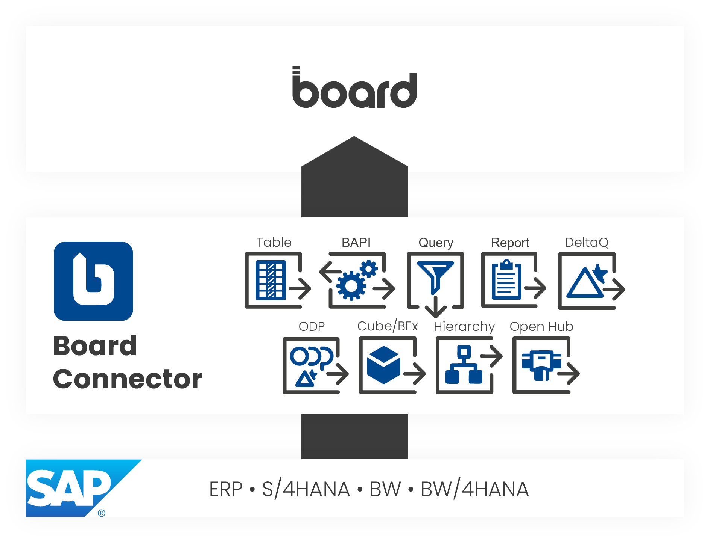
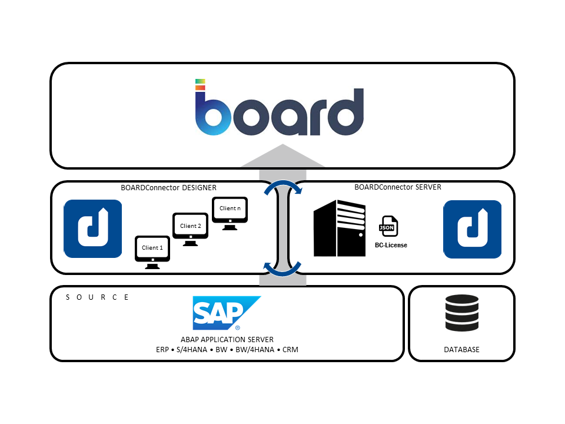

-   { .lg .middle width="30px"} This section contains user documentation for {{ productName }}.

### About {{ productName }}

The Board Connector is an SAP Connector that extracts data from SAP systems and loads it into Board. 
The main entities in {{ productName }} are called "{{ extractions }}". 
An {{ extraction }} is a combination of the following elements:

- A connection to a source system (SAP)
- A connection to a destination / target environment (Board) 
- A defined {{ component }} (e.g., {{ table }})

{:class="img-responsive"}

### Software Architecture 

{{ productName }} consists of two components:

- A [Designer](#link) to design and configure {{ extractions }}. 
When designing {{ extractions }} in the Designer, the user can create and modify extractions, sources and alter the server settings.
- A [Server](#link) to execute {{ extractions }}. 
During the execution phase, the user can execute the {{ extractions }} that were designed in the Designer. 
The execution of the {{ extractions }} takes place on the server.

{:class="img-responsive"}

### Available {{ Components }}

{{ productName }} offers the following {{ components }} to cover a wide range of data extraction scenarios.



