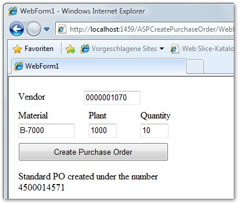
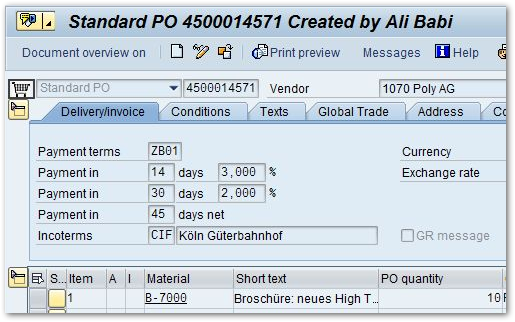

The following section shows the development process for an ASP.NET/ERPConnect project.

### Prerequisites

- Add the ERPConnect.dll class library as a reference to the project (the .dll is copied to the bin directory when compiling the project). 
- Add the librfc32.dll to your bin directory, see [Requirements - 32/64-Bit Environment](../introduction/requirements.md#3264-bit-environment). 

!!! warning "Warning! The standard demo license does not support working in web environments."
    To test ERPConnect with your ASP.NET project, apply for a test license number at [sales@theobald-software.com](mailto:sales@theobald-software.com).

### ASP.NET

The following sample shows how to create a purchase order using the *BAPI_PO_CREATE*.
The sample uses an ASP page to enter data for a purchase order, see screenshot below. <br>
{:class="img-responsive"}  

Input:
```
Vendor: 0000001070
Material: B-7000
Plant: 1000
Quantity: 10
```

#### Call BAPI_PO_CREATE 

To create a purchase order using the *BAPI_PO_CREATE* BAPI, follow the steps below:

1. Establish a connection to the SAP system 
2. Create an RFC-Function object for the BAPI *BAPI_PO_CREATE*.
3. Fill the structure *PO_HEADER* with the following values: 
- DOC_TYPE -> Order type (NB normal order)
- PURCH_ORG -> Purchasing organization
- PUR_GROUP -> Purchasing group
- DOC_DATE -> Date 
- VENDOR -> Vendor number
4. Define the items *PLANT* and *PUR_MAT* (material number) in the table *PO_ITEMS*. <br>
5. The values for the quantity (*QUANTITY*) and the delivery date (*DELIV_DATE*) must be placed in the table *PO_ITEM_SHEDULES*.
6. Execute the BAPI and process the return messages.

```csharp linenums="1" title="How to Create a Purchase Order"
private void Button1_Click(object sender, System.EventArgs e)
{
   // Set your ERPConnect license
	LIC.SetLic("xxxx");

	using var connection = new R3Connection(
		host: "server.acme.org",
		systemNumber: 00,
		userName: "user",
		password: "passwd",
		language: "EN",
		client: "001")
	{
		Protocol = ClientProtocol.NWRFC,
	};

	connection.Open();
   
   // Create a RFC-Function object
   RFCFunction func = connection.CreateFunction("BAPI_PO_CREATE");
   
   // Fill header structure
   RFCStructure Header = func.Exports["PO_HEADER"].ToStructure();
   Header["DOC_TYPE"]= "NB";
   Header["PURCH_ORG"] = "1000";
   Header["PUR_GROUP"] = "010";
   Header["DOC_DATE"]= ERPConnect.ConversionUtils.NetDate2SAPDate(DateTime.Now);
   Header["VENDOR"]= this.txtVendor.Text
 
   // Create an Item
   RFCTable items = func.Tables["PO_ITEMS"];
   RFCStructure item = items.AddRow();
   item["PO_ITEM"] = "1";
   item["PUR_MAT"] = this.txtMaterial.Text;
   item["PLANT"] = this.txtPlant.Text;
  
   // Create and fill shedules
   RFCTable shedules = func.Tables["PO_ITEM_SCHEDULES"];
   RFCStructure shedule = shedules.AddRow();
   shedule["PO_ITEM"] = "1";
   shedule["DELIV_DATE"] = ERPConnect.ConversionUtils.NetDate2SAPDate(DateTime.Now);
   shedule["QUANTITY"] = Convert.ToDecimal(this.txtQuan.Text);
 
   // Exceute BAPI and process return messages
   func.Execute();
   this.txtReturn.Text = "";
   this.txtReturn.Text += func.Tables["RETURN"].Rows[0, "MESSAGE"] + "\r\n";
}
```

Output:

```
Message: Standard PO created under the number 4500018292
```

{:class="img-responsive"}  
  
****
#### Related Links
- [Implement a connection pool](../../samples/implement-a-connection-pool.md)
