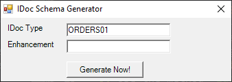

The IDoc class of ERPConnect offers support for both the IDoc schema and IDoc data located in XML-files.

The *IDoc-Schema-Generator* provided by ERPConnect generates an XML file that can be used to load IDoc schemas.<br>
Loading IDoc schemas via XML usually has higher performance than loading them via `CreateIdoc` or `CreateEmptyIdoc`, because no SAP connection is necessary.<br>

!!! note
    IDoc schema files contain the structure of an IDoc while IDoc data files contain the actual content of the IDoc.
	

### Create XML Templates

1. Run the *IdocSchemaGenerator.exe* in the ERPConnect directory `C:\Program Files\ERPConnect` to start the *IDoc-Schema-Generator*.
2. Enter the IDoc type you want to generate. If needed, enter enhancements.<br>

3. Click **[Generate Now!]**. 
3. The window "SAP Login" opens. Enter your SAP credentials and click **[OK]**.
4. Save the XML file to your local hard drive. 

``` xml title="Example of an *ORDERS01* IDoc schema"
xml version="1.0" encoding="ISO-8859-1" ?>
- <ORDERS01>
- <IDOC>
- <EDI_DC40>
<TABNAM>EDI_DC40TABNAM>
<IDOCTYP>ORDERS01IDOCTYP>
<MESTYP>ORDERS>MESTYP>
<SNDPRT>KUSNDPRT>
EDI_DC40>
<E1EDK01 />
- <E1EDK01>
<MENGE>10MENGE>
- <E1EDP10>
<QUALF>002QUALF>
<IDTNR>100-100IDTNR>
E1EDP19>
```

### Use XML Templates
 
1. Create an XML template using the tool *IDocSchemaGenerator.exe* located in the ERPConnect installation directory.
2. Use the method `LoadIdocSchema` tool to create an IDoc object from a schema file.
3. Load the IDoc data from a data file with the method `LoadXMLData`.

```csharp linenums="1" title="How to use XML Templates"
using (R3Connection con = new R3Connection("SAPServer", 00, "SAPUser", "Password", "EN", "800"))
{ 
    Idoc i = new Idoc();  
    i.Connection = con; 
	
    i.LoadIdocSchema(@"ORDERS01.xsd");        
    i.LoadXMLData(@"OrderIdoc.xml");
    
    i.Send();
}
```
