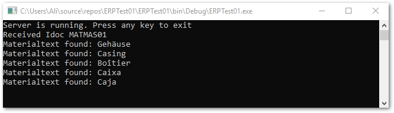

This section shows how to receive and process an IDoc. 
To configure your SAP system to receive IDocs, see [Set Up a Test Environment for IDocs](./prerequisites.md#set-up-a-test-environment-for-idocs).



{:class="img-responsive" width="800px" }

!!! note
    If you do not want to read the data buffer with offset and length of the texts, you can load an XML Schema instead, see [Templates](./idocs-schema-generator.md).

*****
#### Related Links
- [Setting Up a Test Environment for IDocs](./prerequisites.md#set-up-a-test-environment-for-idocs)
- [Set Up Receiving IDocs](./prerequisites.md#set-up-receiving-idocs)
