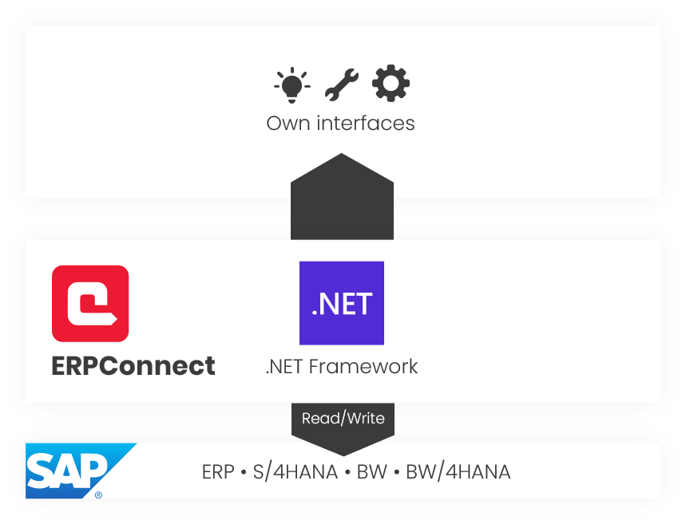

-   { .lg .middle width="30px"} This section shows how to use ERPConnect.

### About ERPConnect

ERPConnect is a flexible and modular .NET library that has been certified by SAP for integration with SAP ECC and SAP S/4HANA.

{:class="img-responsive" width="800px" }

### Features

|  Functionality / SAP Objects  |  Description   |  
|----------|-------------|
|  [__ABAP Code__](../abap/index.md) | Generate and execute ABAP code on-the-fly. |
|   [__BAPIs and Function Modules__](../bapis-and-function-modules/index.md) | Access BAPIs and RFC function modules to read and write data from and to SAP. |
|   [__BW Cube and BEx Queries__](../bw-cubes-and-bw-queries/index.md) | Extract data from SAP BW InfoCubes and BEx Queries. |
|   [__IDocs__](../idocs/index.md) | Send and receive SAP IDocs. |
|   [__Queries__](../queries/index.md) | Extract SAP queries (not BEx queries). |
|   [__RFC Server Functions__](../rfc-server/index.md) | Create, register and use RFC server functions. |
|   [__Tables__](../table/index.md) | Read SAP Tables directly via RFC. |
|   [__Transactions__](../transactions/index.md) | Execute SAP transactions via batch input. |

<!---

-   [__ABAP Code__](../abap/index.md)

	---
	
    Generate and execute ABAP code on-the-fly.
	
-   [__BAPIs and Function Modules__](../bapis-and-function-modules/index.md)
	
	---
	
    Access BAPIs and RFC function modules to read and write data from and to SAP.

-   [__BW Cube and BEx Queries__](../bw-cubes-and-bw-queries/index.md)
	
	---
	
    Extract data from SAP BW InfoCubes and BEx Queries.

-   [__IDocs__](../idocs/index.md)

	---
	
    Send and receive SAP IDocs.

-   [__Queries__](../queries/index.md)

	---
	
    Extract SAP queries (not BEx queries).

-   [__RFC Server Functions__](../rfc-server/index.md)

	---
	
    Create, register and use RFC server functions.
	
-   [__Tables__](../table/index.md)

	---
	
    Read SAP Tables directly via RFC.
	
-   [__Transactions__](../transactions/index.md)

	---
	
    Execute SAP transactions via batch input.
	

-->

### Tools

The installation package of ERPConnect includes the following tools to make development easier and more efficient:

-   [**TransactionRecorder**](../transactions/transaction-recorder.md) 

	---
	
	Records SAP transactions and generates C# or VB code for the transactions.
	
-   [**IDoc-Schema-Generator**](../idocs/idocs-schema-generator.md) 

	---
	
	Generates an XML file that can be used to load IDoc schemas with high performance.

-   [**Function-Template-Generator**](../bapis-and-function-modules/function-template-generator.md) 

	---
	
	Generates reusable XML templates for Function Modules and BAPIs.

