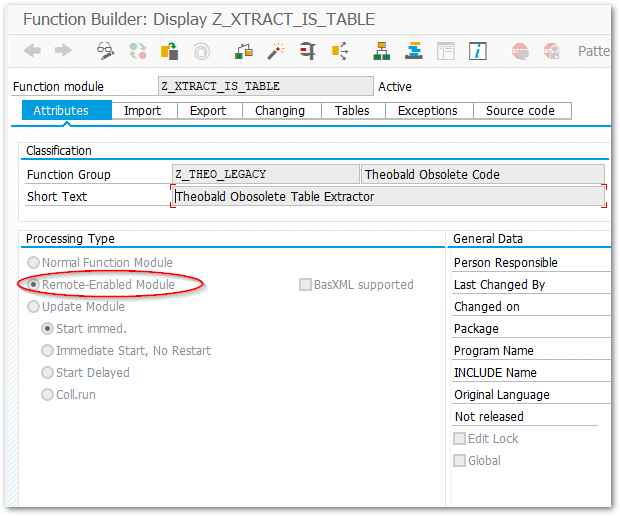
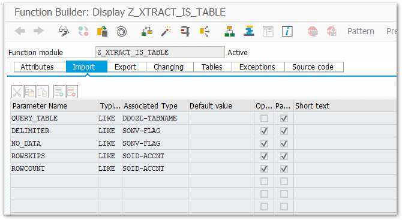
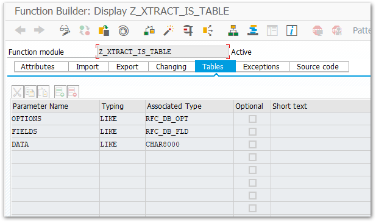
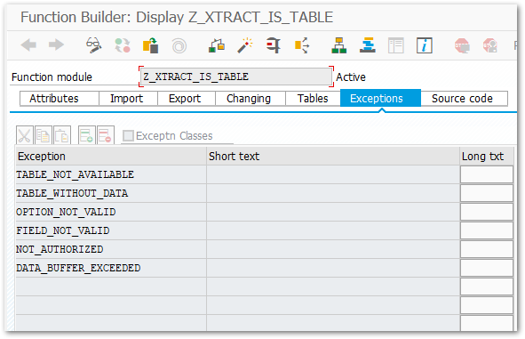

This section shows how to use the *ReadTable* class.<br>
A recurrent task when working with SAP and .NET applications is to read directly from tables of the SAP system. 
The *ReadTable* class enables access to that data.

!!! note
    The *RFC_READ_TABLE* function module for table extractions is not suitable for mass data extraction, see [Restrictions](#restrictions).


### Restrictions

When extracting tables from older SAP releases you may encounter several restrictions when using the SAP standard function module (RFC_READ_TABLE):

- The overall length of all columns to be extracted must not exceed 512 bytes.
- It is not possible to extract data from tables that contain one or more columns of the data type f (FLTP, floating point), DEC (decimal, e.g. for percentage) or x (RAW, LRAW).
- Poor extraction performance with larger tables. Can cause also duplicates.

!!! warning  
	**Error while converting value '\*.0' of row 1530, column 3.**<br>
    The SAP standard module *RFC_READ_TABLE* for table extraction can only extract the ABAP data type DEC to a limited extent. This leads to the mentioned example error during extraction.<br>

To bypass the restrictions, install the custom function module Z_XTRACT_IS_TABLE.

### Install Z_XTRACT_IS_TABLE

Follow the steps below to create a custom function module Z_XTRACT_IS_TABLE in SAP that bypasses the restrictions of the SAP standard function module (RFC_READ_TABLE):

1. Use SAP transaction SE37 to create a new function module named Z_XTRACT_IS_TABLE. 

	!!! note 
		You can use an existing function group or create a new one. This is also valid for the development class (Package).
		
2. In the tab *Attributes* check *Remote Enabled*.
{:class="img-responsive" }
3. define the following import imports:<br>
{:class="img-responsive" }
4. Define the following table parameter:<br>
{:class="img-responsive" }
5. Define the following exceptions:<br>
{:class="img-responsive" }
6. Download the file [Z_XTRACT_IS_TABLE.txt](../../assets/files/ABAPcode/Z_XTRACT_IS_TABLE.txt){:download="Z_XTRACT_IS_TABLE"} that contains the ABAP code for the function module. 
7. Use **[Ctrl + C]** and **[Ctrl + V]** to paste the ABAP code into the source code editor.
8. Save the function module and activate it.

To use the new custom function module with the *ReadTable* class, use the `SetCustomFunctionName()` command before reading the table. Example:

```
table.SetCustomFunctionName("Z_XTRACT_IS_TABLE");
```

!!! warning
	**Duplicates in the target environment!**<br>
	Extracting mass data, can cause duplicates in the target environment. 
 	The use of Z_XTRACT_IS_TABLE does not guarantee duplicate-free results. Note that ERPConnect is not meant for mass data extraction.
  
