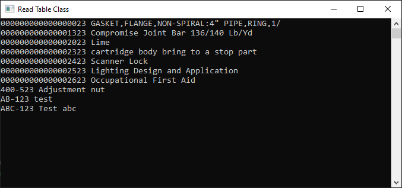

The following sample shows how to use the *ReadTable* class to read data from an SAP table and how to process the ADO.NET result table object. 

### Read Data From Tables

This sample reads the material description texts of the SAP table *MAKT*. 

- Read the columns *MATNR* (material number) and *MAKTX* (material text).
- Add a corresponding WHERE statement `SPRAS='EN'` to make sure only the English language texts are read (SPRAS is the column that contains the language keys).


``` csharp linenums="1"
using System;
using System.Data;
using ERPConnect;
using ERPConnect.Utils;

// Set your ERPConnect license
LIC.SetLic("xxxx");

// Open the connection to SAP
using var connection = new R3Connection(
    host: "server.acme.org",
    systemNumber: 00,
    userName: "user",
    password: "passwd",
    language: "EN",
    client: "001")
{
    Protocol = ClientProtocol.NWRFC,
};

connection.Open();

var table = new ReadTable(connection)
{
    WhereClause = "SPRAS = 'EN'",
    TableName = "MAKT",
    RowCount = 10
};

// Select columns to read
table.AddField("MATNR");
table.AddField("MAKTX");

table.Run();

DataTable result = table.Result;
for (int i = 0; i < result.Rows.Count; i++)
{
    Console.WriteLine($"{result.Rows[i]["MATNR"]} {result.Rows[i]["MAKTX"]}");
}

Console.ReadLine();
```

Output:
```
000000000000000023 Pawan Kalyan_08
000000000000000038 Test US colleagues upd4
000000000000000043 English Check 25_01
000000000000000058 Ventilation, complete build
000000000000000059 Filter Ereteam
000000000000000068 a portable 1 ton crane
000000000000000078 Component Full Repair Service ...
000000000000000088 AS-100 T-shirt XL
000000000000000089 AS-100 T-shirt
000000000000000098 PCB Subassembly
```

{:class="img-responsive" }


****
#### Related Links
- [Transfer data packets with ReadTable class](../../samples/transfer-data-packets-with-readtable-class.md)
- [Get meta data of a table](../../samples/get-meta-data-of-a-table.md)
- [Get CostCenter hierarchies](../../samples/get-costcenter-hierarchies.md)
