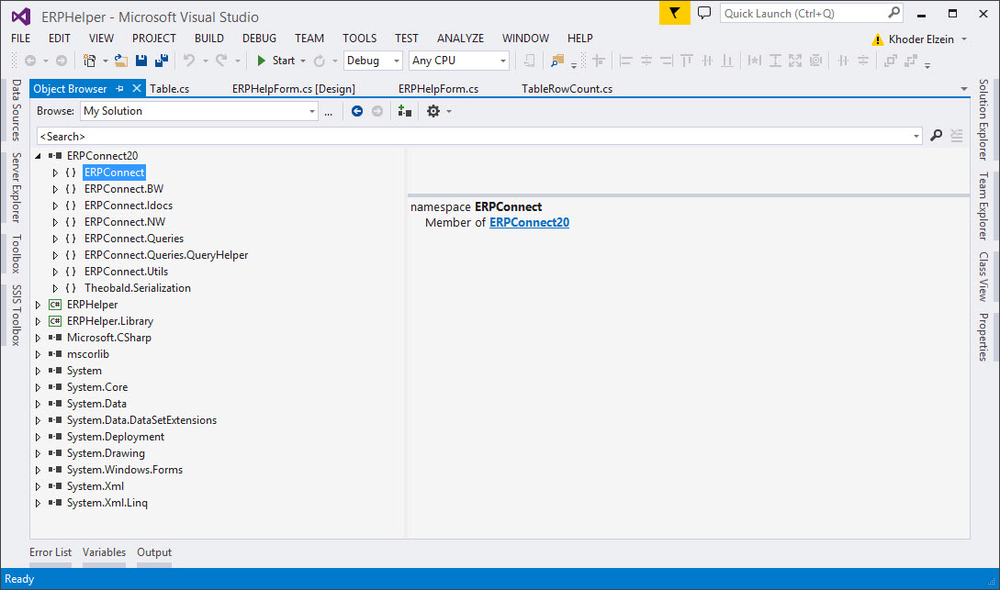

-   { .lg .middle width="30px"} This section contains an auto-generated API documentation.

### Access API Documentation in Visual Studio
The ERPConnect API documentation is available in the Object Browser in Visual Studio. 
To view the Object Browser, navigate to the menu **View -> Object Browser**. 

{:class="img-responsive" }

!!! note 
	To make the API documentation available in Visual Studio, the file *ERPConnectXX.xml* must be in the same folder as the *ERPConnectXX.dll*.
