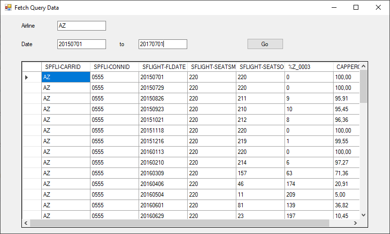

The following sample shows how to fetch data from an SAP Query using ERPConnect.

### About 
This example uses the training Query *D3* which contains flight information of airplanes. 
Data that matches certain selection criteria (e.g. airline and date of flight) is fetched and drawn into a *DataGrid*, see screenshot below. 

{:class="img-responsive" }

!!! tip
    If you don't know the technical name of a Query parameter, you can look it up in your SAP-System.
    Use the transaction **SQ01** or **SQ02** to search a Query. Open the description of the Query and scroll to the section *Selections*.
    All parameter properties including the name are listed.

### Call Queries

1. Open a client connection to the R/3 system using the R3Connection class.
2. Use the *CreateQuery* method to create a query object. 
Each SAP query is defined by three descriptors: 
- the user workspace (whether local or global)
- the user group (in this example *BT*)
- the name of the query itself (in this example *D3*)
3. Define the parameters of the query. Every parameter has a distinctly technical name that can be looked up in the SAP. 
To create the selection criteria for the sample query, access the parameter's range collection via the indexer and use *Add* to add a new range to "CARRID" (airline) and "FLDATE" (date). <br>
An individual range is defined by three descriptors:
- a sign (include or exclude)
- an operator (e.g. *equals* for parity) 
- a low or high value (LowValue and HighValue or only LowValue when using parity).  
4. When all selections are defined, execute the query with the *Execute* method. <br>
The query output is an ADO.NET DataTable. It can be accessed using the *Result* attribute of the query object.

```csharp linenums="1" title="How to call Queries"
private void btnFetchQueryData_Click(object sender, System.EventArgs e)
    {
      using (R3Connection con = new R3Connection("SAPServer", 00, "SAPUser", "Password", "EN", "800"))
        { 
           con.Open(false);
 
           // Create Query object Query q; 
           try
           {
               Query q = con.CreateQuery(WorkSpace.GlobalArea, "BT", "D3");

               // Add a criteria (in this case the airline) 
               q.SelectionParameters["CARRID"].Ranges.Add(
                   Sign.Include, RangeOption.Equals, inputAirline.Text);
               // Add a second criteria (in this case the date) 
               q.SelectionParameters["FLDATE"].Ranges.Add(
                   Sign.Include, RangeOption.Between, inputStartDate.Text, inputEndDate.Text);

               // Run the Query 
               q.Execute();
               // Bind result to datagrid 
               this.dataGridView1.DataSource = q.Result;
           }
           catch (Exception e1)
           {
            MessageBox.Show(e1.Message);
            return;
           }
        }
    }
```
