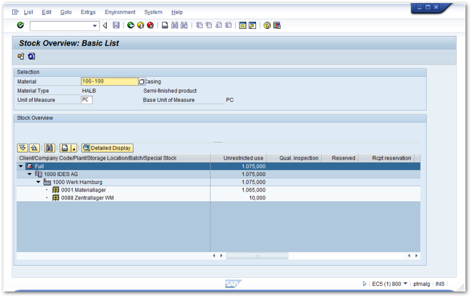

This section shows how to use the *Transaction* class to execute SAP transactions in the foreground as well as in a background process (Batch Input).<br>
When executing transactions in a background process, mass data can be processed and transferred to the SAP system. 
This technique is often used if no suitable BAPI exists.

### How to use SAP Transactions 

The following sample application shows how to use the *Transaction* class to directly execute an SAP transaction.<br>
In this application the user can enter a material number and the name of a plant. 
By clicking a button, the SAP GUI is launched and the transaction **MMBE** (stock overview) is executed to list the entered materials and plants. 

{:class="img-responsive" width="300px" }

!!! tip
    The installation package of ERPConnect includes the *Transaction-Recorder* tool.
    This tool records transactions and implements them to code, see [Transaction-Recorder](../tools/transaction-recorder).

The code below shows how to add batch steps with the method *AddStep*. <br>
When connecting to SAP set the *UseGui* property to true. 
The SAP GUI is launched using the method *Execute*.


```csharp linenums="1"
using System;
using ERPConnect;
using ERPConnect.Utils;

// Set your ERPConnect license
LIC.SetLic("xxxx");

using var connection = new R3Connection(
    host: "server.acme.org",
    systemNumber: 00,
    userName: "user",
    password: "passwd",
    language: "EN",
    client: "001")
{
    Protocol = ClientProtocol.NWRFC,
    UseGui = true,
};

connection.Open();

Console.Write("Material: ");
string material = Console.ReadLine();

Console.Write("Plant: ");
string plant = Console.ReadLine();

var transaction = new Transaction(connection)
{
    ExecutionMode = TransactionDialogMode.ShowAll,
    TCode = "MMBE"
};

transaction.AddStepSetNewDynpro("RMMMBEST", "1000");
transaction.AddStepSetOKCode("ONLI");
transaction.AddStepSetCursor("MS_WERKS-LOW");
transaction.AddStepSetField("MS_MATNR-LOW", material);
transaction.AddStepSetField("MS_WERKS-LOW", plant);

// run
transaction.Execute();
```

Input:
```
Material: 100-100
Plant: 1000
```

Output:

{:class="img-responsive"  }

!!! note
    If you only want to execute a single transaction without adding several batch steps, simply set the property *TCode* and execute the transaction.


### Background Processing (Batch Input)

The following sample shows how to create a purchase order using Batch Input techniques in background processing.
The transaction for creating a purchase order is **ME21**.

At the end the code loops over the *Returns* collection to check the *BatchReturn* objects that contain the return messages of the Batch Input transaction. 

```csharp linenums="1"
using (R3Connection con = new R3Connection("SAPServer", 00, "SAPUser", "Password", "EN", "800"))
    {
	con.Open(false);
   
	Transaction trans = new Transaction();
	trans.Connection = con;
	trans.TCode = "ME21";
   
	//Begin a new Dynpro
	trans.AddStepSetNewDynpro("SAPMM06E", "0100");
	trans.AddStepSetCursor("EKKO-EKGRP");
	trans.AddStepSetOKCode("/00"); // Enter
	trans.AddStepSetField("EKKO-LIFNR", "1070"); // Vendor
	trans.AddStepSetField("RM06E-BSART", "NB"); // Order Type
	trans.AddStepSetField("RM06E-BEDAT", "01.01.2006"); //Purch.Date
	trans.AddStepSetField("EKKO-EKORG", "1000"); // Purchase Org
	trans.AddStepSetField("EKKO-EKGRP", "010"); // Purchase Group
	trans.AddStepSetField("RM06E-LPEIN", "T");
   
	//Begin a new Dynpro
	trans.AddStepSetNewDynpro("SAPMM06E", "0120");
	trans.AddStepSetCursor("EKPO-WERKS(01)");
	trans.AddStepSetOKCode("=BU");
	trans.AddStepSetField("EKPO-EMATN(01)", "B-7000"); // Material
	trans.AddStepSetField("EKPO-MENGE(01)", "20"); // Quantity
	trans.AddStepSetField("EKPO-WERKS(01)", "1000"); // Plant
	trans.Execute();
   
	foreach (ERPConnect.Utils.BatchReturn br in trans.Returns)
		MessageBox.Show(br.Message);
	if (trans.Returns.Count == 0)
		MessageBox.Show("No Messages");
    }
```
