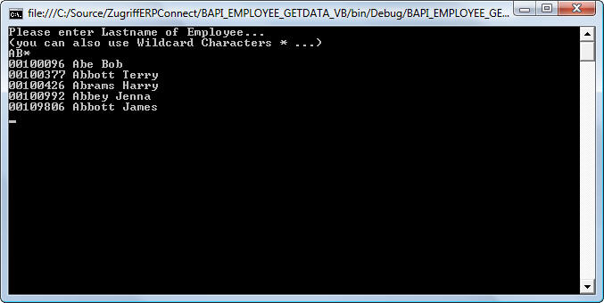
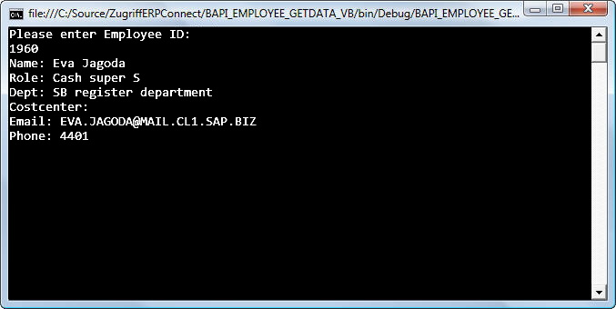

This sample shows how to query personnel data in ERPConnect using the BAPI BAPI_EMPLOYEE_GETDATA.

### About

BAPI_EMPLOYEE_GETDATA is an RFC-enabled function module that should be present in every SAP system. <br>
The depicted sample programs use the last name / personnel number of an employee as an input parameter for the BAPI.
The BAPI returns the employee's personnel data in table parameters.

### Read Personnel Data using Names

Follow the steps below to call the BAPI BAPI_EMPLOYEE_GETDATA:

1. Connect to the SAP system using `R3Connection`.
2. Create an RFCFunction object using `CreateFunction`.
3. Assign a string via user input to the import parameter *LASTNAME_M*.
4. Execute the function module using `Execute`.
5. The function module returns the table parameter *PERSONAL_DATA*.
The table fields PERNO (personnel number), LAST_NAME (last name) and FIRSTNAME (first name) are written to the console. 

```csharp linenums="1"
using System;
using ERPConnect;

// Set your ERPConnect license
LIC.SetLic("xxxx");

using var connection = new R3Connection(
    host: "server.acme.org",
    systemNumber: 00,
    userName: "user",
    password: "passwd",
    language: "EN",
    client: "001")
{
    Protocol = ClientProtocol.NWRFC,
};

connection.Open();

// Create a function object
RFCFunction func = connection.CreateFunction("BAPI_EMPLOYEE_GETDATA");
Console.WriteLine("Please enter Lastname of Employee...");
Console.WriteLine("(you can also use Wildcard Characters * ...)");

// fill the export parameter
string employeeName = Console.ReadLine();
func.Exports["LASTNAME_M"].ParamValue = employeeName;
func.Exports["DATE"].ParamValue = DateTime.Now.ToString("yyyyMMdd");

try
{
    func.Execute();
}
catch (ERPException e)
{
    Console.WriteLine(e.Message);
    Console.ReadLine();
    return;
}

// Output the result of the function module
RFCTable employeeDataTable = func.Tables["PERSONAL_DATA"];
if (employeeDataTable.RowCount > 0)
{
    for (int i = 0; i < employeeDataTable.RowCount; i++)
    {
        Console.WriteLine(
            employeeDataTable.Rows[i]["PERNO"] + " " +
            employeeDataTable.Rows[i]["LAST_NAME"] + " " +
            employeeDataTable.Rows[i]["FIRSTNAME"]);
    }
}
else
{
    Console.WriteLine("No Employee found");
}
```

Output:

{:class="img-responsive"}

<!---
Input/Output:
```
Please enter Lastname of Employee...
(you can also use Wildcard Characters * ...)
AB*
00004007 Abad Esther
00088840 Abagail Ananya
00088869 Abigail AB
00099319 ABC Corp Contractor 1 -
00099320 ABC Corp Contractor 2 -
00099988 Abigail A
00100096 Abe Bob
00100377 Abbott Terry
00100426 Abrams Harry
00100992 Abbey Jenna
00109806 Abbott James
00109822 Abram Norm
```
-->

### Read Personnel Data using Personnel Numbers

Follow the steps below to call the BAPI BAPI_EMPLOYEE_GETDATA:

1. Connect to the SAP system using `R3Connection`.
2. Create an RFCFunction object using `CreateFunction`.
3. Assign a string via user input to the import parameter *EmployeeID*.
4. Execute the function module using `Execute`.
5. The function module returns the table parameter *ORG_ASSIGNMENT*.
The table fields NAME (name of the employee), POSTXT (role), ORGTXT (department) and COSTCENTER (cost center) are written to the console. 
6. The function module returns the table parameter *COMMUNICATION*.
The table fields USRID_LONG (email address) is written to the console. 
7. The function module returns the table parameter *INTERNAL_CONTROL*.
The table fields PHONENO1 (phone number) is written to the console. 

``` csharp linenums="1"
using System;
using ERPConnect;

// Set your ERPConnect license
LIC.SetLic("xxxx");

using var connection = new R3Connection(
    host: "server.acme.org",
    systemNumber: 00,
    userName: "user",
    password: "passwd",
    language: "EN",
    client: "001")
{
    Protocol = ClientProtocol.NWRFC,
};

connection.Open();

// Create a function object
RFCFunction func = connection.CreateFunction("BAPI_EMPLOYEE_GETDATA");
Console.WriteLine("Please enter Employee ID: ");

// fill the export parameter 
string EmployeeID = Console.ReadLine();
func.Exports["EMPLOYEE_ID"].ParamValue = EmployeeID;
func.Exports["DATE"].ParamValue = ERPConnect.ConversionUtils.NetDate2SAPDate(System.DateTime.Now);
          
func.Execute();

if (func.Imports["RETURN"].ToStructure()["MESSAGE"].ToString().Trim() != "")
{
    Console.WriteLine(func.Imports["RETURN"].ToStructure()["MESSAGE"].ToString());
    return;
}

if (func.Tables["ORG_ASSIGNMENT"].RowCount > 0)
{
    Console.WriteLine("Name: " + func.Tables["ORG_ASSIGNMENT"].Rows[0, "NAME"].ToString());
    Console.WriteLine("Role: " + func.Tables["ORG_ASSIGNMENT"].Rows[0, "POSTXT"].ToString());
    Console.WriteLine("Dept: " + func.Tables["ORG_ASSIGNMENT"].Rows[0, "ORGTXT"].ToString());
    Console.WriteLine("Costcenter: " + func.Tables["ORG_ASSIGNMENT"].Rows[0, "COSTCENTER"].ToString());
}

if (func.Tables["COMMUNICATION"].RowCount > 0)
{
    Console.WriteLine("Email: " + func.Tables["COMMUNICATION"].Rows[0, "USRID_LONG"].ToString());
}

 if (func.Tables["INTERNAL_CONTROL"].RowCount > 0)
{
    Console.WriteLine("Phone: " + func.Tables["INTERNAL_CONTROL"].Rows[0, "PHONENO1"].ToString());
}

Console.ReadKey();
```

Output:

{:class="img-responsive"}
