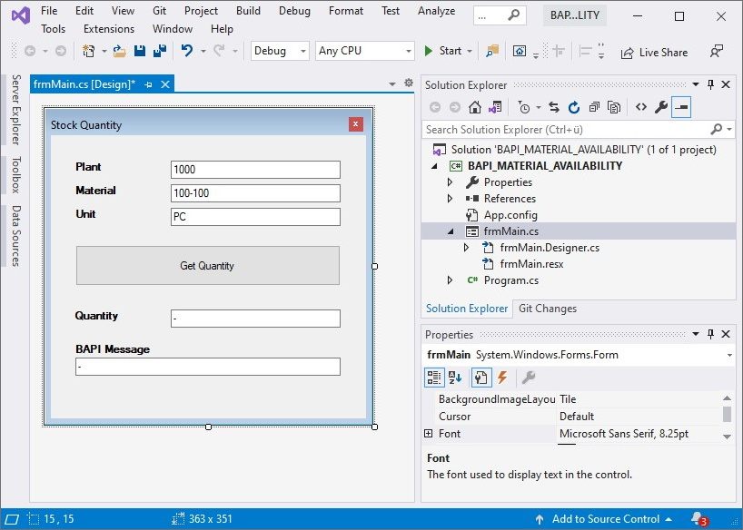
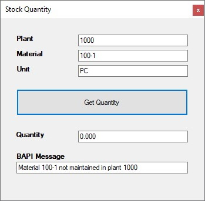
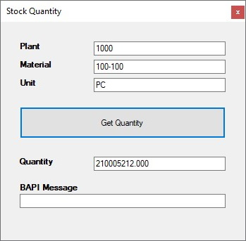

This sample shows how to check the availability of materials using the BAPI BAPI_MATERIAL_AVAILABILITY.

### About

BAPI_MATERIAL_AVAILABILITY shows the availability of a material. 
This availability provides the so-called ATP (stock quantity Available To Promise). 
BAPI_MATERIAL_AVAILABILITY requires at least three import parameters: 
- the Plant (PLANT)
- the material number (MATERIAL) 
- the unit (UNIT) 

### Call BAPI_MATERIAL_AVAILABILITY

The Windows form for the BAPI BAPI_MATERIAL_AVAILABILITY contains the following elements:

- Three text boxes for import parameters: *txtPlant*, *txtMaterial* and *txtUnit* 
- One Button: *btnGetQuantity* 
- Two text boxes to display results: *txtStock* and *txtBAPIMessage*

{:class="img-responsive"}

Follow the steps below to call the BAPI API_MATERIAL_AVAILABILITY:

1. Connect to the SAP system using `R3Connection`.
2. Create an RFCFunction object using `CreateFunction`.
3. Assign the import parameters to the RFCFunction object.
4. Execute the function module using `Execute`.
5. If the BAPI returns an error, display the error message in the Windows form. <br>
If no error occurred, the BAPI returns the parameter *AV_QTY_PLT* that contains the stock quantity in the given unit. 
Display the stock quantity in the Windows form.

```csharp linenums="1"
private void btnGetQuantity_Click(object sender, System.EventArgs e)
        {
            try
            {
        
                // Set your ERPConnect license
                LIC.SetLic("xxxx");

                // Open the connection to SAP
                using var connection = new R3Connection(
                    host: "server.acme.org",
                    systemNumber: 00,
                    userName: "user",
                    password: "passwd",
                    language: "EN",
                    client: "001")
                {
                    Protocol = ClientProtocol.NWRFC,
                };

                connection.Open();
                
                // Create a Bapi object, fill parameters and execute
                RFCFunction f = connection.CreateFunction("BAPI_MATERIAL_AVAILABILITY");
                f.Exports["PLANT"].ParamValue = txtPlant.Text;
                f.Exports["MATERIAL"].ParamValue = txtMaterial.Text;
                f.Exports["UNIT"].ParamValue = txtUnit.Text;
                f.Execute();
  
                // Read the import structure RETURN to provide possible Messages
                RFCStructure BapiRet = f.Imports["RETURN"].ToStructure();
                txtBAPIMessage.Text = BapiRet["MESSAGE"].ToString();
  
                // Fill textbox with stock quantity
                txtStock.Text = f.Imports["AV_QTY_PLT"].ToString();
            }
            catch (ERPException e1)
            { MessageBox.Show(e1.Message); }
        }
```

The screenshots below show the sample program in action. <br>
On the first try, the user types a non-existing material number so an error message is given by the BAPI. 

{:class="img-responsive"}
{:class="img-responsive"}
