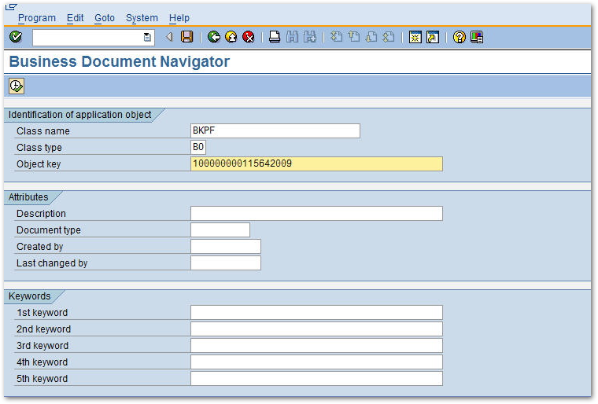
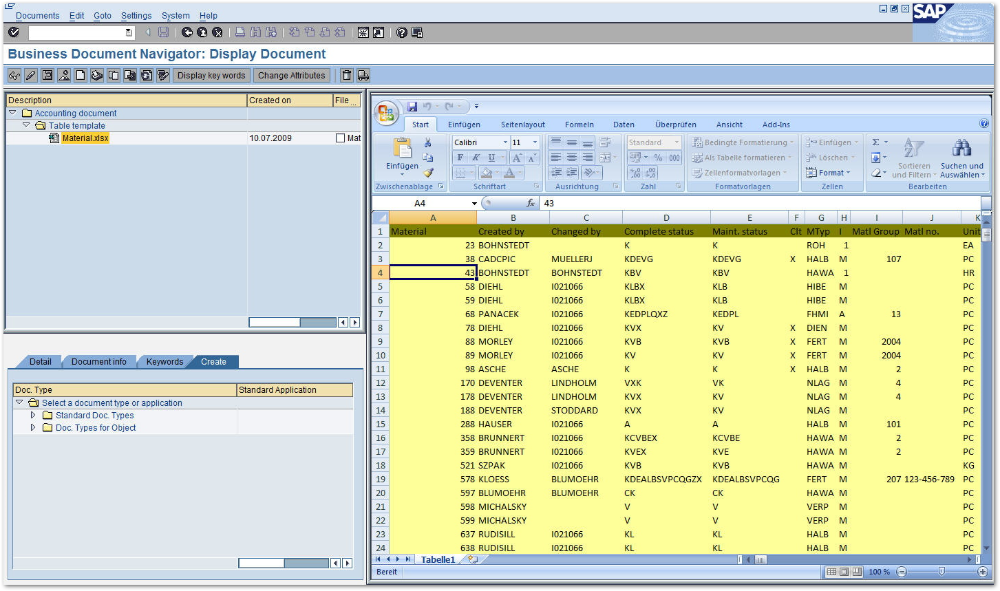

This sample shows how to upload documents to the BDS (Business Document Service) using the function module BDS_BUSINESSDOCUMENT_CREA_TAB.

### About

Upload documents like excel sheets, word documents or images to the BDS by reading the file into a byte array and sending the array line after line to the function module BDS_BUSINESSDOCUMENT_CREA_TAB.

The depicted example uploads an excel sheet to the BDS. 
With small code changes to the document class, the document and MIME-type you can upload other document types.

!!! tip
    You can look up the relevant document classes and types in SAP **IMG > Basis Services > Archive Link > Basic Customizing**.

In the sample code the class name (BKPF) represents the Accounting document type. You can find other classes in the Document Navigator (TA OAOR).<br>
The object key (100000000115642009) for BKPF is build from the company code, document number and the fiscal year.

{:class="img-responsive"}

### Upload an Excel File to the BDS

The following sample code uploads an excel sheet to the BDS:

```csharp linenums="1"
static void Main(string[] args)
        {
  
            try
            {
                string sPath = System.IO.Path.GetDirectoryName(@"C:\temp\Material.xlsx");
                string sFile = System.IO.Path.GetFileName(@"C:\temp\Material.xlsx");
                byte[] bytes;
                R3Connection con = new R3Connection("ptmalg", 05, "xxx", "xxx", "en", "800");
                con.Open(false);
  
                RFCFunction func = con.CreateFunction("BDS_BUSINESSDOCUMENT_CREA_TAB");
  
                RFCTable tbData = func.Tables["CONTENT"];
                RFCTable tbSig = func.Tables["SIGNATURE"];
                RFCTable tbComp = func.Tables["COMPONENTS"];
  
                func.Exports["CLASSNAME"].ParamValue = "BKPF";
                func.Exports["CLASSTYPE"].ParamValue = "BO";
                func.Exports["OBJECT_KEY"].ParamValue = "100000000115642009";
                func.Exports["BINARY_FLAG"].ParamValue = "X";
  
                bytes = System.IO.File.ReadAllBytes(@"C:\temp\Material.xlsx");
  
                RFCStructure Content = new RFCStructure();
  
                for (int offset = 0; offset < bytes.Length; offset += 1022)
                {
                    byte[] ExportBytes = new byte[1022]; // In VB change the value of this array to 1021
                    if (offset + 1022 > bytes.Length)
                        Array.Copy(bytes, offset, ExportBytes, 0, bytes.Length - offset);
                    else
                        Array.Copy(bytes, offset, ExportBytes, 0, 1022);
                    Content = tbData.AddRow();
                    Content["LINE"] = ExportBytes;
                }
  
                RFCStructure recComp = tbComp.AddRow();
  
                recComp["DOC_COUNT"] = 1;
                recComp["COMP_COUNT"] = 1;
                recComp["COMP_ID"] = sFile;
                recComp["MIMETYPE"] = "application/vnd.ms-excel";
                recComp["COMP_SIZE"] = bytes.Length;
  
                RFCStructure recSig = tbSig.AddRow();
  
                recSig["DOC_COUNT"] = 1;
                recSig["DOC_ID"] = "";
                recSig["DOC_VER_NO"] = 1;
                recSig["DOC_VAR_ID"] = 1;
                recSig["DOC_VAR_TG"] = "OR";
                recSig["COMP_COUNT"] = 1;
                recSig["PROP_NAME"] = "BDS_DOCUMENTTYPE";
                recSig["PROP_VALUE"] = "BDS_SHEET";
  
                recSig = tbSig.AddRow();
  
                recSig["DOC_COUNT"] = 1;
                recSig["DOC_ID"] = "";
                recSig["DOC_VER_NO"] = 1;
                recSig["DOC_VAR_ID"] = 1;
                recSig["DOC_VAR_TG"] = "OR";
                recSig["COMP_COUNT"] = 1;
                recSig["PROP_NAME"] = "BDS_DOCUMENTCLASS";
                recSig["PROP_VALUE"] = "XLS";
  
                recSig = tbSig.AddRow();
  
                recSig["DOC_COUNT"] = 1;
                recSig["DOC_ID"] = "";
                recSig["DOC_VER_NO"] = 1;
                recSig["DOC_VAR_ID"] = 1;
                recSig["DOC_VAR_TG"] = "OR";
                recSig["COMP_COUNT"] = 1;
                recSig["PROP_NAME"] = "DESCRIPTION";
                recSig["PROP_VALUE"] = sFile;
  
                recSig = tbSig.AddRow();
  
                recSig["DOC_COUNT"] = 1;
                recSig["DOC_ID"] = "";
                recSig["DOC_VER_NO"] = 1;
                recSig["DOC_VAR_ID"] = 1;
                recSig["DOC_VAR_TG"] = "OR";
                recSig["COMP_COUNT"] = 1;
                recSig["PROP_NAME"] = "LANGUAGE";
                recSig["PROP_VALUE"] = "EN"; 
                func.Execute();
                Console.WriteLine("Upload OK");
                Console.ReadLine();
            }
            catch (Exception e1)
            {
                Console.WriteLine(e1.Message);
                Console.ReadLine();
            }
        }
```

Output:

{:class="img-responsive"}
