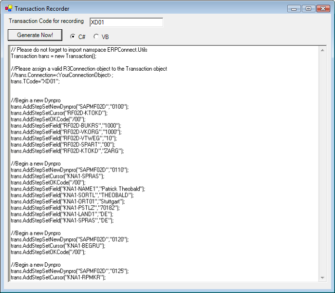

This sample shows how to use batch input with SAP transaction XD01 in ERPConnect to create new customers in SAP.

!!! note
    Using the BAPI BAPI_CUSTOMER_CREATEFROMDATA1 is not recommended because it does not support some fields that are needed to create valid customer master data.

### Create a Code Template

Use the [transaction recorder](../guide/transactions/transaction-recorder.md) tool located in the installation directory of ERPConnect (`C:\Program Files\ERPConnect`) to create a code template for the SAP transaction XD01:

{:class="img-responsive"}

### Call Transaction XD01

The following sample code calls SAP transaction XD01 to create new customers in SAP:

```csharp linenums="1"
using System;
using ERPConnect;
using ERPConnect.Utils;

// Set your ERPConnect license
LIC.SetLic("xxxx");

using var connection = new R3Connection(
    host: "server.acme.org",
    systemNumber: 00,
    userName: "user",
    password: "passwd",
    language: "EN",
    client: "001")
{
    Protocol = ClientProtocol.NWRFC,
};

connection.Open();
  
Transaction trans = new Transaction();
  
trans.Connection=connection;
trans.TCode="XD01"; // Transaction XD01
  
  
// First Dynpro
trans.AddStepSetNewDynpro("SAPMF02D","0100");
trans.AddStepSetOKCode("/00");
trans.AddStepSetField("RF02D-BUKRS","1000"); // Company Code
trans.AddStepSetField("RF02D-VKORG","1000"); // Sales Org
trans.AddStepSetField("RF02D-VTWEG","10"); // Distribution Channel
trans.AddStepSetField("RF02D-SPART","00"); // Division
trans.AddStepSetField("RF02D-KTOKD","ZARG"); // Account Group
  
//Main Address
trans.AddStepSetNewDynpro("SAPMF02D","0110");
trans.AddStepSetOKCode("/00");
trans.AddStepSetField("KNA1-NAME1","C. Pimpelhuber"); // Name 1
trans.AddStepSetField("KNA1-SORTL","PIMPELH"); // Search Term
trans.AddStepSetField("KNA1-ORT01","Stuttgart"); // City
trans.AddStepSetField("KNA1-STRAS","Olgastr. 20"); // City
trans.AddStepSetField("KNA1-PSTLZ","70182"); // Zip-Code
trans.AddStepSetField("KNA1-LAND1","DE"); // Country
trans.AddStepSetField("KNA1-SPRAS","DE"); // Language
  
//Next Dynpro
trans.AddStepSetNewDynpro("SAPMF02D","0120");
trans.AddStepSetOKCode("/00");
  
//Next Dynpro
trans.AddStepSetNewDynpro("SAPMF02D","0125");
trans.AddStepSetOKCode("/00");
  
//Next Dynpro
trans.AddStepSetNewDynpro("SAPMF02D","0130");
trans.AddStepSetOKCode("=ENTR");
  
//Next Dynpro
trans.AddStepSetNewDynpro("SAPMF02D","0340");
trans.AddStepSetOKCode("=ENTR");
  
//Next Dynpro
trans.AddStepSetNewDynpro("SAPMF02D","0370");
trans.AddStepSetOKCode("=ENTR");
trans.AddStepSetField("KNA1-CIVVE","X");
  
//Next Dynpro
trans.AddStepSetNewDynpro("SAPMF02D","0360");
trans.AddStepSetOKCode("=ENTR");
  
//Next Dynpro
trans.AddStepSetNewDynpro("SAPMF02D","0210");
trans.AddStepSetOKCode("/00");
trans.AddStepSetField("KNB1-AKONT","140000"); // Account
  
//Next Dynpro
trans.AddStepSetNewDynpro("SAPMF02D","0215");
trans.AddStepSetOKCode("/00");
  
//Next Dynpro
trans.AddStepSetNewDynpro("SAPMF02D","0220");
trans.AddStepSetOKCode("/00");
  
//Next Dynpro
trans.AddStepSetNewDynpro("SAPMF02D","0230");
trans.AddStepSetOKCode("/00");
  
//Next Dynpro
trans.AddStepSetNewDynpro("SAPMF02D","0310");
trans.AddStepSetOKCode("/00");
trans.AddStepSetField("KNVV-KALKS","1"); // Pricing Procedure
  
//Next Dynpro
trans.AddStepSetNewDynpro("SAPMF02D","0315");
trans.AddStepSetOKCode("/00");
trans.AddStepSetField("KNVV-VSBED","01"); // Shipping condition
  
//Next Dynpro
trans.AddStepSetNewDynpro("SAPMF02D","0320");
trans.AddStepSetOKCode("/00");
  
//Next Dynpro
trans.AddStepSetNewDynpro("SAPMF02D","1350");
trans.AddStepSetOKCode("=ENTR");
trans.AddStepSetField("KNVI-TAXKD(01)","1"); // Tax classification
  
//Begin a new Dynpro
trans.AddStepSetNewDynpro("SAPMF02D","1350");
trans.AddStepSetOKCode("=UPDA");
  
trans.Execute();
  
foreach(ERPConnect.Utils.BatchReturn ret in trans.Returns)
    Console.WriteLine(ret.Message);
  
Console.WriteLine("Press Enter to exit");
Console.ReadLine();
```

Output:

{:class="img-responsive"}
