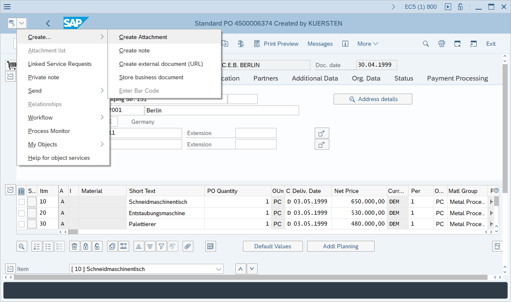

This sample shows how to download attached files from common business objects using the SAP tables SRGBTBREL and SOOD and the function module SO_DOCUMENT_READ_API1. 

### About

As of SAP rel. 4.6 users can attach documents to all common business objects, e.g., purchase orders:
{:class="img-responsive"}

This sample uses the following workflow to download attachment files:
1. Read the table SRGBTBREL to get all object IDs that are attached to business objects.
2. Read the table SOOD to get the corresponding file names and extensions of the object IDs.
3. Use SO_DOCUMENT_READ_API1 to download an attachment with a given object ID.

!!! note
    The function modules BDS_CONNECTIONS_GET and BDS_DOCUMENT_GET_TABLE can not be used in this scenario.
    Even if BDS_CONNECTIONS_GET delivers correct document IDs, the function module BDS_DOCUMENT_GET_TABLE throws an exception (NOTHING_FOUND).

### Get a List of all SAP Attachments

#### Get a List of Object IDs

The following sample code reads the table SRGBTBREL to obtain all document IDs attached to a business object. 
- The object key is the document number, e.g., the purchase number
- The object type is the name of the business object, e.g., BUS2012 for POs or BUS2010 for RFQs). 

The function returns an array of strings each representing a key to a downloadable attachment.

```csharp linenums="1"
public static string[] GetAllAttachmentKeys(R3Connection connection, 
    string ObjectType, string ObjectKey)
{
    ReadTable read = new ReadTable(connection);
    read.TableName = "SRGBTBREL";
    read.AddField("INSTID_B");
    read.AddCriteria("RELTYPE = 'ATTA'");
    read.AddCriteria("AND INSTID_A = '" + ObjectKey + "'");
    read.AddCriteria("AND TYPEID_A = '" + ObjectType + "'");
    read.AddCriteria("AND CATID_A = 'BO'");
    read.Run();
  
    string[] DocIDs = new string[read.Result.Rows.Count];
  
    for (int i = 0; i < read.Result.Rows.Count; i++)
    {
        DocIDs[i] = read.Result.Rows[i]["INSTID_B"].ToString();
    }
  
    return DocIDs;
}
```

#### Get a List of File Names

The following sample code reads the table SOOD to get the file name of each attachment. <br>
- The primary key of the table entry is defined by parts of the document IDs provided by the function `GetAllAttachmentKeys` above. 
- The file name of the attachment can be created by concatenating OBJDES and FILE_EXT.

```csharp linenums="1"
public static string GetFileName(R3Connection connection, string DocID)
{
    string OBJTP = DocID.Substring(17, 3);
    string OBJYR = DocID.Substring(20, 2);
    string OBJNO = DocID.Substring(22, 12);
    ReadTable readsood = new ReadTable(connection);
    readsood.TableName = "SOOD";
    readsood.AddField("OBJDES");
    readsood.AddField("FILE_EXT");
    readsood.AddCriteria("OBJTP = '" + OBJTP + "'");
    readsood.AddCriteria("AND OBJYR = '" + OBJYR + "'");
    readsood.AddCriteria("AND OBJNO = '" + OBJNO + "'");
    readsood.Run();
    if (readsood.Result.Rows.Count == 0)
    {
        return "";
    }
    else
    {
        return readsood.Result.Rows[0]["OBJDES"].ToString() +
            "." + readsood.Result.Rows[0]["FILE_EXT"].ToString();
    }
}
```

### Download SAP Attachment Files

The following sample code downloads an attachment with a given object ID using the function module SO_DOCUMENT_READ_API1.
- The returning structure DOCUMENT_DATA contains information about the file, e.g., DOC_SIZE. 
- The table OBJECT_CONTENT returns the binary content of the attachment as a string. 
- The strings are converted into byte arrays and stored to the disk.

```csharp linenums="1"
public static void DownloadDocument(R3Connection connection, string Path, string key)
{
    RFCFunction func = connection.CreateFunction("SO_DOCUMENT_READ_API1");
    func.Exports["DOCUMENT_ID"].ParamValue = key;
    func.Execute();
  
    Int32 len = Convert.ToInt32(func.Imports["DOCUMENT_DATA"].ToStructure()["DOC_SIZE"]);
  
  
    string strfile = "";
    System.Text.Encoding enc = System.Text.Encoding.GetEncoding(1252);
  
    if (len > 0)
    {
        foreach (RFCStructure row in func.Tables["OBJECT_CONTENT"].Rows)
        {
            string stline = row["LINE"].ToString().PadRight(255);
  
            if (len < 255)
                stline = stline.Substring(0, len);
            else
                len = len - 255;
  
            strfile += stline;
  
        }
        byte[] bytesfile = enc.GetBytes(strfile);
        System.IO.File.WriteAllBytes(Path, bytesfile);
    }
    else
    {
        throw new Exception("Length of file = 0");
    }
  
}
```

### Read and Download Attachment Files

The following sample code queries a list of available attachments and downloads the attachments to the disk.<br>
To download attachments of other business objects, change the object type, e.g., BUS2010 for RFQ.

```csharp linenums="1"
using System;
using ERPConnect;

// Set your ERPConnect license
LIC.SetLic("xxxx");

using var connection = new R3Connection(
    host: "server.acme.org",
    systemNumber: 00,
    userName: "user",
    password: "passwd",
    language: "EN",
    client: "001")
{
    Protocol = ClientProtocol.NWRFC,
};

connection.Open();
  
string[] DocIDs = GetAllAttachmentKeys(connection, "BUS2012", "4500014561");
  
if (DocIDs.Length == 0)
    Console.WriteLine("No attachments found");
else
{
    for (int i=0; i < DocIDs.Length ;i++)
    {
        string FileName = GetFileName(connection, DocIDs[i]);
        Console.WriteLine("Now downloading " + FileName);
        DownloadDocument(connection, @"c:\" + FileName, DocIDs[i]);
    }
}
  
Console.WriteLine("Press enter to exit");
Console.ReadLine();
```

