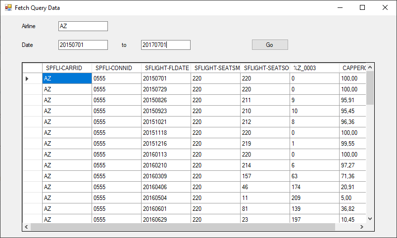

This sample shows how to fetch flight information of airplanes from an SAP Query

### About 
This sample uses the training Query *D3* that contains flight information of airplanes.  
Data that matches certain selection criteria (e.g. airline and date of flight) is fetched and drawn into a *DataGrid*, see screenshot below. 

{:class="img-responsive" }

!!! tip
    If you don't know the technical name of a Query parameter, you can look it up in your SAP-System.
    Use the transaction **SQ01** or **SQ02** to search a Query. Open the description of the Query and scroll to the section *Selections*.
    All parameter properties including the name are listed.

### Call D3

The Query *D3* has the following properties:

- user workspace: global
- user group: *BT*
- parameters: "CARRID" (airline) and "FLDATE" (date)


