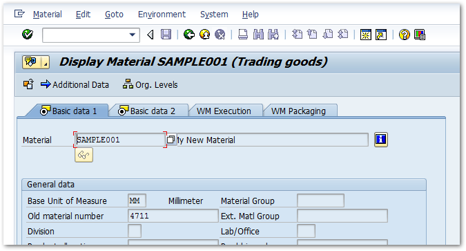

This sample shows how to create and read material master data in SAP using the BAPI BAPI_MATERIAL_SAVEDATA. 

### About

A material object consists of multiple layers or so called views. 
Each view may exist multiple times, e.g., one plant view for plant 1000 and one for plant 2000 - both for the same material. 
To keep it simple, the provided sample code only shows how to handle the basic views. The other views work the same way. 

The attributes of the basic view include:
- the Material Number
- the Old Material Number (which can come from a legacy system)
- the Industry Sector 
- the Material Type (in this case HAWA - Trading Goods)
- the basic measure unit (mandatory).

### Write Material Master Data

The BAPI BAPI_MATERIAL_SAVEDATA can be used for both creating a new material or changing / extending an existing Material. 
Aside from the regular structure for submitting data (CLIENTDATA) there is an additional checkbox structure called CLIENTDATAX. 
Any data that is submitted in CLIENTDATA must be confirmed by an X value in the CLIENTDATAX structure.

The following sample code adds material attributes:

```csharp linenums="1" title="BAPI_MATERIAL_SAVEDATA"
using System;
using ERPConnect;

// Set your ERPConnect license
LIC.SetLic("xxxx");

using var connection = new R3Connection(
    host: "server.acme.org",
    systemNumber: 00,
    userName: "user",
    password: "passwd",
    language: "EN",
    client: "001")
{
    Protocol = ClientProtocol.NWRFC,
};

connection.Open();
 
RFCFunction func = connection.CreateFunction("BAPI_MATERIAL_SAVEDATA");
RFCStructure header = func.Exports["HEADDATA"].ToStructure();
RFCStructure basedata = func.Exports["CLIENTDATA"].ToStructure();
RFCStructure basedatax = func.Exports["CLIENTDATAX"].ToStructure();
 
header["MATERIAL"] = "SAMPLE001";
header["IND_SECTOR"] = "M"; // M stands for Mechanical Engineering
header["MATL_TYPE"] = "HAWA"; // Type HAWA stands for Trading Goods
header["BASIC_VIEW"] = "X"; // Just an X to indicate, that we want to create the basic view
 
basedata["OLD_MAT_NO"] = "4711"; // Old material number
basedata["BASE_UOM"] = "MM"; // Base Unit MM for milimeter
basedatax["OLD_MAT_NO"] = "X"; // X indicates, that we want to set this value
basedatax["BASE_UOM"] = "X"; // X indicates, that we want to set this value
 
// Add a row to the description text tables
RFCStructure descriptionrow = func.Tables["MATERIALDESCRIPTION"].AddRow();
descriptionrow["LANGU"] = "EN"; // Language of the text
descriptionrow["MATL_DESC"] = "My New Material"; // Actual Text
 
func.Execute();
 
// process return message
Console.WriteLine(func.Imports["RETURN"].ToStructure()["MESSAGE"].ToString());
 
// And Commit everything
RFCFunction funccommit = connection.CreateFunction("BAPI_TRANSACTION_COMMIT");
funccommit.Execute();
 
Console.WriteLine("\r\nPress Enter to exit");
Console.ReadLine();
```

Output:

```
The material SAMPLE001 has been created or extended
```

{:class="img-responsive"}

### Read Material Master Data

The following sample code reads the material attributes used in [Write Material Master Data](#write-material-master-data):

```csharp linenums="1"
using System;
using ERPConnect;

// Set your ERPConnect license
LIC.SetLic("xxxx");

using var connection = new R3Connection(
    host: "server.acme.org",
    systemNumber: 00,
    userName: "user",
    password: "passwd",
    language: "EN",
    client: "001")
{
    Protocol = ClientProtocol.NWRFC,
};

connection.Open();
 
RFCFunction func = connection.CreateFunction("BAPI_MATERIAL_GET_DETAIL");
func.Exports["MATERIAL"].ParamValue = "SAMPLE001";
func.Execute();

// Read data
RFCStructure basedata = func.Imports["MATERIAL_GENERAL_DATA"].ToStructure();
 
Console.WriteLine("Description Text: " + basedata["MATL_DESC"].ToString());
Console.WriteLine("Old Material No: " + basedata["OLD_MAT_NO"].ToString());
Console.WriteLine("Industry Sector: " + basedata["IND_SECTOR"].ToString());
Console.WriteLine("Material Type: " + basedata["MATL_TYPE"].ToString());
 
Console.WriteLine("\r\nPress Enter to exit");
Console.ReadLine();
```

Output:

```
Description Text: My New Material
Old Material No: 4711
Industry Sector: M
Material Type: HAWA
```
