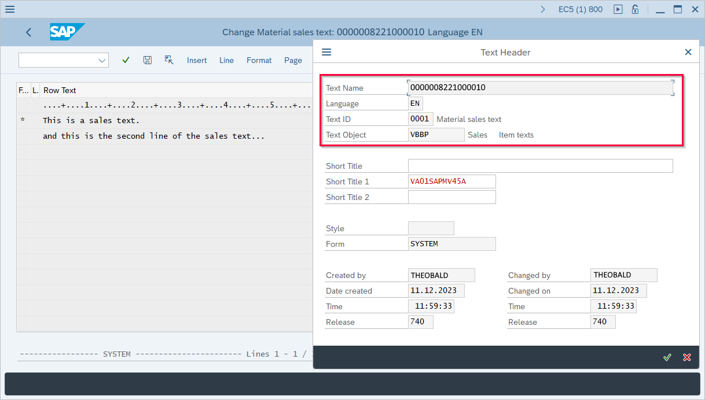
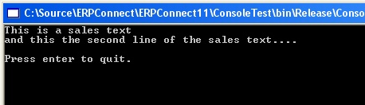

This sample shows how to get texts from sales orders using the function module RFC_READ_TEXT.

### About

Sales orders can store different kinds of texts.
The texts can be attached to the order header or the order items.<br>
Use the SAP standard function module RFC_READ_TEXT to retrieve the texts.
RFC_READ_TEXT requires the following table input (table TEXT_LINES) for each text you want to fetch:

- TDOBJECT is the name of the text object, e.g., VBBK for sales order header or VBBP for sales order item.
- TBNAME is the key, e.g., in case of VBBP it is the sales order number and the Sales order item number.
- TDID is the text ID that defines the text type, e.g., 0001 for Material sales text.
- TDSPRAS is the language key.


### Look up Text Information in SAP

Follow the steps below to look up the correct text name, text object and text ID of a text in SAP:
1. Open the sales order.
2. Access item texts via **More > Goto > Item > Texts** or access header texts via **More > Goto > Header > Texts**.
3. Click **[Detail]** (magnifying glass icon). The text editor opens.
4. Navigate to **Goto > Header**. The window "Text Header" opens.<br>
{:class="img-responsive"}

!!! tip
    Use SAP transaction SE75 to look up all available text objects and the underlying text IDs.

### Call RFC_READ_TEXT

The following sample code calls RFC_READ_TEXT to query the item text of a sales order:

```csharp linenums="1" title="RFC_READ_TEXT"
using System;
using ERPConnect;

// Set your ERPConnect license
LIC.SetLic("xxxx");

using (R3Connection con = new R3Connection())
{
    con.UserName = "SAPUser";
    con.Password = "SAPPassword";
    con.Language = "EN";
    con.Client = "800";
    con.Host = "sap-erp-as05.example.com";
    con.SystemNumber = 00;
    con.Protocol = ClientProtocol.NWRFC; //use ClientProtocol.RFC for classic RFC library

    con.Open();
}
  
// Create function object
RFCFunction func = con.CreateFunction("RFC_READ_TEXT");
  
// Add a new table row and fill it
RFCStructure newrow = func.Tables["TEXT_LINES"].Rows.Add();
newrow["TDOBJECT"] = "VBBP"; // Text object
newrow["TDNAME"] = "0000008221000010"; // Key
newrow["TDID"] = "0001"; // Text-ID
newrow["TDSPRAS"] = "EN"; // Language
  
//Execute the function          
func.Execute();
  
// Loop the table
foreach(RFCStructure row in func.Tables["TEXT_LINES"].Rows)
    Console.WriteLine(row["TDLINE"].ToString());
  
con.Close();
  
Console.WriteLine("");
Console.WriteLine("Press enter to quit.");
Console.ReadLine();
```

Output:

{:class="img-responsive"}
