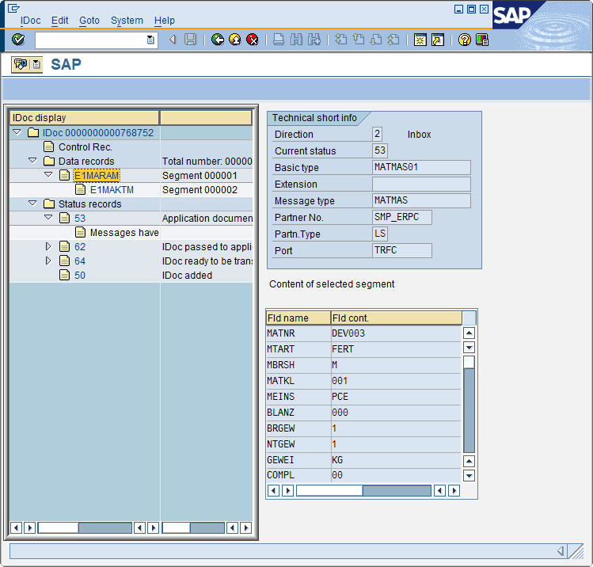

This sample shows how to create and send a MATMAS IDoc.

!!! note
    This sample only creates basic data.
    To add more sophisticated data, look up the IDoc documentation via SAP transaction WE60 to find out more about the segments.

### Send a MATMAS IDocs

Follow the steps below to send a MATMAS IDoc:

1. Connect to the SAP system using `R3Connection`. 
2. Use `CreateEmptyIdoc` to instance an empty IDoc.
3. Provide receiver and sender information. 
4. Use `CreateSegment create the needed segments.
5. Fill in the fields in the IDoc segments.
6. Send the IDoc using `Send`. 
7. Run the program and check the result.



Output:

{:class="img-responsive"}

*****

#### Related Links
- [Prerequisites for working with IDocs](../documentation/idocs/prerequisites.md)
- [Reveive an IDoc](receive-an-idoc.md)
- [Send an ORDER IDoc](send-an-order-idoc.md)
- [Send a STATUS IDoc](send-a-simple-status-idoc.md)