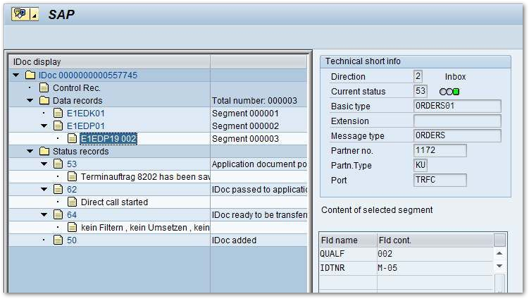

This sample shows to create a sales order in the SAP system using the IDoc type ORDERS01.

### About

An IDoc to create sales orders requires three different kinds of segment types:

- E1EDK01 is the main segment of an ORDERS01 IDoc. 
We leave it empty, but it must be provided by the calling program to pass the SAP IDoc syntax check.
- E1EDP01 is the segment for a single order position. The field MENGE contains the quantity. 
This segment can occur more than once.
- E1EDP19 represents an object definition and is a child of E1EDP01. In this case the object is a material number. 
The field QUALF is therefore set to "002" and the material number is written into the IDTNR field. 

!!! tip
    Use SAP transaction WE60 to look up the segment documentation of IDoc type ORDERS01.

### Prerequisites

Set up an RFC destination to enable calls from an SAP system to a subsystem, see [Complete Guide: IDocs Prerequisites](../documentation/idocs/prerequisites.md). 
If there is no partner profile found for an incoming IDoc, no order will be created.

### Send an ORDER IDoc

The Windows form for the sales order contains the following elements:

- Two text boxes for input: *txtMaterialNumber* (material number) and *txtQty* (quantity).
- One button: *button1*
 


Output:

{:class="img-responsive"}

*****

#### Related Links
- [Prerequisites for working with IDocs](../documentation/idocs/prerequisites.md)
- [Reveive an IDoc](receive-an-idoc.md)
- [Send an MATMAS IDoc](send-a-matmas-idoc.md)
- [Send a STATUS IDoc](send-a-simple-status-idoc.md)