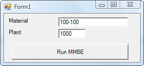

<!---
move to: ../../guide/special-classes/managing-and-executing-transactions-the-class-transaction
-->


The following sample application shows how to execute the SAP transaction MMBE (stock overview) using the *Transaction* class.

### About

In this application the user can enter a material number and the name of a plant. 
By clicking a button, the SAP GUI is launched and the transaction MMBE (stock overview) is executed to list the entered materials and plants. 

{:class="img-responsive" width="300px" }

!!! tip
    The installation package of ERPConnect includes the *Transaction-Recorder* tool.
    This tool records transactions and implements them to code, see [Transaction-Recorder](../../guide/transactions/transaction-recorder.md).

The code below shows how to add batch steps with the method *AddStep*. <br>
When connecting to SAP set the *UseGui* property to true. 
The SAP GUI is launched using the method *Execute*.

### Execute SAP Transactions

The following sample code executes the SAP transaction MMBE (stock overview):

```csharp linenums="1"
using System;
using ERPConnect;
using ERPConnect.Utils;

// Set your ERPConnect license
LIC.SetLic("xxxx");

using var connection = new R3Connection(
    host: "server.acme.org",
    systemNumber: 00,
    userName: "user",
    password: "passwd",
    language: "EN",
    client: "001")
{
    Protocol = ClientProtocol.NWRFC,
    UseGui = true,
};

connection.Open();

Console.Write("Material: ");
string material = Console.ReadLine();

Console.Write("Plant: ");
string plant = Console.ReadLine();

var transaction = new Transaction(connection)
{
    ExecutionMode = TransactionDialogMode.ShowAll,
    TCode = "MMBE"
};

transaction.AddStepSetNewDynpro("RMMMBEST", "1000");
transaction.AddStepSetOKCode("ONLI");
transaction.AddStepSetCursor("MS_WERKS-LOW");
transaction.AddStepSetField("MS_MATNR-LOW", material);
transaction.AddStepSetField("MS_WERKS-LOW", plant);

// run
transaction.Execute();
```

Input:
```
Material: 100-100
Plant: 1000
```

Output:

{:class="img-responsive"}

!!! note
    If you only want to execute a single transaction without adding several batch steps, simply set the property *TCode* and execute the transaction.

