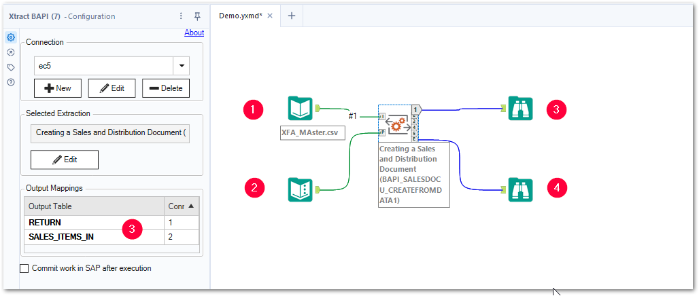

This page shows how to use the {{ bapi }} {{ component }}. 
The {{ bapi }} {{ component }} can be used to parameterize and execute SAP function modules and BAPIs for automation.











### Input and Output Anchors

The {{ bapi }} {{ component }} has the following input and output options:
- Input anchor "I" - input for tables :number-1:.
- Input anchor "P" - input for {{ variables }} :number-2:.
- Output anchor "1" to "5" - custom output :number-3:.
- Output anchor "E" - output for export parameters :number-4:.

{:class="img-responsive" }

### Transaction Commit
Some SAP Function Modules require calling the function module BAPI_TRANSACTION_COMMIT to successfully update data in the database, e.g., BAI_PO_CREATE. 
To automatically call BAPI_TRANSACTION_COMMIT after the selected Function Module / BAPI is processed, activate the option **Commit work in SAP after execution** in the configuration menu of the {{ bapi }} {{ component }}.

{:class="img-responsive"}



****
#### Related Links
- [Sample Workflows: Xtract BAPI](../../sample-workflows.md/#xtract-bapi)
- [Knowledge Base Article: Create and Load Purchase Requisitions in SAP](../../knowledge-base/create-and-load-purchase-requisitions-in-sap.md)
- [Knowledge Base Article: Read and Download SAP Attachment Files](../../knowledge-base/read-sap-attachment-files.md)
- [Knowledge Base Article: Read Data from Cluster Fields in Tables PCL1 and PCL2 (Payroll)](../../knowledge-base/read-data-from-cluster-fields-in-the-tables-pcl1-and-pcl2-payroll.md)
