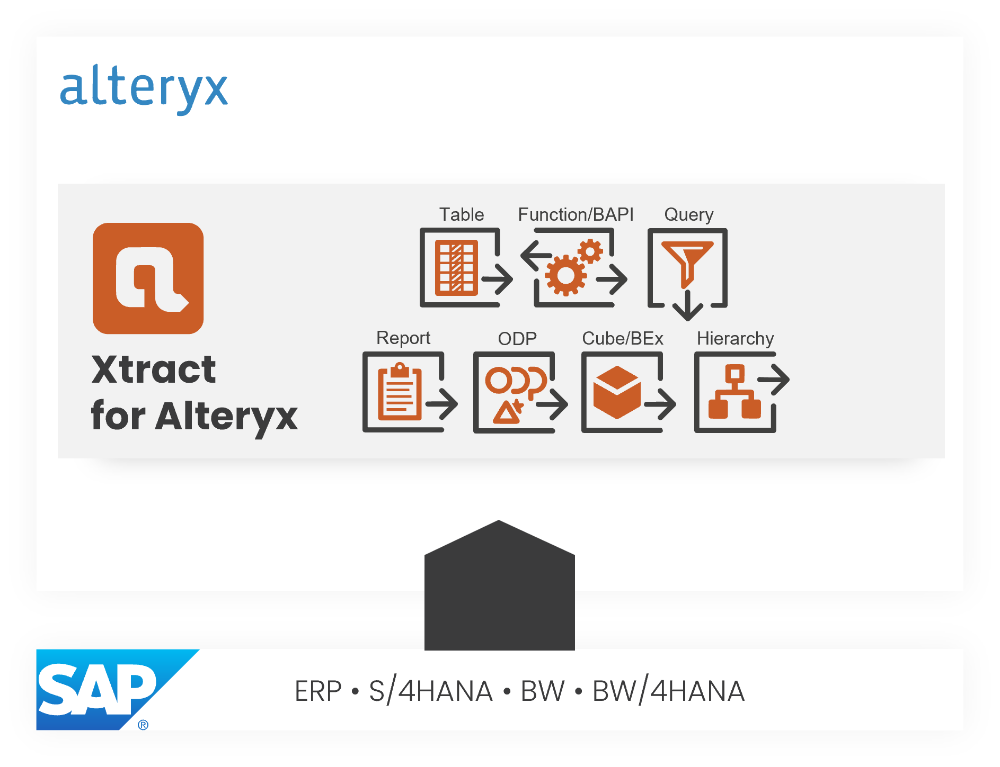

{ .lg .middle width="30px"} This section contains user documentation for {{ productName }}.

### About {{ productName }}

Xtract for Alteryx is a plug-in for [Alteryx Designer and Server](https://www.alteryx.com). 
Xtract for Alteryx enables you to extract data from SAP systems and load it into the data flow of your Alteryx solution.

{:class="img-responsive"}

### Xtract {{ Components }}

{{ productName }} offers the following {{ components }} to cover a wide range of data extraction scenarios.



