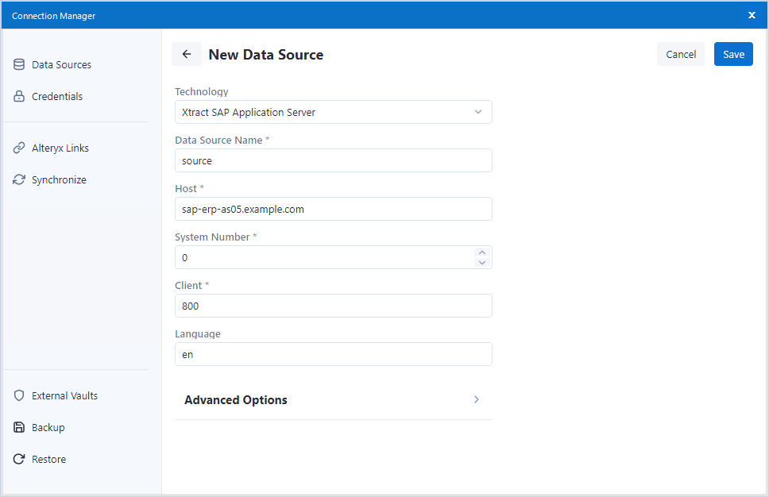
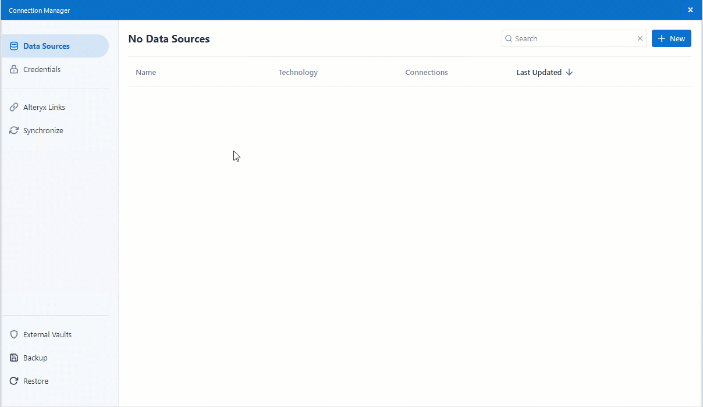
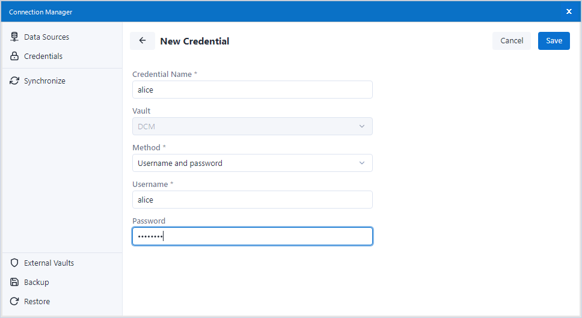
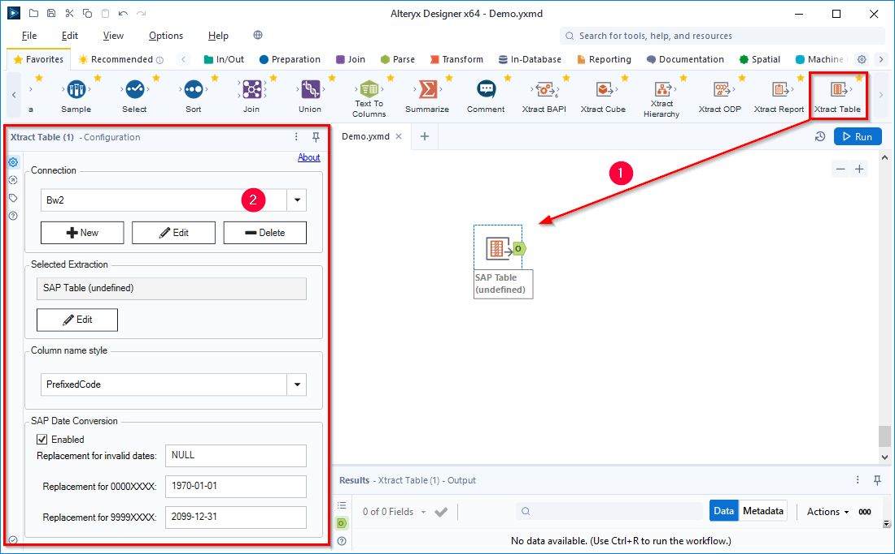

This page shows how to connect to SAP using the [Data Connection Manager](https://help.alteryx.com/current/en/designer/tools/dcm---designer.html) (DCM) of Alteryx. 
The installation of Xtract for Alteryx includes the Xtract data source technology that connects to SAP systems.

An SAP connection is required to use any Xtract for Alteryx {{ component }}.



!!! note
    The usage of the Alteryx Data Connection Manager is supported as of Alteryx Designer version 2022.3.
	To use the DCM, it needs to be enabled for your organization, see [Alteryx Documentation: Data Connection Manager](https://help.alteryx.com/current/en/designer/tools/dcm---designer.html).
	If cannot use the Alteryx Data Connection Manager, refer to the knowledge base article [Create an SAP Connection](../../knowledge-base/sap-connection-using-xfa-gui.md) to create SAP connections using the Xtract for Alteryx UI.

	
**Supported Connection Methods** 

- Connection to a single application server
- Connection to a message server (Load Balancing) 

**Supported Authentication Methods**

- Plain login using SAP username and password (system or dialogue user)
- [Secure Network Communication (SNC)](snc-authentication.md) using username and password via basic authentication
- [SSO with Login-Ticket](sso-with-logon-ticket.md) using username and password via basic authentication

   
### Create an Xtract Data Source

Follow the steps below to create an Xtract data source that connects to SAP:

1. In the main menu of the Alteryx Designer navigate to **File > Manage Connections**. The window "Connection Manager" opens.
2. In the tab *Data Sources* click **[New]** to create a new data source. 
3. Select the **Xtract** technology to create an Xtract data source.
4. Fill out the data source settings for your SAP system, see [Xtract Data Source Settings](#data-source-settings). 
{:class="img-responsive"}
4. Click **[Save]** to save the SAP connection. The subsection *Connection* is displayed.
5. In the subsection *Connection* select one of the following authentication methods:  
	- *Plain* uses the SAP username and password.
	- [*SNC*](snc-authentication.md) uses an encrypted connection between Xtract for Alteryx and SAP with an SAP username and password. 
	- [*Ticket Issuer*](sso-with-logon-ticket.md) uses SAP Logon-Tickets in place of user credentials. This connection is not encrypted.
6. Select an existing credential for your SAP system or click **+ Connect Credential** to create a new credential. 
For more information, see [Create Credentials](#create-credentials).
7. Click **[Link]** / **[Create and link]** to link the credential to the connection. Example: 
{:class="img-responsive" style="border:1px solid black;"}

The SAP connection is now available for selection in the Xtract for Alteryx {{ components }}, see [Assign an SAP Connection to Xtract Components](#assign-an-sap-connection-to-xtract-components).

### Create Credentials

Follow the steps below to create an Xtract data source that connects to SAP:

1. In the main menu of the Alteryx Designer navigate to **File > Manage Connections**. The window "Connection Manager" opens.
2. In the tab *Credentials* click **[New]** to create a new credential. 
{:class="img-responsive"}
3. Enter a name for the credential and select one of the following authentication methods:  
	- *Username and password* uses the SAP username and password.
	- [*SAP SNC*](snc-authentication.md) uses an encrypted connection between Xtract for Alteryx and SAP with username and password. 
	- [*SAP Ticket Issuer*](sso-with-logon-ticket.md) uses SAP Logon-Tickets in place of user credentials. This connection is not encrypted.
4. Enter your authentication details. The depicted example uses plain authentication. 
{:class="img-responsive"}
5. Click **[Save]** to save the credential.

The credential is displayed in the list of credentials.

!!! tip
    You can link credentials to multiple data sources.

## Assign an SAP Connection to Xtract {{ Components }}

1. Drag&drop an Xtract for Alteryx {{ component }} from the Alteryx Designer toolbox onto the canvas :number-1:. 
The configuration window of the component opens. 
{:class="img-responsive"}
2. Select an SAP connection from the dropdown list :number-2:.

If no SAP connections are available, [create an Xtract data source](#create-an-xtract-data-source) in the Alteryx Connection Manager.

*****
#### Related Links
- [Alteryx Documentation: Data Connection Manager - Server](https://help.alteryx.com/current/en/server/use-alteryx-server-ui/data-connection-manager--server-ui.html)
- [Connection Settings](settings.md)