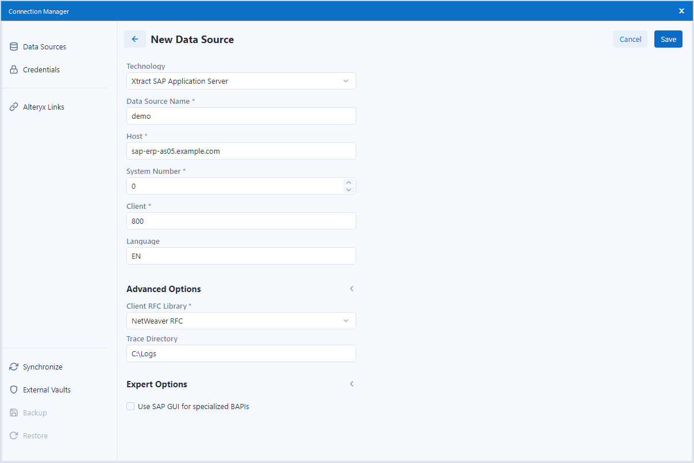

This page contains an overview of the SAP connection settings in the Xtract data source. 

{:class="img-responsive" }

### Xtract Data Source Settings

Some input fields for the SAP connection vary depending on the selected connection method in the field **Technology**. 
{{ productName }} supports the following connection methods to SAP systems:

- Connection to a single application server.
- Connection to a message server, see [SAP Documentation: Load Balancing](https://help.sap.com/saphelp_nwpi711/helpdata/en/c4/3a644c505211d189550000e829fbbd/content.htm?no_cache=true).

=== "Xtract SAP Application Server"

	| Input Field | Description |
	| :------ |:--- | 
	| **Data Source Name** | Name of the Xtract data source. |
	| **Host** |  Host name or IP address of the application server (Property Host).  | 
	| **Sys. No.** | A two-digit number between 00 and 99 (Property SystemNumber). | 
	| **Client** | A three-digit number of the SAP client between 000 and 999, e.g., 800. | 
	| **Language** | The logon language for the SAP system, e.g., EN for English or DE for German. | 

=== "Xtract SAP Load Balancing"

	| Input Field | Description |
	| :------ |:--- | 
	| **Data Source Name** | Name of the Xtract data source. |
	| **Message Server** |  Name or IP address of the message server (Property MessageServer). | 
	| **Client** | A three-digit number of the SAP client between 000 and 999, e.g., 800. | 
	| **Language** | The logon language for the SAP system, e.g., EN for English or DE for German. | 

!!! tip
	Input values for the SAP connection can be found in the Properties of the SAP Logon Pad or the can be requested from the SAP Basis team.
	

### Advanced Options





### Expert Options

#### Use SAP GUI for specialized BAPIs

There are SAP Reports and BAPIs that require an installed SAP GUI even when they are called remotely.  
Activate this option only if necessary.

!!! warning
	**'sapgui' start failed.** 
	Sometimes SAP opens a pop-up window that requires input when running extractions.
	To deactivate pop-up windows, open the SAP GUI Logon pad and navigate to **Options... > Security Settings**. 
	Click the **[Open Security Configuration]** button and select *Allow* as the **Default Action**.
	Apply the changes and close the SAP GUI Logon pad.