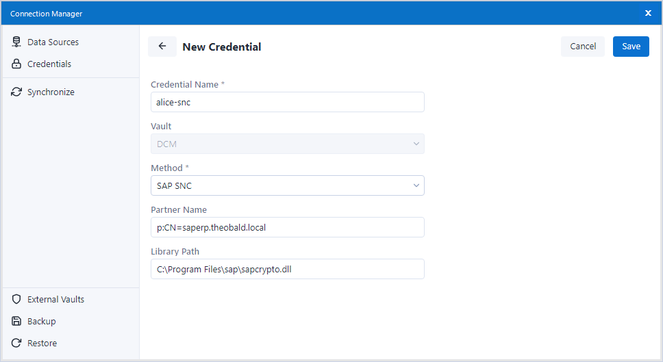
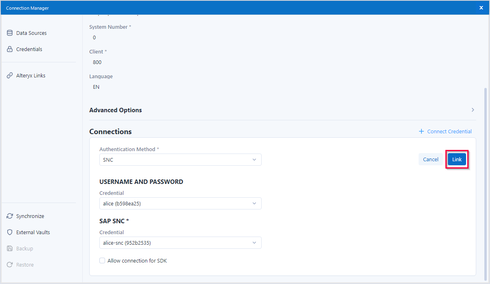

This page shows how to configure the Xtract data source to use encrypted communication via [Secure Network Communication (SNC)](https://help.sap.com/doc/saphelp_nw73ehp1/7.31.19/en-US/e6/56f466e99a11d1a5b00000e835363f/content.htm?no_cache=true) between {{ productName }} and SAP.



### Secure Network Communication (SNC)

Follow the steps below to set up SNC credentials for an SAP connection:

1. In the main menu of the Alteryx Designer navigate to **File > Manage Connections**. The window “Connection Manager” opens.
2. In the tab *Credentials* click **[New]** to create a credential. 
{:class="img-responsive"}
3. Enter a name for the credential, e.g., "alice-SNC".
4. Select the authentication method *SAP SNC*.
5. Enter the SAP Partner Name configured for the SAP application server in the field **Partner Name**, e.g., `p:SAPserviceERP/Alice@THEOBALD.LOCAL`.
6. Enter the path to the SNC library in the **Library Path** field, e.g., `C:\Program Files\SAP\FrontEnd\SecureLogin\sapcrypto.dll`. 
{:class="img-responsive"}
7. Click **[Save]** to save the credential.

### Assign SNC Credentials to an Xtract Data Source

Follow the steps below to assign the SNC credentials to an Xtract data source:

1. In the main menu of the Alteryx Designer navigate to **File > Manage Connections**. The window “Connection Manager” opens.
2. In the tab *Data Sources* click on a data source to display the details of the data source.
3. Click **+ Connect Credential**. 
{:class="img-responsive"}
4. Select the authentication method *SAP SNC*. The sections **USERNAME AND PASSWORD** and **SAP SNC** are displayed.
5. In the section **USERNAME AND PASSWORD**, select the credential that contains the username and password of the SAP dialog or system user that is used for the SAP connection. 
6. In the section **SAP SNC**, select the credential that contains the SNC settings for the SAP connection.
7. Click **[Link]** to assign the credentials to the Xtract data source. 
{:class="img-responsive"}