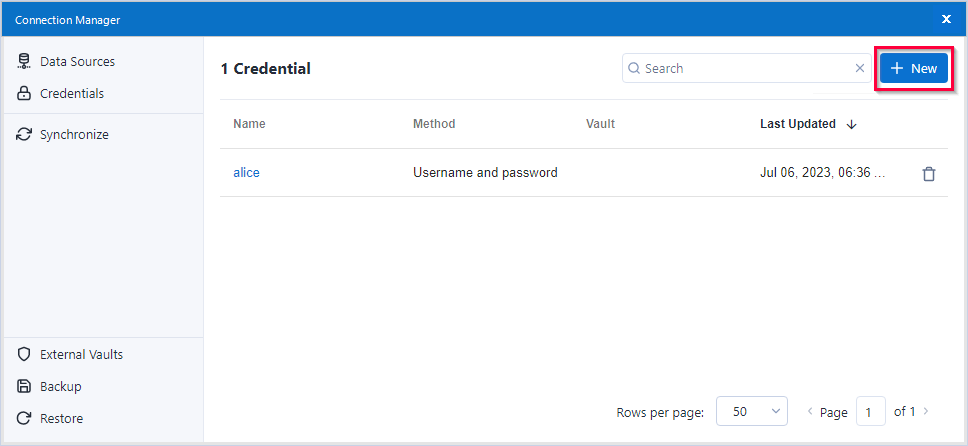
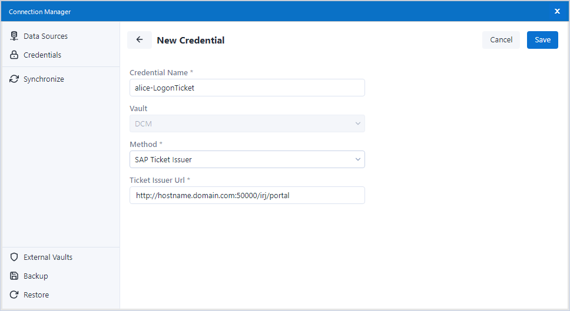
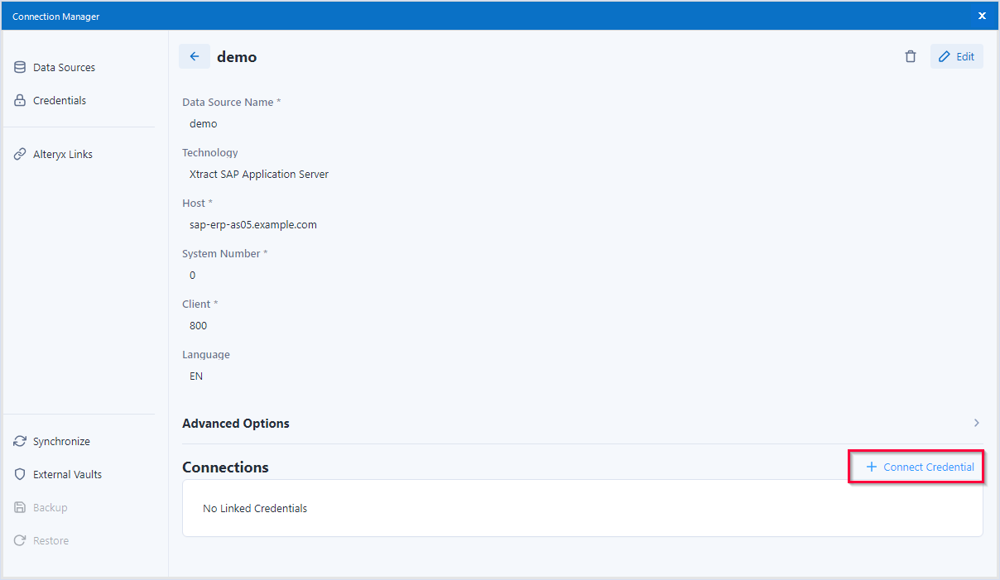
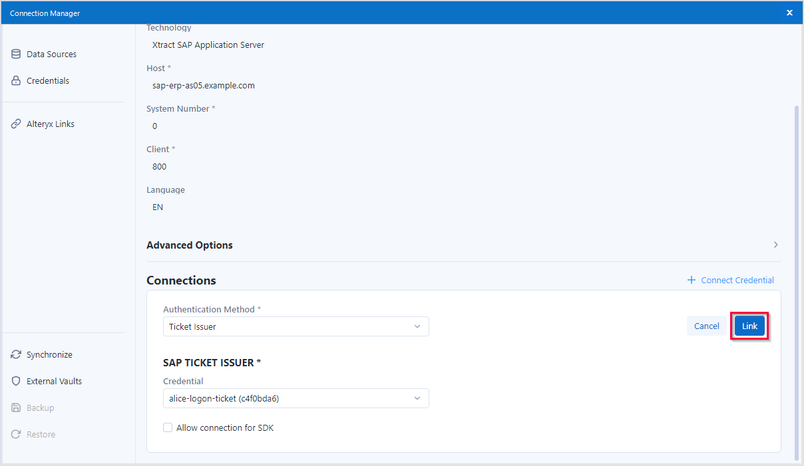

This page shows how to configure the Xtract data source to use SSO via Logon-Tickets between {{ productName }} and SAP.
Note that this connection is not encrypted.

### SAP Logon Ticket

Follow the steps below to set up an SAP connection that uses SNC:

1. In the main menu of the Alteryx Designer navigate to **File > Manage Connections**. The window “Connection Manager” opens.
2. In the tab *Credentials* click **[New]** to create a credential. 
{:class="img-responsive"}
3. Enter a name for the credential, e.g., "alice-logon-ticket".
4. Select the authentication method *SAP Ticket issuer*.
5. Enter the URL of an Application Server Java (AS Java) that is configured to issue logon tickets in the field **Ticket issuer Url**.
For more information, see [SAP Documentation: Configuring the AS Java to Issue Logon Tickets](https://help.sap.com/doc/saphelp_nw75/7.5.5/EN-US/4a/412251343f2ab1e10000000a42189c/frameset.htm). 
{:class="img-responsive"}
6. Click **[Save]** to save the credential.

### Assign Ticket Issuer Credentials to an Xtract Data Source

Follow the steps below to assign the ticket issuer credentials to an Xtract data source:

1. In the main menu of the Alteryx Designer navigate to **File > Manage Connections**. The window “Connection Manager” opens.
2. In the tab *Data Sources* click on a data source to display the details of the data source.
3. Click **+ Connect Credential**. 
{:class="img-responsive"}
4. Select the authentication method *SAP SNC*. The section **SAP TICKET ISSUER** is displayed.
5. In the section **SAP TICKET ISSUER**, select the credential that contains the Logon-Ticket settings for the SAP connection.
6. Click **[Link]** to assign the credential to the Xtract data source. 
{:class="img-responsive"}