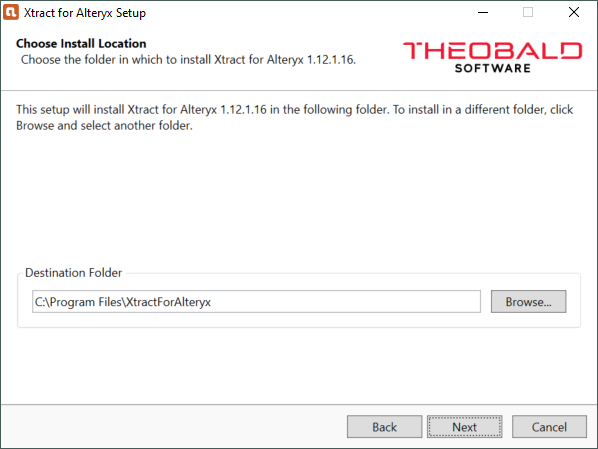

This page shows how and where to install {{ productName }}. 

### Prerequisites

Administrator permissions are required to install {{ productName }}.

### Setup

`{{ setup }}Setup.exe` is an industry standard setup. 
Execute the `{{ setup }}Setup.exe` file and follow the instructions of the setup program.

{:class="img-responsive"}

!!! note 
	During the setup you need to specify the installation directory for Xtract for Alteryx and also the installation directory of Alteryx.
	If you have multiple instances of Alteryx installed, choose the instance on which you want to use Xtract for Alteryx.

After the installation is completed, check if the following entries and extensions are available in the Alteryx installation directory:
- `Alteryx\Settings\AdditionalPlugins\XtractForAlteryx.ini`
- `Alteryx\bin\RuntimeData\icons\categories\XtractForAlteryx.png`
- `Alteryx\bin\RuntimeData\DefaultSettings.xml`

For information on how to install a license, see [Licensing](license.md#install-the-xtract-for-alteryx-license).

### Installation Directory Files

The list below shows several most important files that are placed into the default directory `{{ installationDir }}` after installation:

|Filename | Description |
|:----|:---|
|ABAP directory |  Directory with SAP function modules. Read the readme.txt within the directory for more information. See also [SAP Customization](../setup-in-sap/index.md).|
|XtractForAlteryxSetup.exe | Main installation application that installs Xtract for Alteryx as a plug-in to the Alteryx Designer / Server running on the system.|
|Uninstall Xtract for Alteryx | Shortcut to uninstall and remove Xtract for Alteryx with all its components from your machine.|
|Eula_Xtract_for_Alteryx.rtf |Document containing the license agreement for the use of the software Xtract for Alteryx. |
|XtractForAlteryxLicense.json| License file with information about the server, the component and runtime.|
|XtractForAlteryxSetup.log| Log file to see the exact modifications performed on your system and check whether any errors occurred during installation |

	

	

