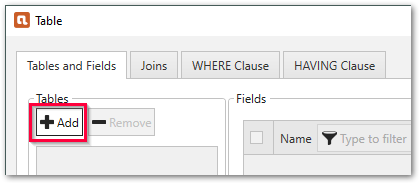

{ .lg .middle width="30px"} This section shows how to install and set up {{ productName }} for the first time. 

### Installation

1. [Download](https://theobald-software.com/en/download-trial/) a 30 day trial version of Xtract for Alteryx.
2. Close the Alteryx Designer.
3. Run the Xtract for Alteryx executable (XtractForAlteryxSetup.exe) to install Xtract for Alteryx. 
For information on system requirements, see [Requirements](documentation/setup/requirements.md).

	!!! note
		During the setup you need to specify the installation directory for Xtract for Alteryx and also the installation directory of Alteryx. 
		If you have multiple instances of Alteryx installed, choose the instance on which you want to use Xtract for Alteryx.

4. Open the Alteryx Designer. The Xtract for Alteryx {{ components }} are available in the Xtract For Alteryx toolbox. 

For more information, see [Setup](documentation/setup/index.md).

### Connect to SAP

Before connecting to SAP for the first time, set up an SAP dialog user with the necessary [SAP user rights](documentation/setup-in-sap/sap-authority-objects.md/#general-authorization-objects).

!!! note
	Xtract for Alteryx can connect to SAP using the [Data Connection Manager (DCM)](https://help.alteryx.com/current/en/designer/tools/dcm---designer.html) of Alteryx or the Xtract for Alteryx GUI.
	If your version of Alteryx does not support the DCM, refer to the [Knowledge Base Article: Create an SAP Connection using the Xtract for Alteryx GUI](knowledge-base/sap-connection-using-xfa-gui.md).

1. In the main menu of the Alteryx Designer navigate to **File > Manage Connections**. The window "Connection Manager" opens.
2. In the tab *Data Sources* click **[New]** to create a new data source.
3. Select the Xtract technology to create an Xtract data source.
4. Enter the system details of your SAP system.
Input values for the SAP connection can be found in the Properties of the SAP Logon Pad or they can be requested from the SAP Basis team.
5. Click **[Save]** to save the SAP connection. The subsection *Connection* opens.
6. In the subsection *Connection*, select an authentication methods and link or create and link the credential of your SAP system or dialog user to the data source. 

For more information, see [SAP Connection](documentation/sap-connection/index.md).

### Use Xtract {{ Components }} in Workflows

Follow the steps below to add an Xtract {{ component }} to your workflow:

1. Drag & drop an Xtract {{ component }} from the Xtract for Alteryx toolbox into the workflow :number-1:. 
{:class="img-responsive"}
2. Assign an existing SAP connection :number-2:.
3. Click **[:pen-button:Edit]** :number-3: to open the main window of the component.
The majority of the functions of the component can be accessed in the main window.

Xtract for Alteryx offers the following {{ components }}:

|  {{ Component }}  | Description   |  
|----------|-------------|
| [:component-bapi:  {{ bapi }}](documentation/bapi/index.md) | Execute BAPIs and Function Modules. |
| [:component-bwcube:  {{ bwcube }}](documentation//bwcube/index.md) | Extract data from SAP BW InfoCubes and BEx Queries. |
| [:component-hierarchy:  {{ hierarchy }}](documentation/hierarchy/index.md) | Extract Hierarchies from an SAP BW / BI system. |
| [:component-odp:  {{ odp }}](documentation/odp/index.md) | Extract data via the SAP Operational Data Provisioning (ODP) framework. | 
| [:component-query:  {{ query }}](documentation/query/index.md) | Extract data from ERP queries. **Note: BEx queries are covered by the {{ bwcube }} {{ component }}**. | 
| [:component-report: {{ report }}](documentation/report/index.md) | Extract data from SAP ABAP reports. | 
| [:component-table:  {{ table }}](documentation/table/index.md) | Extract data from SAP tables and views. |

<!---

-->

#### A Simple SAP Data Extraction for Beginners

Follow the steps below to extract customer master data from the SAP table KNA1:

1. Drag & drop the {{ table }} {{ component }} into the workflow.
2. Assign an existing SAP connection and click **[:pen-button:Edit]** to open the main window of the component.
3. Click **[:material-plus-thick:Add]** to look up an SAP table. The window “Table Lookup” opens.
4. In the field **Table Name**, enter the name of the table to extract (KNA1). Use wildcards (*) if needed.
5. Click **[:magnifying-glass:]**. Search results are displayed.
6. Select the table KNA1 and click **[OK]**. The application returns to the main window of the {{ component }}.
7. Optional: Select the table columns you want to extract. By default all columns are extracted. 
For more information on filter options and advanced settings, see, [Define the {{ table }} {{ Component }}](documentation/table/index.md/#define-the-xtract-table-component).
8. Click {{ previewBtn }} to display a live preview of the first 100 records.
9. Click **[OK]** to save the {{ component }}.

You can now add tools to process the data returned by {{ table }} and run the {{ extraction }}.

{:class="img-responsive" style="border:1px solid black;"}

<!--- --->
<!--- --->